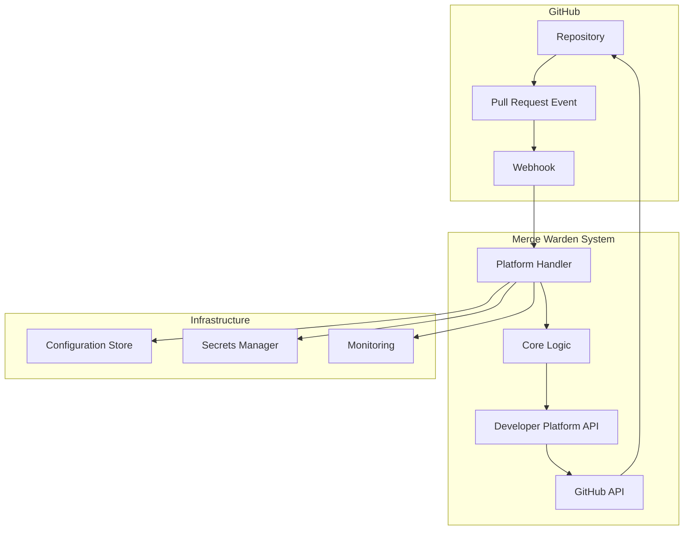
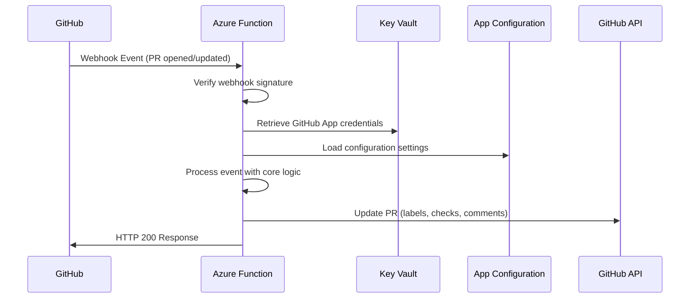
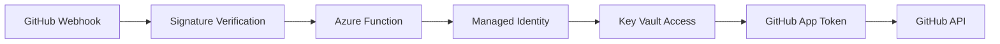
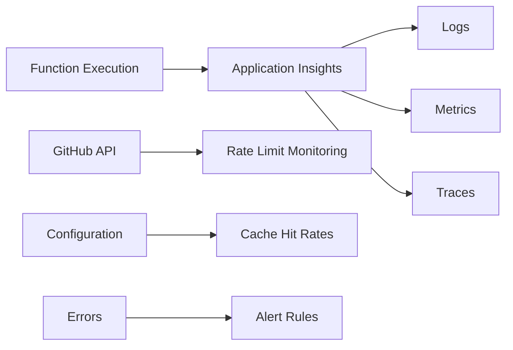

# Merge Warden Architecture

This document describes the high-level architecture of the Merge Warden system and its deployment patterns.

## System Overview

Merge Warden is a GitHub webhook processor that enforces pull request policies and automates workflows.
The system is designed with a modular architecture that separates core logic from platform-specific implementations.



## Core Components

### 1. Core Library (`merge_warden_core`)

The core library contains platform-agnostic business logic:

- **Policy Engine**: Validates PR titles, work item references, and size limits
- **Configuration Management**: Handles repository-specific settings
- **Validation Logic**: Implements check rules and bypass mechanisms
- **Result Processing**: Formats and structures validation results

### 2. Developer Platforms (`merge_warden_developer_platforms`)

Abstracts interactions with development platforms:

- **GitHub Integration**: API client, webhook verification, and GitHub-specific operations
- **Authentication**: Handles GitHub App authentication and token management
- **API Abstraction**: Provides platform-agnostic interfaces for future extensibility

### 3. Platform Handlers

Platform-specific implementations that host the core logic:

#### Azure Functions (`merge_warden_azure_functions`)

- HTTP-triggered function for webhook processing
- Integrates with Azure services (Key Vault, App Configuration)
- Supports Azure-native monitoring and scaling

#### CLI Tool (`merge_warden_cli`)

- Command-line interface for local testing and validation
- Supports direct repository analysis
- Useful for CI/CD pipeline integration

#### Future Platforms

- AWS Lambda (planned)

## Data Flow



## Configuration Architecture

### Three-Tier Configuration

1. **Repository Level** (`.github/merge-warden.toml`)
   - Repository-specific policies
   - PR title patterns, size thresholds
   - Label configurations

2. **Infrastructure Level** (Azure App and CLI Configuration)
   - Environment-specific settings
   - Bypass rules and user permissions
   - Global defaults and feature flags

3. **System Level** (Environment Variables)
   - Service endpoints and connection strings
   - Infrastructure configuration
   - Runtime settings

### Configuration Precedence

```
Repository Config > Infrastructure Config > System Defaults
```

## Security Model

### Authentication Flow



### Security Layers

1. **Transport Security**: HTTPS for all communications
2. **Webhook Verification**: HMAC signature validation
3. **Identity Management**: Azure Managed Identity for service authentication
4. **Secrets Management**: Azure Key Vault for sensitive data
5. **Access Control**: RBAC for infrastructure resources
6. **API Authentication**: GitHub App authentication for API access

### Monitoring and Observability



## Error Handling Strategy

### Retry Logic

1. **Webhook Processing**: Single attempt (GitHub will retry)
2. **GitHub API Calls**: Exponential backoff with jitter
3. **Configuration Loading**: Cache fallback on service unavailability
4. **Transient Failures**: Automatic retry with circuit breaker

### Failure Modes

1. **GitHub API Rate Limits**: Graceful degradation with caching
2. **Configuration Service Down**: Use cached or default values
3. **Network Failures**: Retry with exponential backoff
4. **Invalid Webhook**: Log and reject with appropriate HTTP status
