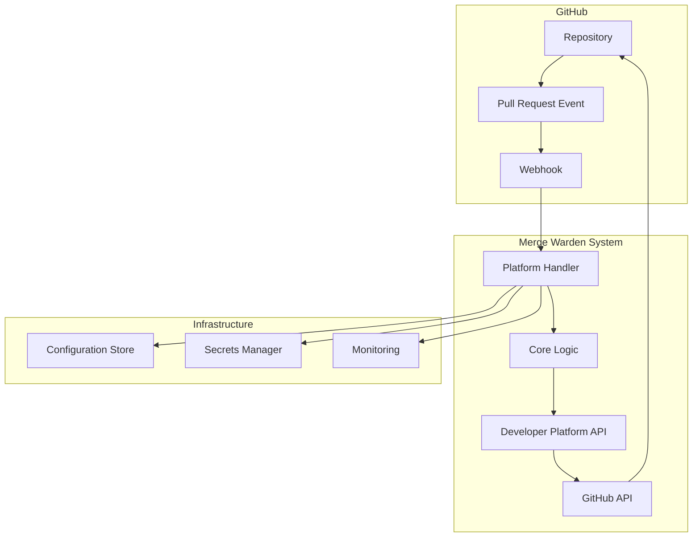
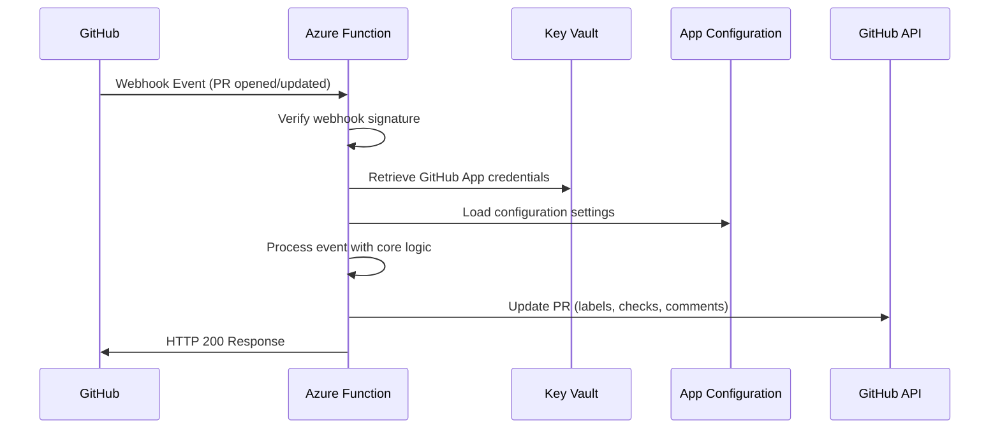
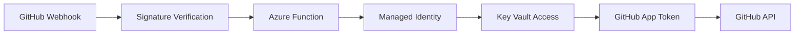
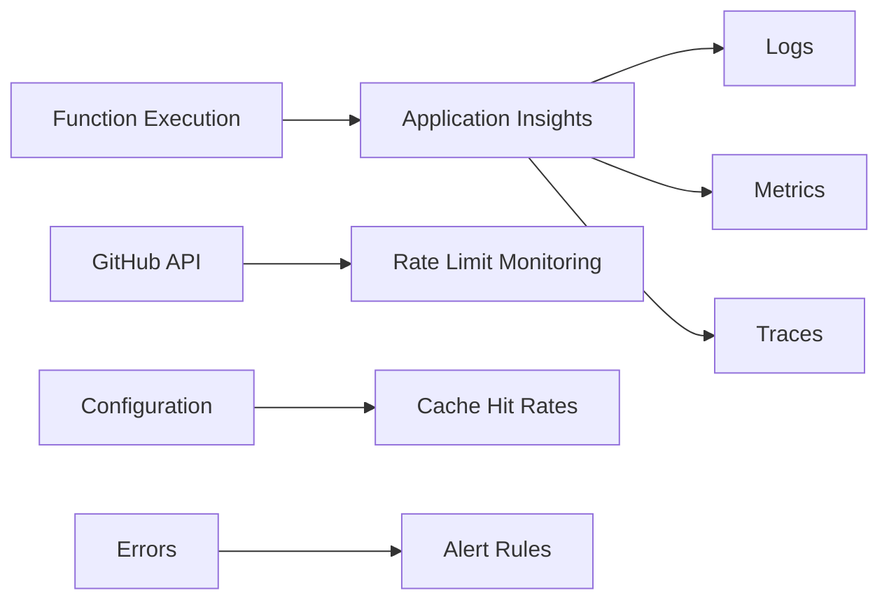

# Merge Warden Architecture

This document describes the high-level architecture of the Merge Warden system and its deployment patterns.

## System Overview

Merge Warden is a GitHub webhook processor that enforces pull request policies and automates workflows.
The system is designed with a modular architecture that separates core logic from platform-specific implementations.


```mermaid
graph TB
    subgraph "GitHub"
        A[Repository] --> B[Pull Request Event]
        B --> C[Webhook]
    end

    subgraph "Merge Warden System"
        C --> D[Platform Handler]
        D --> E[Core Logic]
        E --> F[Developer Platform API]
        F --> G[GitHub API]
    end

    subgraph "Infrastructure"
        D --> H[Configuration Store]
        D --> I[Secrets Manager]
        D --> J[Monitoring]
    end

    G --> A
```

## Core Components

### 1. Core Library (`merge_warden_core`)

The core library contains platform-agnostic business logic:

- **Policy Engine**: Validates PR titles, work item references, and size limits
- **Configuration Management**: Handles repository-specific settings
- **Validation Logic**: Implements check rules and bypass mechanisms
- **Result Processing**: Formats and structures validation results

### 2. Developer Platforms (`merge_warden_developer_platforms`)

Abstracts interactions with development platforms:

- **GitHub Integration**: API client, webhook verification, and GitHub-specific operations
- **Authentication**: Handles GitHub App authentication and token management
- **API Abstraction**: Provides platform-agnostic interfaces for future extensibility

### 3. Platform Handlers

Platform-specific implementations that host the core logic:

#### Azure Functions (`merge_warden_azure_functions`)

- HTTP-triggered function for webhook processing
- Integrates with Azure services (Key Vault, App Configuration)
- Supports Azure-native monitoring and scaling

#### CLI Tool (`merge_warden_cli`)

- Command-line interface for local testing and validation
- Supports direct repository analysis
- Useful for CI/CD pipeline integration

#### Future Platforms

- AWS Lambda (planned)

## Data Flow


```mermaid
sequenceDiagram
    participant GH as GitHub
    participant AZ as Azure Function
    participant KV as Key Vault
    participant AC as App Configuration
    participant API as GitHub API

    GH->>AZ: Webhook Event (PR opened/updated)
    AZ->>AZ: Verify webhook signature
    AZ->>KV: Retrieve GitHub App credentials
    AZ->>AC: Load configuration settings
    AZ->>AZ: Process event with core logic
    AZ->>API: Update PR (labels, checks, comments)
    AZ->>GH: HTTP 200 Response
```

## Configuration Architecture

### Four-Tier Configuration

Merge Warden resolves the effective policy for every PR through a four-tier merge chain.
Each tier is applied in priority order — a higher-priority tier overrides a lower one for
any field that is explicitly set.

| Priority | Tier | Source | Can override? |
|---|---|---|---|
| 1 (lowest) | **Application defaults** | `MERGE_WARDEN_CONFIG_FILE` (`[policies]` section) | Overridable by all tiers above |
| 2 | **Org defaults** | `[defaults]` section of the org policy file | Overridable by repo config and org enforced |
| 3 | **Repository config** | `.github/merge-warden.toml` in each repo | Overridable only by org enforced and app enforcement flags |
| 4 (highest) | **Org enforced** | `[enforced]` section of the org policy file | Cannot be overridden by repos |

Application-level enforcement flags (`enable_title_validation`, `enable_work_item_validation`,
`pr_size_check.enabled`, `wip_check.enforce_wip_blocking`) are applied on top of the merge
chain as a final pass, guaranteeing operator-controlled settings always win.

#### Configuration Resolution Example

```
app_defaults
  └─ merge with org_defaults   →  org can set sensible cross-repo defaults
       └─ merge with repo       →  repo can customise within org defaults
            └─ merge with org_enforced  →  org can lock specific policies
                 └─ apply app enforcement flags  →  operator always wins
                      └─ CurrentPullRequestValidationConfiguration
```

#### Tier 1 — Application Defaults

Loaded from the file pointed to by `MERGE_WARDEN_CONFIG_FILE` at server start.
Applies to every repository handled by this server instance.
See `samples/app-config.sample.toml`.

#### Tier 2 — Org Defaults (optional)

Fetched from a central repository at runtime using the `[org_policy_source]` field
in the app-level config:

```toml
[org_policy_source]
owner = "my-org"
repo  = "platform-configs"
path  = "merge-warden/org-policy.toml"
# fail_if_unreachable = false
```

The file at that path must contain a `[defaults]` section (see
`samples/merge-warden-org-policy.sample.toml`).  When `org_policy_source` is absent the
system behaves identically to the previous three-tier model.

#### Tier 3 — Repository Config

Per-repository overrides in `.github/merge-warden.toml`.
Repository owners can tune policies within the bounds set by the org enforced tier.
See `samples/merge-warden.sample.toml`.

#### Tier 4 — Org Enforced (optional)

The `[enforced]` section of the same org policy file.  Settings here are applied after
the repo tier and cannot be overridden by individual repositories.  Use this section for
organisation-wide mandatory controls (e.g. conventional-commit title format for all repos).

### Configuration Precedence

```
App Enforcement Flags > Org Enforced > Repository Config > Org Defaults > Application Defaults
```

## Security Model

### Authentication Flow


```mermaid
graph LR
    A[GitHub Webhook] --> B[Signature Verification]
    B --> C[Azure Function]
    C --> D[Managed Identity]
    D --> E[Key Vault Access]
    E --> F[GitHub App Token]
    F --> G[GitHub API]
```

### Security Layers

1. **Transport Security**: HTTPS for all communications
2. **Webhook Verification**: HMAC signature validation
3. **Identity Management**: Azure Managed Identity for service authentication
4. **Secrets Management**: Azure Key Vault for sensitive data
5. **Access Control**: RBAC for infrastructure resources
6. **API Authentication**: GitHub App authentication for API access

### Monitoring and Observability


```mermaid
graph LR
    A[Function Execution] --> B[Application Insights]
    B --> C[Logs]
    B --> D[Metrics]
    B --> E[Traces]

    F[GitHub API] --> G[Rate Limit Monitoring]
    H[Configuration] --> I[Cache Hit Rates]
    J[Errors] --> K[Alert Rules]
```

## Error Handling Strategy

### Retry Logic

1. **Webhook Processing**: Single attempt (GitHub will retry)
2. **GitHub API Calls**: Exponential backoff with jitter
3. **Configuration Loading**: Cache fallback on service unavailability
4. **Transient Failures**: Automatic retry with circuit breaker

### Failure Modes

1. **GitHub API Rate Limits**: Graceful degradation with caching
2. **Configuration Service Down**: Use cached or default values
3. **Network Failures**: Retry with exponential backoff
4. **Invalid Webhook**: Log and reject with appropriate HTTP status
