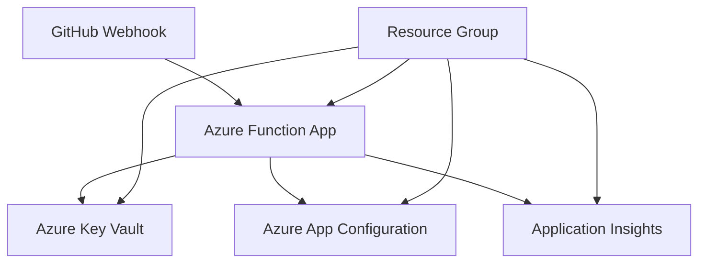

# Azure Deployment Guide

This guide explains how to deploy the Merge Warden Azure Function using the artifacts provided in GitHub releases.

## Overview

The Merge Warden Azure Function is distributed as a pre-built deployment package that can be deployed to Azure Functions using infrastructure-as-code tools like Terraform. This approach separates application code from infrastructure configuration, allowing you to maintain your own deployment infrastructure while using the official Merge Warden binaries.

## Architecture

The Azure deployment consists of several components:



### Required Azure Resources

1. **Resource Group** - Container for all resources
2. **App Service Plan** - Linux Consumption Plan (Y1 SKU)
3. **Function App** - Linux-based with custom handler runtime
4. **Storage Account** - Required by Azure Functions for state management
5. **Key Vault** - Stores sensitive secrets (GitHub App credentials)
6. **App Configuration** - Centralized configuration management
7. **Application Insights** - Monitoring and logging

## Prerequisites

Before deploying, ensure you have:

1. **Azure Subscription** with appropriate permissions
2. **GitHub App** configured for your repositories
3. **Terraform** (version >= 1.5) or other infrastructure deployment tools
4. **Azure CLI** for authentication and deployment

### Required Azure Permissions

Your service principal or user account needs the following permissions:

- `Contributor` role on the target resource group
- `Key Vault Administrator` role for Key Vault operations
- `App Configuration Data Owner` role for App Configuration

## Deployment Steps

### Step 1: Download Artifacts

Download the latest release artifacts from the [GitHub releases page](https://github.com/pvandervelde/merge_warden/releases):

- `az_handler` - The Azure Function binary executable
- `az_handler.sha256` - Checksum for integrity verification

Verify the binary integrity:

```bash
sha256sum -c az_handler.sha256
```

**Important**: The release contains only the compiled binary. You must provide your own configuration files (`host.json` and `function.json`) based on the samples provided in the repository.

### Step 2: Set Up Infrastructure

Use the terraform templates provided in the `samples/terraform/azure/` directory as a starting point. Key configuration variables include:

```hcl
# Environment and naming
variable "environment" {
  description = "Environment name (dev, staging, prod)"
  type        = string
}

variable "location" {
  description = "Azure region"
  type        = string
  default     = "australiaeast"
}

# GitHub App Configuration
variable "github_app_id" {
  description = "GitHub App ID"
  type        = string
}

variable "github_app_private_key" {
  description = "GitHub App private key content"
  type        = string
  sensitive   = true
}

variable "github_webhook_secret" {
  description = "GitHub webhook secret"
  type        = string
  sensitive   = true
}
```

### Step 3: Deploy Infrastructure

```bash
# Initialize terraform
terraform init

# Plan the deployment
terraform plan -var-file="environments/prod.tfvars"

# Apply the infrastructure
terraform apply -var-file="environments/prod.tfvars"
```

### Step 4: Prepare Configuration Files

Before deploying the function code, you need to create the required configuration files based on the samples provided in the repository:

```bash
# Download configuration samples from the repository
curl -O https://raw.githubusercontent.com/pvandervelde/merge_warden/master/samples/host.json
curl -O https://raw.githubusercontent.com/pvandervelde/merge_warden/master/samples/function.json

# Customize the configuration files according to your requirements
# - Edit logging levels in host.json
# - Configure Application Insights if desired
# - Set authentication level in function.json
```

**Required files:**

- `host.json` - Azure Functions runtime configuration (place in root directory)
- `merge_warden/function.json` - HTTP trigger configuration (place in subdirectory)

See the [Azure Functions configuration guide](../../../samples/azure-functions-README.md) for detailed customization instructions.

### Step 5: Deploy Function Code

After infrastructure is provisioned and configuration files are prepared, deploy the function:

```bash
# Extract the resource names from terraform output
RESOURCE_GROUP=$(terraform output -raw resource_group_name)
FUNCTION_APP=$(terraform output -raw function_app_name)

# Create a temporary directory for deployment
mkdir -p temp-deploy/merge_warden

# Copy the function binary (make it executable)
cp az_handler temp-deploy/
chmod +x temp-deploy/az_handler

# Copy your customized configuration files
cp host.json temp-deploy/
cp function.json temp-deploy/merge_warden/function.json
# Create deployment package with your configuration
cd temp-deploy
zip -r ../final-deployment.zip .
cd ..

# Deploy the complete package
az functionapp deployment source config-zip \
  --resource-group $RESOURCE_GROUP \
  --name $FUNCTION_APP \
  --src final-deployment.zip

# Clean up
rm -rf temp-deploy final-deployment.zip
```

### Step 5: Configure GitHub Webhook

1. Get the function URL from the Azure portal or CLI:

   ```bash
   az functionapp function show \
     --resource-group $RESOURCE_GROUP \
     --name $FUNCTION_APP \
     --function-name merge_warden \
     --query "invokeUrlTemplate" -o tsv
   ```

2. Configure the webhook in your GitHub repository:
   - URL: `https://{function-app-name}.azurewebsites.net/api/merge_warden`
   - Content Type: `application/json`
   - Secret: Use the same webhook secret from your terraform variables
   - Events: Select "Pull requests" and "Pull request reviews"

## Configuration

### Azure App Configuration Keys

The function uses Azure App Configuration for centralized settings. Key configuration areas include:

#### Application Settings

- `application:enforce_title_convention` - Enable PR title validation
- `application:require_work_items` - Require work item references

#### Bypass Rules

- `bypass_rules:title:enabled` - Enable title bypass rules
- `bypass_rules:title:users` - JSON array of users who can bypass title rules
- `bypass_rules:work_item:enabled` - Enable work item bypass rules
- `bypass_rules:work_item:users` - JSON array of users who can bypass work item rules

#### PR Size Labeling

- `pr_size:enabled` - Enable automatic PR size labeling
- `pr_size:fail_on_oversized` - Fail checks for oversized PRs
- `pr_size:thresholds:xs` through `pr_size:thresholds:extra_large` - Size thresholds

#### Logging

- `logging:level` - Log level (debug, info, warn, error)
- `logging:rust_log` - Rust-specific logging configuration

### Repository Configuration

Each repository needs a `.github/merge-warden.toml` configuration file. See the [sample configuration](../../samples/merge-warden.sample.toml) for a complete example.

## Monitoring and Troubleshooting

### Application Insights

The function integrates with Application Insights for comprehensive monitoring:

- **Logs**: Function execution logs and application logs
- **Metrics**: Performance counters and custom metrics
- **Traces**: Distributed tracing for request flow
- **Failures**: Exception tracking and error analysis

### Common Issues

1. **Function not receiving webhooks**
   - Verify the webhook URL is correct
   - Check GitHub webhook delivery history
   - Verify the webhook secret matches

2. **Authentication failures**
   - Ensure GitHub App private key is correctly stored in Key Vault
   - Verify App ID and webhook secret are correct
   - Check Key Vault access policies

3. **Configuration not loading**
   - Verify App Configuration endpoint is accessible
   - Check Azure RBAC permissions for the function's managed identity
   - Review function logs for configuration errors

## Security Considerations

1. **Secrets Management**: All sensitive values are stored in Azure Key Vault
2. **Network Security**: Function app can be configured with IP restrictions
3. **Authentication**: Uses GitHub App authentication for API calls
4. **Webhook Verification**: All webhook payloads are cryptographically verified

## Cost Optimization

- **Consumption Plan**: Pay-per-execution pricing model
- **Storage**: Standard LRS storage for function state
- **App Insights**: Pay-per-GB ingestion with data retention limits
- **Key Vault**: Pay-per-operation pricing

Estimated monthly cost for moderate usage (1000 PR events):

- Function App: ~$0.50
- Storage: ~$1.00
- App Insights: ~$2.00
- Key Vault: ~$0.10
- **Total**: ~$3.60/month

## Support

For deployment issues:

1. Check the [troubleshooting section](#monitoring-and-troubleshooting)
2. Review Application Insights logs
3. Consult the [terraform samples](../../samples/terraform/azure/)
4. Open an issue in the [merge_warden repository](https://github.com/pvandervelde/merge_warden/issues)
