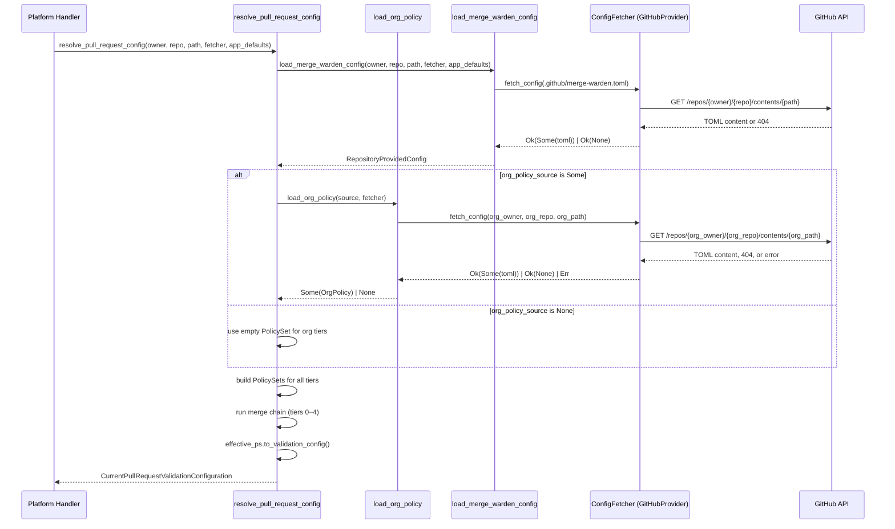

# Org-Level Policy Configuration Architecture

**Version:** 1.0
**Last Updated:** 2026-05-28
**ADR reference:** [ADR-003-org-level-policy.md](../../adr/ADR-003-org-level-policy.md)
**Issue:** #N/A — see task 5.0 in `.llm/tasks.md`

---

## Overview

This document describes the four-tier configuration resolution architecture introduced for
org-level policy enforcement.  It covers the data flow, component boundaries, failure modes,
and the enforcement model.

---

## Four-Tier Configuration Model

```text
Priority (highest → lowest)

┌──────────────────────────────────────────────────────────────────────┐
│  Tier 4 — App-level enforcement                                      │
│  Source: ApplicationDefaults (enable_title_validation etc.)          │
│  Wins unconditionally over every other tier                          │
└──────────────────────────────────────────────────────────────────────┘
        ↑ applied last in merge chain
┌──────────────────────────────────────────────────────────────────────┐
│  Tier 3 — Org-enforced                                               │
│  Source: OrgPolicySource → [enforced] section of org policy TOML    │
│  Wins over repo config and org defaults                              │
└──────────────────────────────────────────────────────────────────────┘
        ↑
┌──────────────────────────────────────────────────────────────────────┐
│  Tier 2 — Repo config                                                │
│  Source: .github/merge-warden.toml in each repository               │
│  Wins over org defaults; overridden by org enforced                  │
└──────────────────────────────────────────────────────────────────────┘
        ↑
┌──────────────────────────────────────────────────────────────────────┐
│  Tier 1 — Org defaults                                               │
│  Source: OrgPolicySource → [defaults] section of org policy TOML    │
│  Wins over app defaults; overridden by repo config                   │
└──────────────────────────────────────────────────────────────────────┘
        ↑
┌──────────────────────────────────────────────────────────────────────┐
│  Tier 0 — Application defaults                                       │
│  Source: ApplicationDefaults (app-config.toml)                       │
│  Lowest priority — used when nothing above specifies a setting       │
└──────────────────────────────────────────────────────────────────────┘
```

---

## Merge Chain

The merge chain uses the existing `PolicySet::merge` semantics: when `a.merge(b)` is called,
`b` wins for non-default values.

```
effective = app_defaults_ps
    .merge(&org_defaults_ps)    // Tier 1 wins over Tier 0
    .merge(&repo_ps)            // Tier 2 wins over Tier 1
    .merge(&org_enforced_ps)    // Tier 3 wins over Tier 2
    .merge(&app_enforced_ps)    // Tier 4 wins over everything
```

When `org_policy_source` is absent from `ApplicationDefaults`, both `org_defaults_ps` and
`org_enforced_ps` are `PolicySet::default()` — which has no effect on the merge result.
The system behaves identically to the previous three-tier system.

---

## Data Flow



---

## Failure Modes

### Absent org policy source

`ApplicationDefaults.org_policy_source` is `None`. The system behaves identically to the
pre-task-5 three-tier system. No log output related to org policy.

### Org policy file not found

`load_org_policy` receives `Ok(None)` from `ConfigFetcher` (HTTP 404 from GitHub).

- Log: `warn!(org_owner, org_repo, org_path, "Org policy file not found; using three-tier config")`
- Behaviour: `OrgPolicy` absent; merge chain proceeds with `PolicySet::default()` for org tiers.

This is a normal condition for orgs that have `org_policy_source` configured but have not yet
created the policy file.

### Org policy file has parse error

`load_org_policy` parses the TOML but it fails validation (bad TOML, wrong `schemaVersion`).

- Log: `warn!(org_owner, org_repo, org_path, error, "Org policy file is invalid; using three-tier config")`
- Behaviour: same as "file not found".

This is likely a misconfiguration that warrants operator attention but should not block PRs.

### Org policy file fetch error

`load_org_policy` receives `Err(...)` from `ConfigFetcher` (network error, GitHub rate-limit,
auth failure).

- Log: `warn!(org_owner, org_repo, org_path, error, "Failed to fetch org policy; using three-tier config")`
- Behaviour: same as "file not found".

### `fail_if_unreachable = true` (strict mode)

When `OrgPolicySource.fail_if_unreachable` is `true`:

- File not found (`Ok(None)`) → `None` returned (treat as absent, not an error).
- Fetch error or parse error → `Err(ConfigLoadError::OrgPolicyUnavailable)` propagated to
  `resolve_pull_request_config`, which returns the error to the platform handler.
- Platform handler returns a non-200 response to GitHub, which retries the webhook.

---

## Component Boundaries

### `OrgPolicySource` (data)

Lives in `ApplicationDefaults`. Contains the coordinates of the org policy file and the
`fail_if_unreachable` flag. Known by: `resolve_pull_request_config`, `load_org_policy`.

### `OrgPolicy` (data)

Two `PolicySet` values: `enforced` and `defaults`. Returned by `load_org_policy`. Never
persisted or cached in this phase.

### `load_org_policy` (function, `crates/core/src/config.rs`)

Responsibility: fetch, parse, and validate the org policy TOML. Returns `Option<OrgPolicy>`.
Knows: `OrgPolicySource`, `ConfigFetcher`. Does: one `fetch_config` call; TOML parse; schema
version check.

### `resolve_pull_request_config` (function, `crates/core/src/config.rs`)

Responsibility: orchestrate the four-tier merge chain. Returns
`Result<CurrentPullRequestValidationConfiguration, ConfigLoadError>`. Platform handlers call
this as the single entry point for all PR config resolution.

### `load_merge_warden_config` (existing function, retained)

Responsibility: fetch and parse the repo-level config; apply `PolicySet` two-tier merge
(app defaults + repo config). Returns `RepositoryProvidedConfig`. The four ad-hoc enforcement
flags are removed from this function — they now live in `resolve_pull_request_config`.

---

## `ApplicationDefaults` Extension

```toml
# app-config.toml — new optional section

[org_policy_source]
owner              = "my-org"
repo               = "platform-configs"
path               = "merge-warden/org-policy.toml"
# fail_if_unreachable = false   # optional; default false
```

When `[org_policy_source]` is absent, `ApplicationDefaults.org_policy_source` is `None` and
the system behaves identically to the previous release.

---

## Org Policy TOML Schema

```toml
schemaVersion = 1

# Settings that CANNOT be overridden by individual repo configs.
[enforced]
# ... same structure as .github/merge-warden.toml [policies] section ...

[enforced.policies.pullRequests.prTitle]
required = true
pattern  = "^(feat|fix|chore|docs|style|refactor|perf|test)(\\([a-z0-9_-]+\\))?!?: .+"

# Settings that CAN be overridden by individual repo configs.
[defaults]
[defaults.policies.pullRequests.workItem]
required = true
pattern  = "#\\d+"
```

Both `[enforced]` and `[defaults]` sections are optional and independently configurable.
Omitting a section is equivalent to an empty `PolicySet::default()` for that tier.
