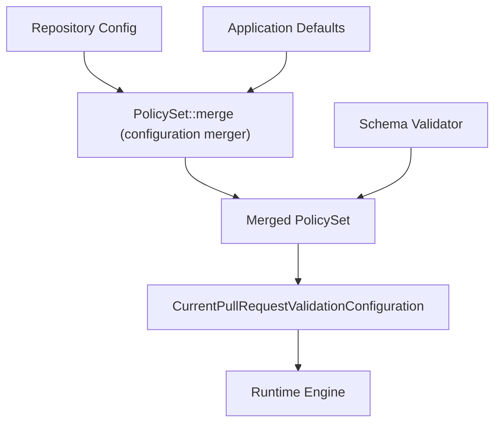
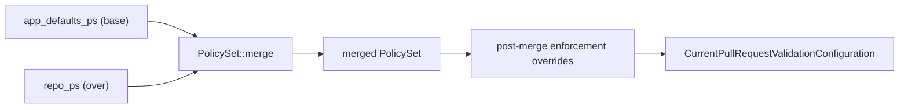

# Configuration System

**Version:** 1.1
**Last Updated:** 2026-05-21

## Overview

The configuration system provides centralized, flexible, and extensible configuration management for Merge Warden across all deployment targets. It supports repository-specific configuration, centralized settings, runtime updates, and comprehensive validation.

## Design Principles

### Configuration as Code

Repository-specific configuration is stored in version control alongside code, enabling configuration changes to be reviewed, tested, and rolled back through standard development workflows.

### Hierarchical Configuration

Configuration is applied in layers with clear precedence rules, enabling both centralized defaults and repository-specific customization.

### Schema Validation

All configuration is validated against a versioned schema to ensure correctness and provide clear error messages for invalid configurations.

### Dynamic Updates

Support for runtime configuration updates without service restarts, enabling operational flexibility and reduced downtime.

## Configuration Architecture



> **Future extension:** When org-level configuration is introduced, two additional tiers feed
> into `PolicySet::merge`: org-level defaults (overriding application defaults) and org-level
> enforced policies (applied last, winning unconditionally).

## Policy Engine

### `PolicySet` — the merge abstraction

All PR validation policies for a single configuration tier are grouped in a `PolicySet`
struct. The 8 constituent configs are:

| Field | Type | Description |
| :--- | :--- | :--- |
| `title` | `PullRequestsTitlePolicyConfig` | Title format, pattern, and missing label |
| `work_item` | `WorkItemPolicyConfig` | Work-item requirement, pattern, and missing label |
| `size` | `PrSizeCheckConfig` | Size thresholds, label prefix, file exclusions |
| `wip` | `WipCheckConfig` | WIP detection patterns and blocking behaviour |
| `pr_state` | `PrStateLabelsConfig` | Draft / review / approved lifecycle labels |
| `issue_propagation` | `IssuePropagationConfig` | Milestone and project propagation settings |
| `change_type_labels` | `ChangeTypeLabelConfig` | Conventional-commit mappings, keyword labels |
| `bypass_rules` | `BypassRules` | Per-rule bypass user lists |
| `renovate_stability` | `RenovateStabilityConfig` | Renovate stability-days label management |

`PolicySet::merge(&self, over: &PolicySet) -> PolicySet` implements "higher-priority `over`
wins for non-default values". Enforcement is achieved by call-site ordering — the enforcing
tier is applied last in the merge chain. See
[ADR-002](../../adr/ADR-002-policy-engine.md) for the full rationale.

### Merge semantics



Per-field merge rules:

| Field type | Rule |
| :--- | :--- |
| Activation `bool` (`required`, `enabled`, `enforce_*`) | `base \|\| over` — once active in either tier, stays active |
| Pattern `String` | `over` wins if non-empty and differs from the type's `default()` value |
| `Option<String>` — optional label | `over.or(base)` |
| `Vec<String>` — label candidates | `over` if non-empty; otherwise `base` |
| Non-activation `bool` | `over` wins unconditionally |
| `HashMap<String, String>` | Per-key: `over` key wins if present |

### Enforcement overrides

Until org-level configuration is supported, four ad-hoc enforcement overrides are applied
after `PolicySet::merge` in `load_merge_warden_config`:

- `app_defaults.enable_title_validation = true` → force `merged.title.required = true`
- `app_defaults.enable_work_item_validation = true` → force `merged.work_item.required = true`
- `app_defaults.pr_size_check.enabled = true` → force `merged.size.enabled = true`
- `app_defaults.wip_check.enforce_wip_blocking = true` → force `merged.wip.enforce_wip_blocking = true`

These will be replaced by the `OrgPolicy.enforced` tier when org-level configuration is introduced.

### Four-tier chain with org-level configuration (planned)

```text
app_defaults_ps
    .merge(&org_defaults_ps)   // org defaults override app defaults
    .merge(&repo_ps)           // repo overrides org defaults
    .merge(&org_enforced_ps)   // org enforced wins unconditionally — applied last
```

Concrete type definitions for `OrgPolicy` are deferred to a future interface spec.

## Configuration Sources

### Repository Configuration

Primary configuration source stored in `.github/merge-warden.toml`:

```toml
schemaVersion = 1

[policies.pullRequests.prTitle]
format = "conventional-commits"
allowed_types = ["feat", "fix", "docs", "chore", "refactor", "test"]

[policies.pullRequests.workItem]
required = true
pattern = "#\\d+"
allowed_prefixes = ["closes", "fixes", "relates to", "references"]

[policies.pullRequests.prSize]
enabled = true
fail_on_oversized = false
size_thresholds = { xs = 10, s = 50, m = 100, l = 250, xl = 500 }

[change_type_labels]
enabled = true
create_if_missing = true

# Override the labels applied automatically based on keywords in the PR title/body.
# All fields are optional; omitted fields use the built-in defaults.
[change_type_labels.keyword_labels]
breaking_change = "breaking-change"   # title contains `!:` or body contains "breaking change"
security = "security"                 # body contains "security" or "vulnerability"
hotfix = "hotfix"                     # body contains "hotfix"
tech_debt = "tech-debt"               # body contains "technical debt" or "tech debt"

[policies.bypassRules.title_convention]
enabled = true
users = ["admin", "release-manager"]

[policies.bypassRules.work_items]
enabled = true
users = ["hotfix-team"]

# Renovate stability-days label management.
# Omit this section to use the built-in defaults (enabled = true,
# label = "pr-validation: pending-stability").
[policies.pullRequests.renovateStability]
enabled = true
pending_stability_label = "pr-validation: pending-stability"
```

> **Note:** All three bypass sub-sections (`title_convention`, `work_items`, `size`) are
> optional. A repo that specifies only one category inherits the server-level defaults
> for the other two. A repo that omits the entire `[policies.bypassRules]` block inherits
> all server-level defaults.

### Azure App Configuration

Centralized configuration for operational settings:

```json
{
  "merge-warden:default:enforce_title_convention": "true",
  "merge-warden:default:require_work_items": "true",
  "merge-warden:bypass:emergency_bypass_enabled": "false",
  "merge-warden:monitoring:telemetry_level": "info"
}
```

### Environment Variables

Platform-specific and security-sensitive configuration:

```bash
# Azure Functions
APP_CONFIG_ENDPOINT=https://merge-warden-config.azconfig.io
MERGE_WARDEN_GITHUB_APP_ID=123456
GITHUB_WEBHOOK_SECRET=secret

# CLI
MERGE_WARDEN_CONFIG_PATH=/path/to/config.toml
GITHUB_TOKEN=ghp_token
```

## Configuration Schema

### Schema Versioning

```rust
#[derive(Debug, Deserialize)]
pub struct MergeWardenConfig {
    #[serde(rename = "schemaVersion")]
    pub schema_version: u32,
    pub policies: Option<Policies>,
    pub change_type_labels: Option<ChangeTypeLabels>,
    pub bypass_rules: Option<BypassRules>,
}
```

### Policy Configuration

```rust
#[derive(Debug, Deserialize)]
pub struct Policies {
    #[serde(rename = "pullRequests")]
    pub pull_requests: PullRequestPolicies,
}

#[derive(Debug, Deserialize)]
pub struct PullRequestPolicies {
    #[serde(rename = "prTitle")]
    pub title: Option<TitlePolicy>,
    #[serde(rename = "workItem")]
    pub work_item: Option<WorkItemPolicy>,
    #[serde(rename = "prSize")]
    pub size: Option<SizePolicy>,
}
```

### Validation Rules

```rust
impl MergeWardenConfig {
    pub fn validate(&self) -> Result<(), ConfigurationError> {
        // Schema version compatibility check
        if self.schema_version < MIN_SUPPORTED_VERSION {
            return Err(ConfigurationError::UnsupportedSchemaVersion(
                self.schema_version
            ));
        }

        // Validate policy configurations
        if let Some(policies) = &self.policies {
            policies.validate()?;
        }

        Ok(())
    }
}
```

## Configuration Loading

### Loading Strategy

```rust
pub struct ConfigurationLoader {
    app_config_client: Option<AppConfigurationClient>,
    cache: Arc<Mutex<ConfigurationCache>>,
}

impl ConfigurationLoader {
    pub async fn load_configuration(
        &self,
        repository: &Repository,
    ) -> Result<MergeWardenConfig, ConfigurationError> {
        // 1. Load repository-specific configuration
        let repo_config = self.load_repository_config(repository).await?;

        // 2. Load centralized defaults
        let default_config = self.load_default_config().await?;

        // 3. Apply environment overrides
        let env_overrides = self.load_environment_overrides();

        // 4. Merge configurations with precedence
        let merged_config = self.merge_configurations(
            repo_config,
            default_config,
            env_overrides,
        )?;

        // 5. Validate final configuration
        merged_config.validate()?;

        Ok(merged_config)
    }
}
```

### Caching Strategy

```rust
pub struct ConfigurationCache {
    entries: HashMap<String, CacheEntry>,
    ttl: Duration,
}

impl ConfigurationCache {
    pub fn get(&self, key: &str) -> Option<&MergeWardenConfig> {
        self.entries.get(key)
            .filter(|entry| !entry.is_expired())
            .map(|entry| &entry.config)
    }

    pub fn put(&mut self, key: String, config: MergeWardenConfig) {
        self.entries.insert(key, CacheEntry {
            config,
            expires_at: Instant::now() + self.ttl,
        });
    }
}
```

## Error Handling

### Configuration Errors

```rust
#[derive(Debug, thiserror::Error)]
pub enum ConfigurationError {
    #[error("Unsupported schema version: {0}")]
    UnsupportedSchemaVersion(u32),

    #[error("Invalid configuration: {0}")]
    ValidationError(String),

    #[error("Failed to load repository configuration: {0}")]
    RepositoryConfigError(String),

    #[error("Failed to load App Configuration: {0}")]
    AppConfigError(String),

    #[error("Configuration merge conflict: {0}")]
    MergeConflict(String),
}
```

### Fallback Behavior

```rust
impl ConfigurationLoader {
    async fn load_with_fallback(
        &self,
        repository: &Repository,
    ) -> MergeWardenConfig {
        match self.load_configuration(repository).await {
            Ok(config) => config,
            Err(e) => {
                log::warn!("Failed to load configuration: {}, using defaults", e);
                self.get_safe_defaults()
            }
        }
    }

    fn get_safe_defaults(&self) -> MergeWardenConfig {
        MergeWardenConfig {
            schema_version: CURRENT_SCHEMA_VERSION,
            policies: Some(Policies::default()),
            change_type_labels: Some(ChangeTypeLabels::default()),
            bypass_rules: None,
        }
    }
}
```

## Testing Strategy

### Unit Tests

- Configuration parsing and validation
- Schema compatibility checks
- Merge logic for multiple configuration sources
- Cache behavior and expiration

### Integration Tests

- Repository configuration loading from GitHub
- Azure App Configuration integration
- Environment variable override behavior
- End-to-end configuration loading workflows

### Configuration Test Cases

```rust
#[cfg(test)]
mod tests {
    use super::*;

    #[test]
    fn test_valid_configuration_parsing() {
        let config_toml = r#"
            schemaVersion = 1

            [policies.pullRequests.prTitle]
            format = "conventional-commits"
        "#;

        let config: MergeWardenConfig = toml::from_str(config_toml).unwrap();
        assert_eq!(config.schema_version, 1);
        config.validate().unwrap();
    }

    #[test]
    fn test_invalid_schema_version() {
        let config = MergeWardenConfig {
            schema_version: 0,
            policies: None,
            change_type_labels: None,
            bypass_rules: None,
        };

        assert!(matches!(
            config.validate(),
            Err(ConfigurationError::UnsupportedSchemaVersion(0))
        ));
    }
}
```

## Migration and Compatibility

### Schema Evolution

```rust
pub const CURRENT_SCHEMA_VERSION: u32 = 1;
pub const MIN_SUPPORTED_VERSION: u32 = 1;

// Future schema migrations
impl MergeWardenConfig {
    pub fn migrate_from_v1_to_v2(mut self) -> Self {
        // Example migration logic
        self.schema_version = 2;
        // ... migration transformations
        self
    }
}
```

### Backward Compatibility

The configuration system maintains backward compatibility for at least two major schema versions, with clear deprecation warnings and migration guidance for users.

## Security Considerations

### Sensitive Data Handling

- Secrets (API keys, tokens) are never stored in repository configuration
- Azure Key Vault integration for secure secret management
- Environment variable validation to prevent accidental secret exposure

### Configuration Validation

- Input sanitization for all configuration values
- Regular expression validation for patterns and formats
- Size limits on configuration files and values

## Configuration Change Validation

When a pull request includes changes to `.github/merge-warden.toml`, Merge Warden validates the
proposed configuration and posts an informational comment on the PR. This gives authors immediate
feedback before a broken config reaches the default branch.

### How It Works

1. During `process_pull_request`, the changed-file list is inspected for `.github/merge-warden.toml`.
2. If the file is present, its content is fetched from the PR head SHA using
   `ConfigFetcher::fetch_config_at_ref` — not from the default branch.
3. The content is validated with `validate_config_content(content: &str) -> ConfigValidationOutcome`.
4. A comment identified by `CONFIG_COMMENT_MARKER` (`<!-- MERGE_WARDEN_CONFIG_CHECK -->`) is
   added, updated, or removed according to the validation result.

### `ConfigValidationOutcome`

```rust
pub struct ConfigValidationOutcome {
    /// Whether the configuration parsed and passed schema validation.
    pub valid: bool,
    /// Human-readable error descriptions when `valid` is false.
    pub errors: Vec<String>,
}
```

### Validation Rules Applied

- The TOML content must be parseable as `RepositoryProvidedConfig`.
- `schema_version` must equal `1` (the only currently supported version).
- Structural constraints enforced by `serde` deserialization (unknown fields, type mismatches).

### Comment Behaviour

| Scenario | Comment action |
|---|---|
| Config is valid, no prior comment | No comment posted |
| Config is valid, prior failure comment exists | Delete prior comment |
| Config is invalid, no prior comment | Post failure comment with error list |
| Config is invalid, prior comment identical | No-op (idempotent) |
| Config is invalid, prior comment differs | Delete old comment; post fresh comment |
| PR no longer touches config file | Delete any existing config comment |

### Non-Blocking Guarantee

The config validation result **does not** influence the commit status check conclusion
(`success`, `neutral`, or `failure`). A PR with an invalid `.github/merge-warden.toml`
can still be merged. The comment exists to surface the problem early, not to gate the PR.

This matches the existing runtime behaviour: if the file is absent or unreadable on the
default branch, Merge Warden falls back to application defaults without blocking anything.

## Repository Scope Filtering

Large GitHub organisations can hit GitHub App install-scope limits that prevent an operator
from selecting individual repositories at installation time — past a certain organisation
size, GitHub only offers "All repositories" as an install option. When that happens, Merge
Warden receives webhooks for every repository in the organisation, including ones it was never
intended to act on.

`repository_scope` lets the operator declare, in application-level configuration, which
repositories Merge Warden should actually process — independent of which repositories the
GitHub App installation can technically reach.

### How Repository Scope Filtering Works

`[policies.repository_scope]` is an optional section of the `ApplicationDefaults` TOML
(loaded via `MERGE_WARDEN_CONFIG_FILE`, same as every other `ApplicationDefaults` field, all of
which live under the file's top-level `[policies]` table):

```toml
[policies.repository_scope]
include_patterns = ["payments-*", "checkout", "billing-?"]
exclude_patterns = ["payments-legacy"]
```

- `include_patterns` — glob patterns (`*` = any sequence, `?` = single character) matched
  case-insensitively against the bare repository name. A repository must match at least one
  entry to be processed.
- `exclude_patterns` — glob patterns that take precedence over `include_patterns`. A
  repository matching an exclude pattern is never processed, even if it also matches an
  include pattern. Defaults to an empty list when the key is omitted.
- Omitting the entire `[policies.repository_scope]` section processes every repository — full
  backward compatibility with deployments that predate this feature.
- Setting `include_patterns = []` explicitly processes no repositories at all; this is a
  deliberate fail-closed "pause everything" lever, independent of `exclude_patterns`.

### Not a `PolicySet` Tier

Repository scope filtering is **not** a policy tier and does not participate in the
`PolicySet::merge` chain described above. It is a binary, app-level gate evaluated once per
event, before any repository-specific configuration (org policy, repo config, conditional
policies) is loaded. An out-of-scope repository never reaches `resolve_pull_request_config`
or any part of the merge chain — see
[event-processing.md](../architecture/event-processing.md#repository-scope-filtering) for the
exact point in the pipeline where the check runs.

### Backward Compatibility for Repository Scope Filtering

Because the section is optional and defaults to "process everything" when absent, deployments
that do not set `repository_scope` see no behavioural change.

### Related Types

See [core-config-validation.md](../interfaces/core-config-validation.md#repository-scope-filtering-additions)
for the `RepositoryScope` struct, the `is_repository_in_scope` matching function, and the
`validate_repository_scope_patterns` startup validator.

## Related Specifications

- [Validation Engine](./validation-engine.md) - How configuration drives validation behavior
- [Operations Configuration Management](../operations/configuration-management.md) - Operational configuration procedures
- [Security Data Protection](../security/data-protection.md) - Secure handling of configuration data
- [Functional Requirements FR-007](../requirements/functional-requirements.md#fr-007-configuration-change-validation) - Acceptance criteria for this feature
