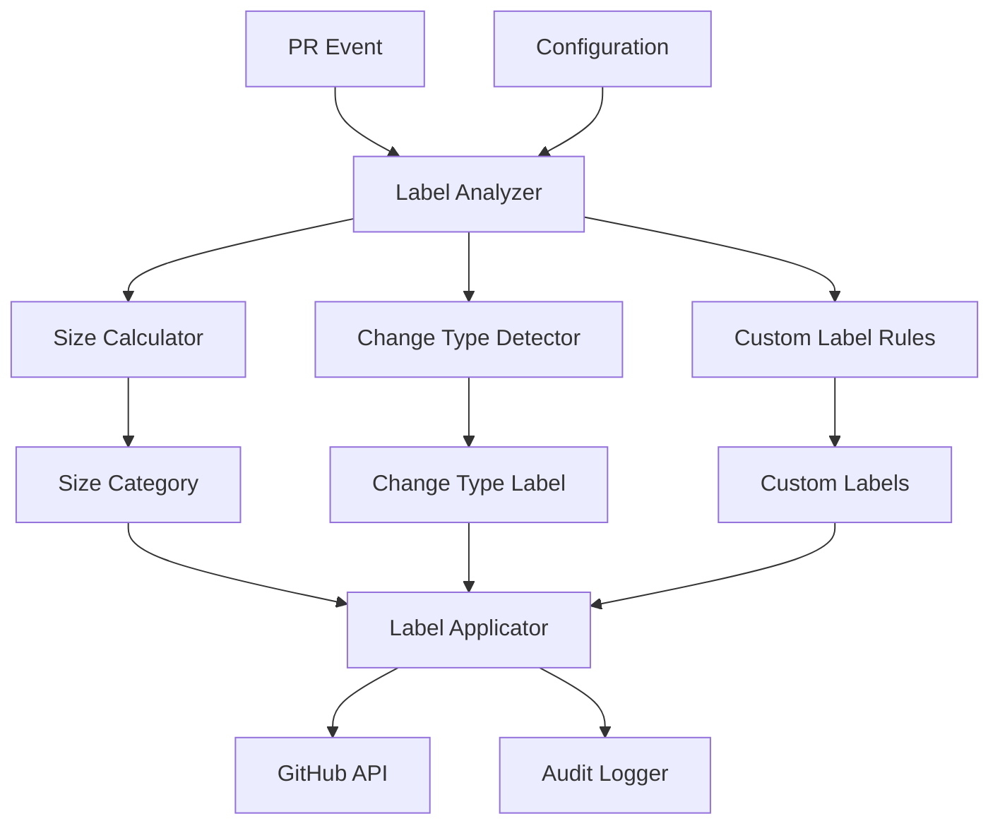
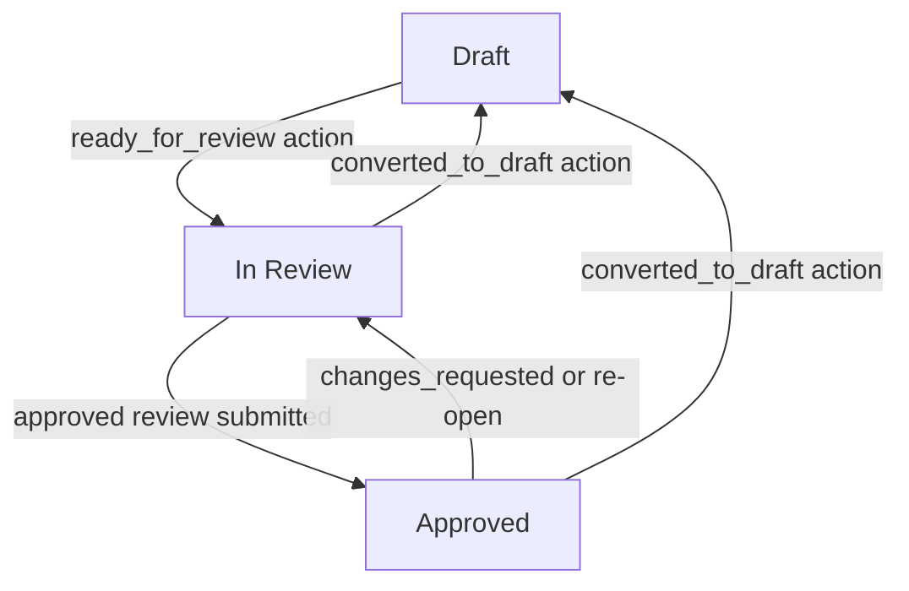

# Labeling System

**Version:** 1.0
**Last Updated:** July 22, 2025

## Overview

The labeling system provides automatic categorization and visual indicators for pull requests based on size, change type, and other characteristics. It helps reviewers quickly assess PRs and enforces project policies through intelligent labeling strategies.

## Design Principles

### Automatic Classification

Labels are applied automatically based on PR content and metadata, reducing manual overhead and ensuring consistency across the repository.

### Visual Communication

Labels provide immediate visual feedback about PR characteristics, helping reviewers prioritize and allocate appropriate time for reviews.

### Configurable Thresholds

Size categories and change type mappings are configurable per repository to accommodate different project needs and review practices.

### Audit and Transparency

All labeling actions are logged and traceable, supporting compliance requirements and operational observability.

## Labeling Architecture



## PR Size Labeling

### Size Categories

Industry-standard size categories based on research showing optimal review effectiveness:

| Label | Size Range | Color | Description | Review Time |
|-------|------------|-------|-------------|-------------|
| `size/XS` | 1-10 lines | `#3CBF00` | Trivial changes | 5-10 minutes |
| `size/S` | 11-50 lines | `#5D9801` | Small changes | 15-30 minutes |
| `size/M` | 51-100 lines | `#A8A800` | Medium changes | 30-60 minutes |
| `size/L` | 101-250 lines | `#DFAB00` | Large changes | 1-2 hours |
| `size/XL` | 251-500 lines | `#FE6D00` | Extra large changes | 2-4 hours |
| `size/XXL` | 500+ lines | `#FE2C01` | Should be split | 4+ hours |

### Size Calculation

```rust
pub struct PullRequestSizeCalculator;

impl PullRequestSizeCalculator {
    pub async fn calculate_size(
        &self,
        pr: &PullRequest,
        github_client: &dyn PullRequestProvider,
    ) -> Result<PrSizeInfo, SizeCalculationError> {
        let files = github_client.get_pull_request_files(
            &pr.repository,
            pr.number,
        ).await?;

        let mut total_additions = 0;
        let mut total_deletions = 0;
        let mut modified_files = 0;
        let mut excluded_files = 0;

        for file in &files {
            if self.should_exclude_file(&file.filename) {
                excluded_files += 1;
                continue;
            }

            total_additions += file.additions;
            total_deletions += file.deletions;
            modified_files += 1;
        }

        Ok(PrSizeInfo {
            total_changes: total_additions + total_deletions,
            additions: total_additions,
            deletions: total_deletions,
            modified_files,
            excluded_files,
            total_files: files.len(),
        })
    }

    fn should_exclude_file(&self, filename: &str) -> bool {
        // Exclude generated files, lock files, etc.
        const EXCLUDED_PATTERNS: &[&str] = &[
            "package-lock.json",
            "yarn.lock",
            "Cargo.lock",
            "poetry.lock",
            ".min.js",
            ".min.css",
            "/dist/",
            "/build/",
            "/__generated__/",
        ];

        EXCLUDED_PATTERNS.iter().any(|pattern| filename.contains(pattern))
    }
}

#[derive(Debug, Clone)]
pub struct PrSizeInfo {
    pub total_changes: u32,
    pub additions: u32,
    pub deletions: u32,
    pub modified_files: usize,
    pub excluded_files: usize,
    pub total_files: usize,
}
```

### Size Categorization

```rust
#[derive(Debug, Clone, PartialEq, Eq)]
pub enum SizeCategory {
    XS,  // 1-10 lines
    S,   // 11-50 lines
    M,   // 51-100 lines
    L,   // 101-250 lines
    XL,  // 251-500 lines
    XXL, // 500+ lines
}

impl SizeCategory {
    pub fn from_line_count(lines: u32, thresholds: &SizeThresholds) -> Self {
        match lines {
            n if n <= thresholds.xs => SizeCategory::XS,
            n if n <= thresholds.s => SizeCategory::S,
            n if n <= thresholds.m => SizeCategory::M,
            n if n <= thresholds.l => SizeCategory::L,
            n if n <= thresholds.xl => SizeCategory::XL,
            _ => SizeCategory::XXL,
        }
    }

    pub fn label(&self) -> &'static str {
        match self {
            SizeCategory::XS => "size/XS",
            SizeCategory::S => "size/S",
            SizeCategory::M => "size/M",
            SizeCategory::L => "size/L",
            SizeCategory::XL => "size/XL",
            SizeCategory::XXL => "size/XXL",
        }
    }

    pub fn color(&self) -> &'static str {
        match self {
            SizeCategory::XS => "#3CBF00",
            SizeCategory::S => "#5D9801",
            SizeCategory::M => "#A8A800",
            SizeCategory::L => "#DFAB00",
            SizeCategory::XL => "#FE6D00",
            SizeCategory::XXL => "#FE2C01",
        }
    }

    pub fn description(&self) -> &'static str {
        match self {
            SizeCategory::XS => "Trivial changes",
            SizeCategory::S => "Small changes",
            SizeCategory::M => "Medium changes",
            SizeCategory::L => "Large changes",
            SizeCategory::XL => "Extra large changes",
            SizeCategory::XXL => "Should be split",
        }
    }

    pub fn should_fail_check(&self, config: &SizePolicy) -> bool {
        config.fail_on_oversized && *self == SizeCategory::XXL
    }
}

#[derive(Debug, Clone, Deserialize)]
pub struct SizeThresholds {
    pub xs: u32,
    pub s: u32,
    pub m: u32,
    pub l: u32,
    pub xl: u32,
}

impl Default for SizeThresholds {
    fn default() -> Self {
        Self {
            xs: 10,
            s: 50,
            m: 100,
            l: 250,
            xl: 500,
        }
    }
}
```

## Change Type Labeling

### Conventional Commit Mapping

```rust
pub struct ChangeTypeLabelManager;

impl ChangeTypeLabelManager {
    pub fn detect_change_type(&self, pr: &PullRequest) -> Option<ChangeType> {
        // Extract type from conventional commit title
        let title = &pr.title;
        let conventional_commit_regex = Regex::new(
            r"^(build|chore|ci|docs|feat|fix|perf|refactor|revert|style|test)(\(.+\))?!?:"
        ).unwrap();

        if let Some(captures) = conventional_commit_regex.captures(title) {
            if let Some(commit_type) = captures.get(1) {
                return ChangeType::from_conventional_commit(commit_type.as_str());
            }
        }

        // Fallback to heuristic detection
        self.detect_from_files_and_description(pr)
    }

    pub async fn apply_change_type_labels(
        &self,
        pr: &PullRequest,
        change_type: ChangeType,
        config: &ChangeTypeLabelsConfig,
        github_client: &dyn PullRequestProvider,
    ) -> Result<(), LabelingError> {
        let labels = self.get_labels_for_change_type(&change_type, config);

        for label in labels {
            // Create label if it doesn't exist
            if config.create_if_missing {
                self.ensure_label_exists(&label, github_client, &pr.repository).await?;
            }

            // Apply label to PR
            github_client.add_label(&pr.repository, pr.number, &label.name).await?;
        }

        Ok(())
    }
}

#[derive(Debug, Clone, PartialEq, Eq)]
pub enum ChangeType {
    Feature,
    BugFix,
    Documentation,
    Chore,
    Refactor,
    Test,
    Performance,
    Style,
    CI,
    Build,
    Revert,
}

impl ChangeType {
    pub fn from_conventional_commit(commit_type: &str) -> Option<Self> {
        match commit_type.to_lowercase().as_str() {
            "feat" => Some(ChangeType::Feature),
            "fix" => Some(ChangeType::BugFix),
            "docs" => Some(ChangeType::Documentation),
            "chore" => Some(ChangeType::Chore),
            "refactor" => Some(ChangeType::Refactor),
            "test" => Some(ChangeType::Test),
            "perf" => Some(ChangeType::Performance),
            "style" => Some(ChangeType::Style),
            "ci" => Some(ChangeType::CI),
            "build" => Some(ChangeType::Build),
            "revert" => Some(ChangeType::Revert),
            _ => None,
        }
    }

    pub fn default_labels(&self) -> Vec<String> {
        match self {
            ChangeType::Feature => vec!["enhancement".to_string(), "feature".to_string()],
            ChangeType::BugFix => vec!["bug".to_string(), "bugfix".to_string()],
            ChangeType::Documentation => vec!["documentation".to_string()],
            ChangeType::Chore => vec!["chore".to_string(), "maintenance".to_string()],
            ChangeType::Refactor => vec!["refactor".to_string()],
            ChangeType::Test => vec!["testing".to_string()],
            ChangeType::Performance => vec!["performance".to_string()],
            ChangeType::Style => vec!["style".to_string()],
            ChangeType::CI => vec!["ci".to_string()],
            ChangeType::Build => vec!["build".to_string()],
            ChangeType::Revert => vec!["revert".to_string()],
        }
    }
}
```

### Configuration

```toml
[change_type_labels]
enabled = true
create_if_missing = true

[change_type_labels.conventional_commit_mappings]
feat = ["enhancement", "feature"]
fix = ["bug", "bugfix"]
docs = ["documentation"]
chore = ["maintenance"]
refactor = ["refactor"]
test = ["testing"]
perf = ["performance"]
style = ["style"]
ci = ["ci"]
build = ["build"]
revert = ["revert"]

[change_type_labels.fallback_label_settings]
name_format = "type: {change_type}"
create_if_missing = true

[change_type_labels.detection_strategy]
exact_match = true
prefix_match = true
description_match = true
```

## Label Management

### Label Applicator

```rust
pub struct LabelApplicator {
    github_client: Arc<dyn PullRequestProvider>,
}

impl LabelApplicator {
    pub async fn apply_size_label(
        &self,
        pr: &PullRequest,
        size_category: SizeCategory,
        config: &SizePolicy,
    ) -> Result<(), LabelingError> {
        // Remove existing size labels
        self.remove_size_labels(pr).await?;

        // Create size label if needed
        let label = Label {
            name: size_category.label().to_string(),
            color: size_category.color().to_string(),
            description: Some(size_category.description().to_string()),
        };

        self.ensure_label_exists(&label, &pr.repository).await?;

        // Apply new size label
        self.github_client.add_label(
            &pr.repository,
            pr.number,
            &label.name,
        ).await?;

        // Log labeling action
        log::info!(
            "Applied size label '{}' to PR #{} ({})",
            label.name,
            pr.number,
            pr.repository.full_name()
        );

        Ok(())
    }

    async fn remove_size_labels(&self, pr: &PullRequest) -> Result<(), LabelingError> {
        let current_labels = self.github_client.get_labels(
            &pr.repository,
            pr.number,
        ).await?;

        for label in current_labels {
            if label.name.starts_with("size/") {
                self.github_client.remove_label(
                    &pr.repository,
                    pr.number,
                    &label.name,
                ).await?;
            }
        }

        Ok(())
    }

    async fn ensure_label_exists(
        &self,
        label: &Label,
        repository: &Repository,
    ) -> Result<(), LabelingError> {
        match self.github_client.get_repository_label(repository, &label.name).await {
            Ok(_) => Ok(()), // Label already exists
            Err(_) => {
                // Create the label
                self.github_client.create_label(repository, label).await
            }
        }
    }
}

#[derive(Debug, Clone)]
pub struct Label {
    pub name: String,
    pub color: String,
    pub description: Option<String>,
}
```

### Intelligent Label Cleanup

```rust
impl LabelApplicator {
    pub async fn cleanup_outdated_labels(
        &self,
        pr: &PullRequest,
        current_change_type: ChangeType,
        config: &ChangeTypeLabelsConfig,
    ) -> Result<(), LabelingError> {
        let current_labels = self.github_client.get_labels(
            &pr.repository,
            pr.number,
        ).await?;

        let expected_labels = self.get_labels_for_change_type(&current_change_type, config);
        let expected_label_names: HashSet<_> = expected_labels.iter()
            .map(|l| &l.name)
            .collect();

        // Remove labels that are no longer relevant
        for label in current_labels {
            if self.is_change_type_label(&label.name, config)
                && !expected_label_names.contains(&label.name)
            {
                self.github_client.remove_label(
                    &pr.repository,
                    pr.number,
                    &label.name,
                ).await?;

                log::info!(
                    "Removed outdated label '{}' from PR #{} ({})",
                    label.name,
                    pr.number,
                    pr.repository.full_name()
                );
            }
        }

        Ok(())
    }
}
```

## Error Handling

### Labeling Errors

```rust
#[derive(Debug, thiserror::Error)]
pub enum LabelingError {
    #[error("GitHub API error: {0}")]
    GitHubApiError(String),

    #[error("Size calculation failed: {0}")]
    SizeCalculationError(#[from] SizeCalculationError),

    #[error("Label creation failed: {0}")]
    LabelCreationError(String),

    #[error("Invalid configuration: {0}")]
    ConfigurationError(String),
}

#[derive(Debug, thiserror::Error)]
pub enum SizeCalculationError {
    #[error("Failed to fetch PR files: {0}")]
    FilesFetchError(String),

    #[error("Invalid file data: {0}")]
    InvalidFileData(String),
}
```

### Fallback Strategies

```rust
impl LabelApplicator {
    pub async fn apply_labels_with_fallback(
        &self,
        pr: &PullRequest,
        size_info: PrSizeInfo,
        change_type: Option<ChangeType>,
        config: &LabelingConfig,
    ) -> Result<LabelingResult, LabelingError> {
        let mut results = LabelingResult::new();

        // Apply size label with fallback
        match self.apply_size_label(pr, size_info.into(), &config.size).await {
            Ok(_) => results.size_label_applied = true,
            Err(e) => {
                log::warn!("Failed to apply size label: {}", e);
                results.errors.push(e.to_string());
            }
        }

        // Apply change type labels with fallback
        if let Some(change_type) = change_type {
            match self.apply_change_type_labels(pr, change_type, &config.change_type).await {
                Ok(_) => results.change_type_labels_applied = true,

                Err(e) => {
                    log::warn!("Failed to apply change type labels: {}", e);
                    results.errors.push(e.to_string());
                }
            }
        }

        Ok(results)
    }
}

#[derive(Debug, Clone)]
pub struct LabelingResult {
    pub size_label_applied: bool,
    pub change_type_labels_applied: bool,
    pub errors: Vec<String>,
}
```

## Testing Strategy

### Unit Testing

- Size calculation logic with various file types
- Change type detection from conventional commits
- Label creation and cleanup logic
- Configuration parsing and validation

### Integration Testing

- End-to-end labeling workflows
- GitHub API integration for label management
- Error handling and recovery scenarios
- Performance with large PRs

### Test Cases

```rust
#[cfg(test)]
mod tests {
    use super::*;

    #[tokio::test]
    async fn test_size_calculation_excludes_generated_files() {
        let calculator = PullRequestSizeCalculator;
        let files = vec![
            PrFile { filename: "src/main.rs".to_string(), additions: 50, deletions: 10 },
            PrFile { filename: "package-lock.json".to_string(), additions: 1000, deletions: 0 },
            PrFile { filename: "dist/app.min.js".to_string(), additions: 500, deletions: 0 },
        ];

        let size_info = calculator.calculate_size_from_files(files);

        assert_eq!(size_info.total_changes, 60); // Only main.rs counted
        assert_eq!(size_info.excluded_files, 2);
    }

    #[test]
    fn test_change_type_detection_from_conventional_commit() {
        let manager = ChangeTypeLabelManager;

        let pr = PullRequest {
            title: "feat(auth): add user authentication".to_string(),
            // ... other fields
        };

        let change_type = manager.detect_change_type(&pr);
        assert_eq!(change_type, Some(ChangeType::Feature));
    }

    #[test]
    fn test_size_categorization_with_custom_thresholds() {
        let thresholds = SizeThresholds {
            xs: 5,
            s: 25,
            m: 75,
            l: 200,
            xl: 400,
        };

        assert_eq!(SizeCategory::from_line_count(3, &thresholds), SizeCategory::XS);
        assert_eq!(SizeCategory::from_line_count(50, &thresholds), SizeCategory::M);
        assert_eq!(SizeCategory::from_line_count(500, &thresholds), SizeCategory::XXL);
    }
}
```

## Performance Considerations

### Caching

- Cache label existence checks to reduce GitHub API calls
- Cache file content analysis for unchanged PRs
- Cache change type detection results

### Batch Operations

- Batch label application/removal operations
- Optimize GitHub API usage to stay within rate limits
- Prioritize critical labeling operations

## Security Considerations

### Input Validation

- Sanitize file names and content before processing
- Validate label names conform to GitHub requirements
- Limit size calculation to prevent resource exhaustion

### Permission Management

- Ensure minimal required permissions for label management
- Audit label creation and modification operations
- Protect against label spam or abuse

## State-Based PR Lifecycle Labels

### Overview

Pull requests move through a well-defined lifecycle: they start as drafts (or open),
progress to ready for review, and finally reach the approved state. State-based lifecycle
labels give reviewers an at-a-glance view of exactly where a PR stands in that journey.

Labels are applied and removed automatically as state transitions happen. Only one state
label is active at a time. State labels are independent of size and WIP labels — they
co-exist without interference.

### PR States and Transitions



| Transition event | Action / review state | Label applied |
| :--- | :--- | :--- |
| PR opened as draft or converted back | `converted_to_draft` | `draft_label` |
| PR opened as ready, reopened, or marked ready | `ready_for_review`, `opened`, `reopened`, `synchronize` | `review_label` |
| Approved review submitted | `pull_request_review` with `state: "approved"` | `approved_label` |

### Re-evaluation Strategy

State labels are re-evaluated on **every** `pull_request` event (all actions) and on every
`pull_request_review` event. This ensures labels are always accurate regardless of the
order events arrive, providing idempotent, eventually-consistent behaviour.

The evaluation logic on each event:

1. Check `pr.draft` — if `true`, the PR is in draft state regardless of reviews.
2. Otherwise call `list_pr_reviews`, then group all reviews by reviewer (taking the **most
   recent review per reviewer** — the API returns reviews oldest-first). A reviewer who first
   approved and later submitted `changes_requested` or was `dismissed` is no longer counted
   as an approver. After deduplication, check whether any reviewer's latest review has
   `state: "approved"`.
3. Apply/replace the label that matches the current state; remove the labels for the other
   two states.

### Configuration Model

```rust
/// Configuration for state-based PR lifecycle labels.
///
/// When enabled, exactly one label from `{draft_label, review_label, approved_label}`
/// is active on the PR at any time. Labels are automatically applied and removed as the
/// PR moves through its lifecycle. Setting any label to `None` disables labeling for
/// that state.
#[derive(Debug, Clone, Serialize, Deserialize, PartialEq, Eq)]
pub struct PrStateLabelsConfig {
    /// Whether lifecycle label management is enabled for this repository.
    #[serde(default = "PrStateLabelsConfig::default_enabled")]
    pub enabled: bool,

    /// Label applied when the PR is in draft state.
    /// Set to `None` (or omit the key) to disable labeling for this state.
    #[serde(default)]
    pub draft_label: Option<String>,

    /// Label applied when the PR is open and awaiting review (not draft, not approved).
    /// Set to `None` (or omit the key) to disable labeling for this state.
    #[serde(default)]
    pub review_label: Option<String>,

    /// Label applied when the PR has at least one approved review and is not a draft.
    /// Set to `None` (or omit the key) to disable labeling for this state.
    #[serde(default)]
    pub approved_label: Option<String>,
}
```

TOML configuration:

```toml
[policies.pullRequests.prState]
# Enable state-based lifecycle label management
enabled = true

# Label applied while the PR is in draft state
draft_label = "status: draft"

# Label applied while the PR is open and awaiting review
review_label = "status: in-review"

# Label applied once the PR has an approved review
approved_label = "status: approved"
```

### Implementation Contract

`manage_pr_state_labels` in `crates/core/src/labels.rs`:

```rust
/// Applies the correct lifecycle label to a pull request and removes stale ones.
///
/// Exactly one of `{draft_label, review_label, approved_label}` is applied.
/// The other two are removed if present. This function is idempotent — calling
/// it multiple times with the same inputs is safe.
///
/// Label operations are skipped when `config.enabled` is `false` or when the
/// label for the target state is `None`.
///
/// # Arguments
///
/// * `provider` - The Git provider implementation
/// * `owner` - Repository owner
/// * `repo` - Repository name
/// * `pr_number` - Pull request number
/// * `is_draft` - Whether the PR is currently a draft
/// * `is_approved` - Whether the PR currently has at least one approved review
/// * `config` - Lifecycle label configuration
pub async fn manage_pr_state_labels<P: PullRequestProvider>(
    provider: &P,
    owner: &str,
    repo: &str,
    pr_number: u64,
    is_draft: bool,
    is_approved: bool,
    config: &PrStateLabelsConfig,
) -> Result<(), MergeWardenError>;
```

### Label Conflict Rules

State labels are orthogonal to all other label categories:

| Label category | Interaction |
| :--- | :--- |
| Size labels (`size/XS` … `size/XXL`) | No interaction. Both can exist simultaneously. |
| WIP label | No interaction. The WIP check blocks merging independently of state. |
| Change-type labels | No interaction. Both can exist simultaneously. |
| Invalid-title / missing-work-item | No interaction. Validation labels are independent. |

### Behavioural Assertions

1. A PR opened as draft receives `draft_label` immediately.
2. When a draft PR is marked ready, `draft_label` is removed and `review_label` is applied.
3. When a PR receives an approved review, `review_label` is removed and `approved_label` is
   applied.
4. When a PR is converted back to draft, `review_label` and `approved_label` are removed and
   `draft_label` is applied.
5. When a PR previously approved receives a `changes_requested` or `dismissed` review, it
   is no longer considered approved and reverts to `review_label`. (A `dismissed` review
   is not an approval; the implementation's per-reviewer latest-review check handles this
   correctly without special-casing.)
6. If `enabled = false`, no lifecycle labels are ever applied or removed.
7. If a specific state label is `None`, no label is applied for that state; labels for the
   other states are still removed normally.
8. All label operations are idempotent — re-processing the same event produces no duplicate
   labels and no spurious removals.
9. State labels coexist with size labels, WIP labels, and change-type labels without conflict.

## Related Specifications

- [Validation Engine](./validation-engine.md) - How labeling integrates with validation rules
- [Configuration System](./configuration-system.md) - Labeling configuration management
- [Platform Integrations](../architecture/platform-integrations.md) - GitHub API integration patterns

## Renovate Stability Label Management

### Overview

When Renovate raises a dependency-update PR, it runs a "stability days" check: the PR
remains in a pending state until the package version has been published for a configured
number of days. Merge Warden reflects this external state with a dedicated label so that
reviewers can see at a glance whether the stability period has elapsed — without the PR
being blocked from merging.

This feature is **observability-only**. It never contributes to the commit-status check
conclusion and never prevents a PR from being merged.

### Trigger Events

The label is re-evaluated in two situations:

1. **`pull_request` events** — on every action that triggers `process_pull_request`
   (opened, synchronize, ready_for_review, etc.), the current HEAD commit is inspected for
   a `renovate/stability-days` status and the label is applied or removed accordingly.

2. **`status` events** — when GitHub fires a `status` webhook whose `context` field equals
   `"renovate/stability-days"`, Merge Warden maps the commit SHA back to open pull requests
   using `find_pull_requests_for_commit` and calls `process_pull_request` for each one.
   The event SHA is used only for routing; the label decision always reads the current HEAD
   status via `get_commit_statuses`.

When the `context` field in a `status` event is absent or does not equal
`"renovate/stability-days"`, the event is a no-op.

### Label Semantics

| Commit status state | Label action |
| :--- | :--- |
| `pending`, `error`, or `failure` | Add `pending_stability_label` (idempotent) |
| `success` | Remove `pending_stability_label` (idempotent) |
| Context absent on HEAD | No-op; label state is left unchanged |

Only the newest status entry per context is used. When multiple entries exist for
`renovate/stability-days` (GitHub returns them newest-first), only the first is read.

### Label Definition

| Property | Value |
| :--- | :--- |
| Default label name | `pr-validation: pending-stability` |
| Colour | `#986ee2` |
| Description | `PR is waiting for Renovate stability period` |

The label is created automatically on first use if it does not exist in the repository,
following the same pattern used by `manage_size_labels`.

### Configuration Model

```rust
/// Configuration for Renovate stability-days label management.
///
/// When enabled, `pr-validation: pending-stability` (or the configured label name)
/// is applied while the `renovate/stability-days` commit status is pending, and
/// removed when the status reaches success.  The label is purely informational —
/// it never influences the merge-blocking check conclusion.
#[derive(Debug, Clone, Serialize, Deserialize, PartialEq, Eq)]
pub struct RenovateStabilityConfig {
    /// Whether Renovate stability label management is enabled.
    ///
    /// Defaults to `true`.
    #[serde(default = "RenovateStabilityConfig::default_enabled")]
    pub enabled: bool,

    /// Label to apply while the stability period has not yet elapsed.
    ///
    /// Defaults to `"pr-validation: pending-stability"`.
    #[serde(default = "RenovateStabilityConfig::default_label")]
    pub pending_stability_label: String,
}
```

TOML configuration:

```toml
[policies.pullRequests.renovateStability]
# Disable if you do not use Renovate or do not want this label
enabled = true

# Override the default label name
pending_stability_label = "pr-validation: pending-stability"
```

### Constants

```rust
/// Context string identifying the Renovate stability check in GitHub commit statuses.
pub const RENOVATE_STABILITY_CHECK_CONTEXT: &str = "renovate/stability-days";

/// Default label name applied while the Renovate stability period has not elapsed.
pub const RENOVATE_STABILITY_LABEL: &str = "pr-validation: pending-stability";
```

### Implementation Contract

`manage_renovate_stability_label` in `crates/core/src/labels.rs`:

```rust
/// Applies or removes the Renovate stability label based on the current HEAD commit status.
///
/// Fetches commit statuses for `head_sha`, filters by `RENOVATE_STABILITY_CHECK_CONTEXT`,
/// and applies or removes `config.pending_stability_label` accordingly.
///
/// This function is a no-op when:
/// - `config.enabled` is `false`
/// - no status entry for `renovate/stability-days` is present on `head_sha`
///
/// Label operations are idempotent: adding a label that is already present and
/// removing a label that is absent are both safe and do not return errors.
///
/// # Arguments
///
/// * `provider`    - The Git provider implementation
/// * `repo_owner`  - Repository owner
/// * `repo_name`   - Repository name
/// * `pr_number`   - Pull request number
/// * `head_sha`    - HEAD commit SHA whose statuses are inspected
/// * `config`      - Renovate stability label configuration
pub async fn manage_renovate_stability_label<P: PullRequestProvider>(
    provider: &P,
    repo_owner: &str,
    repo_name: &str,
    pr_number: u64,
    head_sha: &str,
    config: &RenovateStabilityConfig,
) -> Result<(), MergeWardenError>;
```

The function is called from a private method `communicate_renovate_stability_status` on
`MergeWarden`, which is invoked unconditionally early in `process_pull_request` (after the
PR is fetched, before validation checks begin). Errors are logged at `warn` level and do not
propagate, following the same error-handling pattern as `communicate_pr_state_labels`.

### Pagination Assumption

`get_commit_statuses` fetches the first page of results only (same precedent as
`get_pull_request_files`). Because GitHub returns commit statuses newest-first and Renovate
updates its status in place, the relevant entry is virtually always on the first page. This
assumption is documented and should be revisited if evidence of missed statuses emerges.

### Label Conflict Rules

The Renovate stability label is orthogonal to all other label categories:

| Label category | Interaction |
| :--- | :--- |
| Size labels (`size/XS` ... `size/XXL`) | No interaction. Both can coexist. |
| State labels (`status: draft`, etc.) | No interaction. Both can coexist. |
| WIP label | No interaction. WIP check is independent. |
| Change-type labels | No interaction. Both can coexist. |
| Keyword labels | No interaction. Both can coexist. |

### Behavioural Assertions

1. When the `renovate/stability-days` status is `pending`, `error`, or `failure` on the
   PR's HEAD commit, the `pending_stability_label` is added to the PR.
2. When the `renovate/stability-days` status is `success` on the PR's HEAD commit, the
   `pending_stability_label` is removed from the PR.
3. When no `renovate/stability-days` status exists on the PR's HEAD commit, neither add
   nor remove is performed.
4. When `config.enabled` is `false`, no label operations are performed.
5. All label operations are idempotent — applying an already-present label and removing an
   absent label are both safe.
6. The label is auto-created with colour `#986ee2` if it does not exist in the repository.
7. The Renovate stability label never affects the commit-status check conclusion.
8. A `status` event with `context != "renovate/stability-days"` produces no label changes.
9. When a `status` event fires, the label decision is based on the current HEAD status of
   each associated PR, not on the state embedded in the event payload.

## Keyword Labels

### Overview

Several labels are applied when keyword phrases appear in the PR title or body. Because
natural language frequently negates these phrases ("no breaking change", "doesn't introduce
any security concerns"), the detection logic is negation-aware: a keyword match is only acted
upon when it is **not** preceded by a negation word within the same clause.

Keyword detection runs as part of every `set_pull_request_labels_with_config` invocation.

### Detected Keywords and Labels

| Keyword pattern (regex) | Label applied | Negation-aware? |
| :--- | :--- | :--- |
| `\bbreaking[\s\-]+change\b` | configured `breaking_change` label | Yes (body); No (title `!:` path) |
| `\b(security\|vulnerability)\b` | configured `security` label | Yes |
| `\bhotfix\b` | configured `hotfix` label | Yes |
| `\btech(?:nical)?[\s\-]+debt\b` | configured `tech_debt` label | Yes |

The `!:` (exclamation-colon) conventional commit footer is a deliberate breaking-change
signal and is exempted from negation checking — it always triggers the breaking-change label
regardless of body text.

### Negation Detection

**Algorithm:** `is_keyword_negated(text: &str, keyword_span: Range<usize>) -> bool`

1. Extract the substring of `text` that precedes the keyword span.
2. Find the rightmost clause boundary (`.`, `!`, `?`, `;`, `\n`) in that prefix.
   `!` followed immediately by `[` (a Markdown image link) is **not** treated as a boundary.
3. Tokenise the clause before the keyword using whitespace splits.
4. Take the last 5 tokens (the look-back window).
5. For each token, strip leading/trailing punctuation while preserving `'` and `-`
   (so `"no,"`, `"(no)"`, and `"no:"` all normalise to `"no"`).
6. Return `true` if any stripped token matches an entry in `NEGATION_SINGLE_WORDS`.

**Negation word list (`NEGATION_SINGLE_WORDS`):**

```
no, not, never, without,
don't, dont, doesn't, doesnt, isn't, isnt, aren't, arent, won't, wont
```

"cannot", "neither", and "nor" are **deliberately excluded**: "cannot" is ambiguous
("we cannot wait to add a breaking change" is affirmative), and "neither"/"nor" require
correlative context that a window-based approach cannot reliably evaluate. These may be
added in a future improvement.

**Clause boundary rationale:** Limiting look-back to the current clause prevents a negation
in one sentence from suppressing a keyword in the next sentence. For example:
> "No changes were needed. This introduced a breaking change."
The "No" before the period does not affect the detection of "breaking change" in the
following sentence.

### Comment-Based Label Suppression

Users can permanently suppress a keyword-triggered label by posting a PR comment containing
the following command on its own line:

```
@merge-warden suppress: <label-name>
```

The bot mentions prefix is case-insensitive. Unknown commands are silently ignored.

**Parser:** `parse_suppressed_labels(comments: &[Comment], bot_mention: &str) -> HashMap<String, String>`

Returns a map of `label_name → first_commenter_login`. First-commenter-wins: if two users
suppress the same label, only the first is recorded. Suppression entries are label-scoped —
suppressing `breaking-change` does not affect any other label.

The bot's own explanation comments (identified by `KEYWORD_LABEL_COMMENT_MARKER`) are
excluded from suppression parsing, preventing the sample suppress command embedded in those
comments from being treated as a real command.

**Effect:**

- If a label would be applied **and** is suppressed: it is not applied; any existing
  instance of that label is removed from the PR.
- If a label would not be applied: suppression has no effect.

### Explanation Comments

When a keyword label is applied, the bot posts a per-label explanation comment so the PR
author knows why the label appeared and how to opt out.

**Comment format:** `build_keyword_label_comment(label_name: &str, bot_mention: &str) -> String`

The comment body begins with a unique HTML marker:

```
<!-- MERGE_WARDEN_KEYWORD_LABEL:<label-name> -->
```

The marker is used to locate and manage the comment idempotently across PR re-evaluations.

**Lifecycle (managed per-label on every evaluation):**

| Condition | Action |
| :--- | :--- |
| Label triggered; no prior comment | Post new comment |
| Label triggered; existing comment body identical | No action (idempotent) |
| Label triggered; existing comment body differs | Post fresh comment, then delete stale copies |
| Label not triggered (or suppressed) | Delete all comments with this label's marker |

The lifecycle uses a **post-first-then-delete** approach when replacing stale comments: the
fresh comment is posted before stale copies are removed. This ensures an explanation comment
is never permanently lost due to a transient API failure during deletion.

API failures when posting or deleting explanation comments are logged at `warn!` and do not
propagate — they do not fail the overall label management step.

### `bot_mention` Configuration

The bot mention prefix used in suppress commands defaults to `"@merge-warden"`. It is
configurable at the application level via `ApplicationDefaults.bot_mention` in
`app-config.toml`:

```toml
bot_mention = "@merge-warden"
```

**Repository-level override:** The `bot_mention` field is intentionally not configurable per
repository (it is `#[serde(skip)]` in `RepositoryProvidedConfig`). In a single-tenant
deployment this is never needed; in multi-tenant deployments all repositories share the same
bot identity. If per-repository override is required in the future, the `#[serde(skip)]`
annotation must be replaced with an optional merge that falls back to the application default.

### Behavioural Assertions

1. A keyword match preceded by a negation word within a 5-token, single-clause window does
   not trigger the corresponding label.
2. Punctuation attached to a negation token (`"no,"`, `"(no)"`, `"no:"`) is stripped before
   comparison — these all count as the word `"no"`.
3. A negation word in a prior clause (before `.`, `!`, `?`, `;`, or `\n`) does not
   suppress a keyword in the current clause.
4. `!` immediately followed by `[` (Markdown image link) is not treated as a clause boundary.
5. A user-posted `<bot_mention> suppress: <label>` comment prevents the label from being
   applied (or removes it if already present); the explanation comment is also deleted.
6. The bot's own explanation comment sample text does not self-suppress the label.
7. Explanation comments are idempotent: re-running on an unchanged PR posts no duplicate.
8. Clearing a keyword from the PR title/body causes the explanation comment to be deleted
   on the next evaluation.
9. Each keyword label's comment lifecycle is independent of the others.
10. API failures in comment posting/deletion are non-fatal and do not affect label application.
