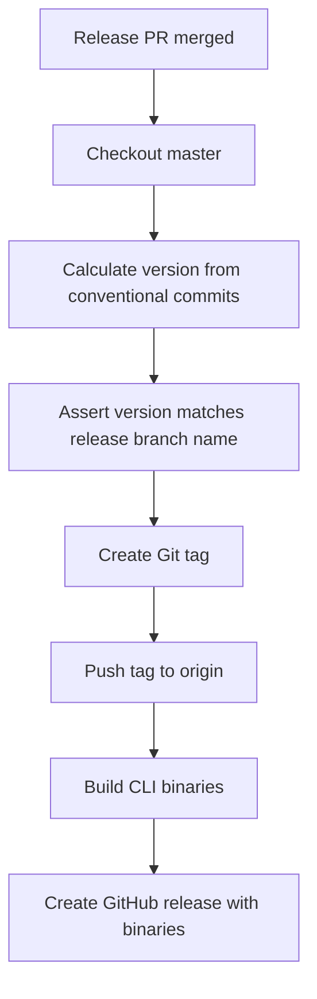

# Release Management

Comprehensive release management strategy for Merge Warden, covering version control, automated release workflows, and deployment coordination across all targets.

## Overview

This document defines the release management processes, automation workflows, and coordination strategies for delivering Merge Warden updates across Azure Functions, CLI distributions, and future deployment targets. It encompasses version control, changelog generation, release automation, and quality assurance procedures.

## Release Strategy

### Semantic Versioning

Merge Warden follows [Semantic Versioning 2.0.0](https://semver.org/) with the following interpretation:

**Version Format:** `MAJOR.MINOR.PATCH`

- **MAJOR**: Breaking changes to public APIs or configuration schema
- **MINOR**: New features and functionality (backward compatible)
- **PATCH**: Bug fixes and minor improvements (backward compatible)

**Pre-release Versions:**

- **Alpha**: `1.2.3-alpha.1` - Early development builds
- **Beta**: `1.2.3-beta.1` - Feature-complete pre-releases
- **Release Candidate**: `1.2.3-rc.1` - Final testing before release

### Release Cadence

**Regular Releases:**

- **Major releases**: Quarterly (as needed for breaking changes)
- **Minor releases**: Monthly (new features and enhancements)
- **Patch releases**: Bi-weekly or as needed (bug fixes)

**Emergency Releases:**

- **Hotfixes**: As needed for critical security or stability issues
- **Security patches**: Immediate for security vulnerabilities

## Version Management

### Centralized Versioning

**Workspace Configuration:**

```toml
# Root Cargo.toml
[workspace]
members = ["crates/*"]

[workspace.package]
version = "1.2.3"
edition = "2021"

[workspace.dependencies]
# Shared dependencies
```

**Crate Configuration:**

```toml
# crates/*/Cargo.toml
[package]
name = "merge-warden-core"
version.workspace = true
edition.workspace = true
```

### Version Calculation

**Conventional Commits Integration:**

- `feat:` commits trigger MINOR version bump
- `fix:` commits trigger PATCH version bump
- `BREAKING CHANGE:` footer triggers MAJOR version bump
- Other commit types (docs, style, etc.) don't affect version

**Tools:**

- **release-regent**: Version calculation, changelog generation, and release PR creation
- **conventional commits**: Commit message convention driving version bumps

## Automated Release Workflows

### Release Preparation Workflow

**Trigger:** Push to `master` branch (handled by release-regent GitHub App)

Release PR creation and manifest version updates are managed by [release-regent](https://github.com/pvandervelde/release_regent), configured in `release-regent.toml` at the repository root.

**Process:**

```mermaid
graph TD
    A[Push to master] --> B{release-regent}
    B --> C[Calculate next version via conventional commits]
    C --> D[Update workspace.package.version in Cargo.toml]
    D --> E[Generate changelog section]
    E --> F[Create/update release branch release/{version}]
    F --> G[Create/update release PR]
```

**Key configuration** (`release-regent.toml`):

- `version_prefix = ""` — tags use bare version numbers, e.g. `0.5.0`
- `tag_pattern = "[0-9]*"` — matches existing tag format
- `manifest_files` — explicitly targets `workspace.package.version` in root `Cargo.toml`
- `[releases]` section omitted — GitHub release creation is handled by `publish-release.yml`

### Release Publication Workflow

**Trigger:** Release PR merged to `master` (branch pattern `release/*`)

**Process:**



**Implementation:** `.github/workflows/publish-release.yml`

Tags use bare version numbers (no `v` prefix), e.g. `0.5.0`, matching `version_prefix = ""` in `release-regent.toml`.

## Release Coordination

### Multi-Target Deployment

**Deployment Sequence:**

1. **Tag Creation**: Automated via release workflow
2. **Azure Functions**: Triggered by tag push
3. **CLI Binaries**: Built and published to GitHub Releases
4. **Container Images**: Updated and pushed to registry
5. **Documentation**: Updated and deployed

**Coordination Workflow:**

```yaml
name: Coordinated Deployment
on:
  push:
    tags: ['v*']

jobs:
  deploy-azure-functions:
    uses: ./.github/workflows/deploy-azure-functions.yml
    with:
      version: ${{ github.ref_name }}

  build-cli-binaries:
    uses: ./.github/workflows/build-cli.yml
    with:
      version: ${{ github.ref_name }}

  update-documentation:
    uses: ./.github/workflows/update-docs.yml
    with:
      version: ${{ github.ref_name }}
```

### Release Validation

**Pre-release Checks:**

- Automated test suite execution
- Security vulnerability scanning
- Performance regression testing
- Documentation validation

**Post-release Validation:**

- Deployment health checks
- Integration testing with real repositories
- Performance monitoring
- User acceptance validation

## Changelog Management

### Release Notes Structure

**Standard Format:**

```markdown
## [1.2.3] - 2025-07-22

### Features
- Add support for custom validation rules
- Implement repository-specific configuration overrides

### Bug Fixes
- Fix issue with large pull request processing
- Resolve configuration loading timeout

### Documentation
- Update deployment guide
- Add troubleshooting section

### Performance
- Optimize webhook processing pipeline
- Reduce memory usage in CLI operations
```

## Hotfix Management

### Emergency Release Process

**Hotfix Workflow:**

1. **Create hotfix branch** from latest release tag
2. **Apply minimal fix** with thorough testing
3. **Create hotfix PR** with expedited review
4. **Emergency release** with patch version bump
5. **Backport to master** if applicable

**Hotfix Branch Strategy:**

```bash
# Create hotfix branch from release tag
git checkout v1.2.3
git checkout -b hotfix/v1.2.4

# Apply fix and test
git commit -m "fix: critical security vulnerability"

# Create emergency release
git tag v1.2.4
git push origin v1.2.4

# Backport to master
git checkout master
git cherry-pick <hotfix-commit>
```

### Security Patches

**Security Release Process:**

1. **Private disclosure** and assessment
2. **Coordinated fix development**
3. **Security advisory preparation**
4. **Expedited release and disclosure**
5. **User notification and guidance**

## Release Quality Assurance

### Testing Strategy

**Pre-release Testing:**

- Unit test execution (100% pass rate required)
- Integration test validation
- End-to-end scenario testing
- Performance regression testing
- Security vulnerability scanning

**Release Candidate Process:**

- Release candidate deployment to staging
- Extended testing period (48-72 hours)
- Community feedback collection
- Performance monitoring and analysis

### Release Criteria

**Release Gates:**

- All automated tests passing
- Security scan clean results
- Performance benchmarks met
- Documentation updated
- Breaking changes documented

**Quality Metrics:**

- Test coverage ≥ 90%
- No critical or high severity security issues
- Performance within 5% of previous release
- Documentation completeness score ≥ 95%

## Rollback Procedures

### Release Rollback

**Automated Rollback Triggers:**

- Critical bug discovery within 24 hours
- Security vulnerability exploitation
- Performance degradation > 20%
- High error rates (> 5%)

**Rollback Process:**

1. **Immediate action**: Revert to previous stable version
2. **Communication**: Notify users and stakeholders
3. **Investigation**: Root cause analysis
4. **Resolution**: Fix development and testing
5. **Re-release**: Updated version with fixes

### Version Management During Rollback

**Tag Management:**

- Rolled-back versions marked as deprecated
- Clear communication about version status
- Updated release notes with rollback information

## Release Communication

### Stakeholder Notification

**Release Announcements:**

- GitHub release notes
- Repository README updates
- Documentation site updates
- Email notifications (for major releases)

**Breaking Change Communication:**

- Migration guides for breaking changes
- Deprecation notices with timelines
- Compatibility matrices
- Support for previous versions

### Community Engagement

**Pre-release Communication:**

- Beta release announcements
- Feature previews and demos
- Community feedback collection
- Documentation updates

**Post-release Follow-up:**

- Usage analytics review
- Community feedback analysis
- Issue tracking and resolution
- Performance monitoring

## Related Documents

- **[Deployment](./deployment.md)**: Deployment procedures and coordination
- **[Configuration Management](./configuration-management.md)**: Configuration versioning
- **[Monitoring](./monitoring.md)**: Release monitoring and health checks
- **[Testing](../testing/README.md)**: Release testing strategies
