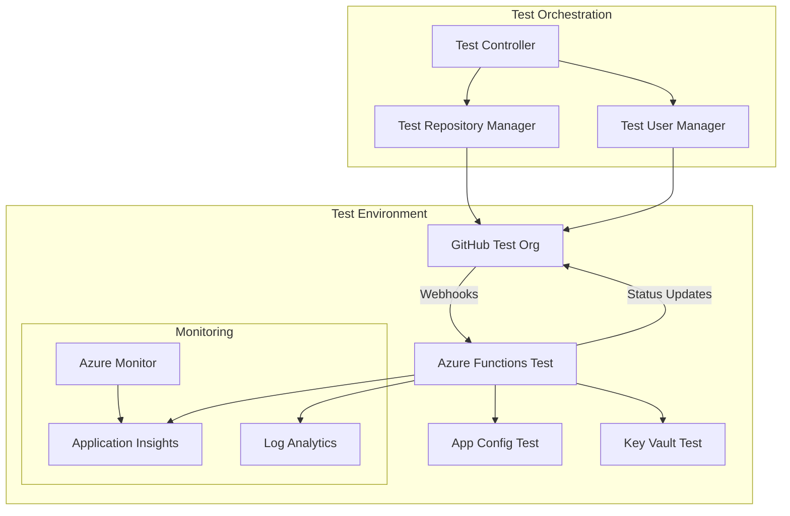

# End-to-End Testing

Comprehensive end-to-end testing strategy for Merge Warden to validate complete system functionality in production-like environments with real GitHub repositories and external service integrations.

## Overview

End-to-end testing validates the entire Merge Warden system from webhook receipt through final action completion, ensuring all components work together correctly in realistic production scenarios. These tests complement integration testing by validating the complete user experience and system behavior.

## Testing Strategy

### E2E Testing Principles

**Production-Like Environment:**

- Real GitHub repositories and organizations
- Actual Azure services (App Config, Key Vault, Functions)
- Production deployment configurations
- Realistic data volumes and scenarios

**User Journey Validation:**

- Complete pull request lifecycle testing
- Multi-user collaboration scenarios
- Complex configuration change workflows
- Error recovery and edge case handling

**System Health Verification:**

- Performance under realistic load
- Monitoring and alerting validation
- Deployment and rollback procedures
- Security and compliance verification

## Test Environment Architecture

### Production Mirror Environment

**Infrastructure Components:**



**Environment Configuration:**

```yaml
# e2e-test-environment.yml
environment:
  name: "merge-warden-e2e"
  type: "production-mirror"

azure:
  subscription: "test-subscription-id"
  resource_group: "merge-warden-e2e-rg"
  location: "East US"

  functions:
    name: "merge-warden-e2e-func"
    plan: "Y1"
    runtime: "dotnet"

  app_config:
    name: "merge-warden-e2e-config"
    sku: "free"

  key_vault:
    name: "merge-warden-e2e-kv"
    sku: "standard"

github:
  organization: "merge-warden-e2e-org"
  app_id: "${GITHUB_E2E_APP_ID}"
  webhook_secret: "${GITHUB_E2E_WEBHOOK_SECRET}"

monitoring:
  application_insights: "merge-warden-e2e-ai"
  log_analytics: "merge-warden-e2e-logs"
```

### Test Data Management

**Repository Templates:**

```rust
pub struct RepositoryTemplate {
    pub name: String,
    pub description: String,
    pub files: Vec<TemplateFile>,
    pub configuration: MergeWardenConfig,
    pub branch_protection: BranchProtectionConfig,
}

impl RepositoryTemplate {
    pub fn simple_project() -> Self {
        Self {
            name: "simple-project".to_string(),
            description: "Simple project for basic E2E testing".to_string(),
            files: vec![
                TemplateFile {
                    path: "README.md".to_string(),
                    content: include_str!("../test-templates/simple-readme.md").to_string(),
                },
                TemplateFile {
                    path: "src/main.rs".to_string(),
                    content: include_str!("../test-templates/simple-main.rs").to_string(),
                },
                TemplateFile {
                    path: ".github/merge-warden.toml".to_string(),
                    content: include_str!("../test-templates/simple-config.toml").to_string(),
                },
            ],
            configuration: MergeWardenConfig::simple(),
            branch_protection: BranchProtectionConfig::standard(),
        }
    }

    pub fn complex_enterprise_project() -> Self {
        Self {
            name: "enterprise-project".to_string(),
            description: "Complex enterprise project for advanced E2E testing".to_string(),
            files: vec![
                TemplateFile {
                    path: "README.md".to_string(),
                    content: include_str!("../test-templates/enterprise-readme.md").to_string(),
                },
                TemplateFile {
                    path: ".github/merge-warden.toml".to_string(),
                    content: include_str!("../test-templates/enterprise-config.toml").to_string(),
                },
                TemplateFile {
                    path: "docs/CONTRIBUTING.md".to_string(),
                    content: include_str!("../test-templates/contributing.md").to_string(),
                },
            ],
            configuration: MergeWardenConfig::enterprise(),
            branch_protection: BranchProtectionConfig::strict(),
        }
    }
}
```

## End-to-End Test Scenarios

### Basic Pull Request Workflow

**Standard PR Lifecycle Test:**

```rust
#[tokio::test]
async fn test_complete_pull_request_lifecycle() {
    let test_env = E2ETestEnvironment::setup().await.unwrap();

    // Setup: Create repository from template
    let repo = test_env
        .create_repository_from_template(RepositoryTemplate::simple_project())
        .await
        .unwrap();

    // Test scenario: Developer creates a feature branch and PR
    let developer = test_env.create_test_user("developer-alice").await.unwrap();

    // Create feature branch
    let feature_branch = developer
        .create_branch(&repo, "feature/user-authentication", "main")
        .await
        .unwrap();

    // Add changes to feature branch
    developer
        .commit_changes(&repo, &feature_branch, vec![
            FileChange {
                path: "src/auth.rs".to_string(),
                content: include_str!("../test-data/auth-implementation.rs").to_string(),
                action: FileAction::Add,
            },
            FileChange {
                path: "tests/auth_tests.rs".to_string(),
                content: include_str!("../test-data/auth-tests.rs").to_string(),
                action: FileAction::Add,
            },
        ])
        .await
        .unwrap();

    // Create pull request
    let pr = developer
        .create_pull_request(&repo, &PullRequestRequest {
            title: "feat: implement user authentication system".to_string(),
            body: "This PR implements the user authentication system.\n\n- Adds login/logout functionality\n- Implements JWT token validation\n- Adds comprehensive test coverage\n\nCloses #42".to_string(),
            head: feature_branch.name.clone(),
            base: "main".to_string(),
        })
        .await
        .unwrap();

    // Wait for Merge Warden processing
    test_env.wait_for_webhook_processing(&repo, &pr, Duration::from_secs(30)).await.unwrap();

    // Verify Merge Warden actions
    let pr_state = test_env.get_pull_request_state(&repo, pr.number).await.unwrap();

    // Check labels were applied
    assert!(pr_state.labels.iter().any(|l| l.name.starts_with("size/")));
    assert!(pr_state.labels.iter().any(|l| l.name == "type: feature"));

    // Check status checks
    assert!(pr_state.checks.iter().any(|c| c.name == "merge-warden"));
    let merge_warden_check = pr_state.checks.iter()
        .find(|c| c.name == "merge-warden")
        .unwrap();
    assert_eq!(merge_warden_check.conclusion, Some("success".to_string()));

    // Check comments
    assert!(pr_state.comments.iter().any(|c|
        c.user.login == "merge-warden[bot]" &&
        c.body.contains("Pull request validation completed successfully")
    ));

    // Test approval workflow
    let reviewer = test_env.create_test_user("reviewer-bob").await.unwrap();
    reviewer
        .create_pull_request_review(&repo, pr.number, &ReviewRequest {
            event: "APPROVE".to_string(),
            body: Some("LGTM! Great implementation.".to_string()),
        })
        .await
        .unwrap();

    // Wait for review processing
    test_env.wait_for_webhook_processing(&repo, &pr, Duration::from_secs(10)).await.unwrap();

    // Verify merge readiness
    let updated_pr_state = test_env.get_pull_request_state(&repo, pr.number).await.unwrap();
    assert!(updated_pr_state.mergeable.unwrap_or(false));

    // Perform merge
    developer
        .merge_pull_request(&repo, pr.number, &MergeRequest {
            commit_title: None,
            commit_message: None,
            merge_method: "squash".to_string(),
        })
        .await
        .unwrap();

    // Verify final state
    let final_pr_state = test_env.get_pull_request_state(&repo, pr.number).await.unwrap();
    assert_eq!(final_pr_state.state, "closed");
    assert!(final_pr_state.merged.unwrap_or(false));

    // Cleanup
    test_env.cleanup().await.unwrap();
}
```

### Configuration Management Scenarios

**Dynamic Configuration Update Test:**

```rust
#[tokio::test]
async fn test_configuration_hot_reload() {
    let test_env = E2ETestEnvironment::setup().await.unwrap();
    let repo = test_env
        .create_repository_from_template(RepositoryTemplate::simple_project())
        .await
        .unwrap();

    let admin = test_env.create_test_user("admin-charlie").await.unwrap();

    // Initial configuration test
    let pr1 = admin
        .create_test_pull_request(&repo, &PullRequestSpec {
            title: "invalid title format".to_string(),
            body: "Test PR".to_string(),
            ..Default::default()
        })
        .await
        .unwrap();

    test_env.wait_for_webhook_processing(&repo, &pr1, Duration::from_secs(30)).await.unwrap();

    let pr1_state = test_env.get_pull_request_state(&repo, pr1.number).await.unwrap();
    let initial_check = pr1_state.checks.iter()
        .find(|c| c.name == "merge-warden")
        .unwrap();
    assert_eq!(initial_check.conclusion, Some("failure".to_string()));

    // Update configuration to be more permissive
    admin
        .update_file(&repo, ".github/merge-warden.toml", r#"
            schemaVersion = 1

            [policies.pullRequests.prTitle]
            format = "freeform"

            [policies.pullRequests.prBody]
            requireWorkItemReference = false
        "#)
        .await
        .unwrap();

    // Wait for configuration to propagate
    tokio::time::sleep(Duration::from_secs(60)).await;

    // Test with new configuration
    let pr2 = admin
        .create_test_pull_request(&repo, &PullRequestSpec {
            title: "another invalid title format".to_string(),
            body: "Test PR with new config".to_string(),
            ..Default::default()
        })
        .await
        .unwrap();

    test_env.wait_for_webhook_processing(&repo, &pr2, Duration::from_secs(30)).await.unwrap();

    let pr2_state = test_env.get_pull_request_state(&repo, pr2.number).await.unwrap();
    let updated_check = pr2_state.checks.iter()
        .find(|c| c.name == "merge-warden")
        .unwrap();
    assert_eq!(updated_check.conclusion, Some("success".to_string()));

    // Re-trigger validation on first PR to verify configuration update
    admin
        .add_comment_to_pr(&repo, pr1.number, "@merge-warden re-validate")
        .await
        .unwrap();

    test_env.wait_for_webhook_processing(&repo, &pr1, Duration::from_secs(30)).await.unwrap();

    let retriggered_pr1_state = test_env.get_pull_request_state(&repo, pr1.number).await.unwrap();
    let retriggered_check = retriggered_pr1_state.checks.iter()
        .find(|c| c.name == "merge-warden")
        .unwrap();
    assert_eq!(retriggered_check.conclusion, Some("success".to_string()));

    test_env.cleanup().await.unwrap();
}
```

### Error Handling and Recovery

**Service Outage Recovery Test:**

```rust
#[tokio::test]
async fn test_service_outage_recovery_workflow() {
    let test_env = E2ETestEnvironment::setup().await.unwrap();
    let repo = test_env
        .create_repository_from_template(RepositoryTemplate::simple_project())
        .await
        .unwrap();

    let developer = test_env.create_test_user("developer-dave").await.unwrap();

    // Simulate Azure App Config outage
    test_env.simulate_service_outage("app-config").await;

    // Create PR during outage
    let pr = developer
        .create_test_pull_request(&repo, &PullRequestSpec {
            title: "feat: implement during outage".to_string(),
            body: "Testing resilience during service outage".to_string(),
            ..Default::default()
        })
        .await
        .unwrap();

    // Wait for processing attempt
    test_env.wait_for_webhook_processing(&repo, &pr, Duration::from_secs(30)).await.unwrap();

    // Verify fallback behavior
    let outage_pr_state = test_env.get_pull_request_state(&repo, pr.number).await.unwrap();
    let outage_check = outage_pr_state.checks.iter()
        .find(|c| c.name == "merge-warden")
        .unwrap();

    // Should still process with default configuration
    assert!(outage_check.conclusion.is_some());

    // Should have comment indicating service issues
    assert!(outage_pr_state.comments.iter().any(|c|
        c.user.login == "merge-warden[bot]" &&
        c.body.contains("configuration service unavailable")
    ));

    // Restore service
    test_env.restore_service("app-config").await;

    // Wait for service restoration
    tokio::time::sleep(Duration::from_secs(60)).await;

    // Create another PR to verify normal operation
    let pr2 = developer
        .create_test_pull_request(&repo, &PullRequestSpec {
            title: "feat: implement after recovery".to_string(),
            body: "Testing after service recovery".to_string(),
            ..Default::default()
        })
        .await
        .unwrap();

    test_env.wait_for_webhook_processing(&repo, &pr2, Duration::from_secs(30)).await.unwrap();

    let recovery_pr_state = test_env.get_pull_request_state(&repo, pr2.number).await.unwrap();

    // Should process normally without fallback messages
    assert!(!recovery_pr_state.comments.iter().any(|c|
        c.user.login == "merge-warden[bot]" &&
        c.body.contains("configuration service unavailable")
    ));

    test_env.cleanup().await.unwrap();
}
```

### Performance and Scale Testing

**High Volume Processing Test:**

```rust
#[tokio::test]
async fn test_high_volume_pull_request_processing() {
    let test_env = E2ETestEnvironment::setup().await.unwrap();
    let repo = test_env
        .create_repository_from_template(RepositoryTemplate::simple_project())
        .await
        .unwrap();

    // Create multiple test users
    let users: Vec<_> = futures::future::try_join_all(
        (0..5).map(|i| test_env.create_test_user(&format!("developer-{}", i)))
    ).await.unwrap();

    // Create PRs concurrently
    let pr_creation_tasks: Vec<_> = users.iter().enumerate().map(|(i, user)| {
        let repo = repo.clone();
        let user = user.clone();
        async move {
            let prs = futures::future::try_join_all(
                (0..4).map(|j| {
                    let repo = repo.clone();
                    let user = user.clone();
                    async move {
                        user.create_test_pull_request(&repo, &PullRequestSpec {
                            title: format!("feat: feature {} from user {}", j, i),
                            body: format!("Implementation of feature {} by user {}", j, i),
                            source_branch: format!("feature-{}-{}", i, j),
                            target_branch: "main".to_string(),
                            files: vec![FileChange {
                                path: format!("src/feature_{}_{}.rs", i, j),
                                content: format!("// Feature {} by user {}", j, i),
                                action: FileAction::Add,
                            }],
                        }).await
                    }
                })
            ).await?;
            Ok::<Vec<PullRequest>, TestError>(prs)
        }
    }).collect();

    let all_prs: Vec<Vec<PullRequest>> = futures::future::try_join_all(pr_creation_tasks).await.unwrap();
    let flat_prs: Vec<&PullRequest> = all_prs.iter().flatten().collect();

    println!("Created {} PRs, waiting for processing...", flat_prs.len());

    // Wait for all processing to complete
    let processing_futures: Vec<_> = flat_prs.iter().map(|pr| {
        test_env.wait_for_webhook_processing(&repo, pr, Duration::from_secs(60))
    }).collect();

    futures::future::try_join_all(processing_futures).await.unwrap();

    // Verify all PRs were processed successfully
    let mut success_count = 0;
    let mut total_processing_time = Duration::ZERO;

    for pr in &flat_prs {
        let pr_state = test_env.get_pull_request_state(&repo, pr.number).await.unwrap();

        if let Some(check) = pr_state.checks.iter().find(|c| c.name == "merge-warden") {
            if check.conclusion.is_some() {
                success_count += 1;
            }

            if let (Some(started_at), Some(completed_at)) = (&check.started_at, &check.completed_at) {
                let processing_time = completed_at.signed_duration_since(*started_at);
                total_processing_time += processing_time.to_std().unwrap_or(Duration::ZERO);
            }
        }
    }

    // Performance assertions
    assert_eq!(success_count, flat_prs.len(), "All PRs should be processed successfully");

    let avg_processing_time = total_processing_time / flat_prs.len() as u32;
    assert!(avg_processing_time < Duration::from_secs(15), "Average processing time should be under 15 seconds");

    println!("Successfully processed {} PRs with average time {:?}", success_count, avg_processing_time);

    test_env.cleanup().await.unwrap();
}
```

### Security and Compliance Testing

**Permission and Access Control Test:**

```rust
#[tokio::test]
async fn test_security_and_access_controls() {
    let test_env = E2ETestEnvironment::setup().await.unwrap();
    let repo = test_env
        .create_repository_from_template(RepositoryTemplate::enterprise_project())
        .await
        .unwrap();

    // Create users with different permission levels
    let admin = test_env.create_test_user_with_role("admin-alice", "admin").await.unwrap();
    let maintainer = test_env.create_test_user_with_role("maintainer-bob", "maintain").await.unwrap();
    let contributor = test_env.create_test_user_with_role("contributor-charlie", "write").await.unwrap();
    let external = test_env.create_test_user_with_role("external-dave", "read").await.unwrap();

    // Test bypass capabilities for admins
    let admin_pr = admin
        .create_test_pull_request(&repo, &PullRequestSpec {
            title: "invalid title",
            body: "No work item reference",
            ..Default::default()
        })
        .await
        .unwrap();

    admin
        .add_comment_to_pr(&repo, admin_pr.number, "@merge-warden bypass validation")
        .await
        .unwrap();

    test_env.wait_for_webhook_processing(&repo, &admin_pr, Duration::from_secs(30)).await.unwrap();

    let admin_pr_state = test_env.get_pull_request_state(&repo, admin_pr.number).await.unwrap();
    let admin_check = admin_pr_state.checks.iter()
        .find(|c| c.name == "merge-warden")
        .unwrap();
    assert_eq!(admin_check.conclusion, Some("success".to_string()));
    assert!(admin_pr_state.comments.iter().any(|c|
        c.body.contains("Validation bypassed by administrator")
    ));

    // Test bypass denial for non-admins
    let contributor_pr = contributor
        .create_test_pull_request(&repo, &PullRequestSpec {
            title: "invalid title",
            body: "No work item reference",
            ..Default::default()
        })
        .await
        .unwrap();

    contributor
        .add_comment_to_pr(&repo, contributor_pr.number, "@merge-warden bypass validation")
        .await
        .unwrap();

    test_env.wait_for_webhook_processing(&repo, &contributor_pr, Duration::from_secs(30)).await.unwrap();

    let contributor_pr_state = test_env.get_pull_request_state(&repo, contributor_pr.number).await.unwrap();
    let contributor_check = contributor_pr_state.checks.iter()
        .find(|c| c.name == "merge-warden")
        .unwrap();
    assert_eq!(contributor_check.conclusion, Some("failure".to_string()));
    assert!(contributor_pr_state.comments.iter().any(|c|
        c.body.contains("Insufficient permissions to bypass validation")
    ));

    // Test audit trail
    let audit_logs = test_env.get_audit_logs(&repo, Duration::from_secs(300)).await.unwrap();
    assert!(audit_logs.iter().any(|log|
        log.action == "validation_bypassed" &&
        log.actor == admin.login &&
        log.target_type == "pull_request" &&
        log.target_id == admin_pr.number.to_string()
    ));

    test_env.cleanup().await.unwrap();
}
```

## Monitoring and Observability Validation

### Application Performance Monitoring

**APM Integration Test:**

```rust
#[tokio::test]
async fn test_application_performance_monitoring() {
    let test_env = E2ETestEnvironment::setup().await.unwrap();
    let repo = test_env
        .create_repository_from_template(RepositoryTemplate::simple_project())
        .await
        .unwrap();

    let developer = test_env.create_test_user("developer-eve").await.unwrap();

    // Create PR to generate telemetry
    let pr = developer
        .create_test_pull_request(&repo, &PullRequestSpec {
            title: "feat: implement telemetry test".to_string(),
            body: "Testing telemetry and monitoring".to_string(),
            ..Default::default()
        })
        .await
        .unwrap();

    test_env.wait_for_webhook_processing(&repo, &pr, Duration::from_secs(30)).await.unwrap();

    // Wait for telemetry to propagate
    tokio::time::sleep(Duration::from_secs(120)).await;

    // Verify telemetry data
    let telemetry = test_env.get_application_insights_data(Duration::from_minutes(5)).await.unwrap();

    // Check request telemetry
    assert!(telemetry.requests.iter().any(|r|
        r.name == "webhook-processing" &&
        r.success == true &&
        r.response_code == "200"
    ));

    // Check dependency telemetry
    assert!(telemetry.dependencies.iter().any(|d|
        d.type_name == "GitHub API" &&
        d.target.contains("api.github.com")
    ));

    // Check custom events
    assert!(telemetry.custom_events.iter().any(|e|
        e.name == "pull_request_validated" &&
        e.properties.get("repository").unwrap() == &repo.full_name
    ));

    // Check performance counters
    assert!(telemetry.performance_counters.iter().any(|p|
        p.category == "webhook_processing_time" &&
        p.counter == "average_duration_ms" &&
        p.value < 15000.0 // Less than 15 seconds
    ));

    test_env.cleanup().await.unwrap();
}
```

### Alert and Notification Testing

**Alert System Validation:**

```rust
#[tokio::test]
async fn test_monitoring_alerts_and_notifications() {
    let test_env = E2ETestEnvironment::setup().await.unwrap();
    let repo = test_env
        .create_repository_from_template(RepositoryTemplate::simple_project())
        .await
        .unwrap();

    // Simulate high error rate scenario
    let developer = test_env.create_test_user("developer-frank").await.unwrap();

    // Create multiple PRs with configuration that will cause errors
    test_env.update_app_config("invalid-github-token", "invalid-token-value").await;

    let error_prs = futures::future::try_join_all(
        (0..5).map(|i| {
            let repo = repo.clone();
            let developer = developer.clone();
            async move {
                developer.create_test_pull_request(&repo, &PullRequestSpec {
                    title: format!("feat: error test {}", i),
                    body: "Testing error conditions".to_string(),
                    ..Default::default()
                }).await
            }
        })
    ).await.unwrap();

    // Wait for processing attempts
    tokio::time::sleep(Duration::from_secs(60)).await;

    // Check that alerts were triggered
    let alerts = test_env.get_azure_monitor_alerts(Duration::from_minutes(5)).await.unwrap();
    assert!(alerts.iter().any(|a|
        a.alert_rule == "high_error_rate" &&
        a.severity == "Warning" &&
        a.state == "Fired"
    ));

    // Restore valid configuration
    test_env.restore_app_config("invalid-github-token").await;

    // Wait for alert resolution
    tokio::time::sleep(Duration::from_secs(120)).await;

    let resolved_alerts = test_env.get_azure_monitor_alerts(Duration::from_minutes(2)).await.unwrap();
    assert!(resolved_alerts.iter().any(|a|
        a.alert_rule == "high_error_rate" &&
        a.state == "Resolved"
    ));

    test_env.cleanup().await.unwrap();
}
```

## Deployment and Release Testing

### Blue-Green Deployment Validation

**Zero-Downtime Deployment Test:**

```rust
#[tokio::test]
async fn test_zero_downtime_deployment() {
    let test_env = E2ETestEnvironment::setup().await.unwrap();
    let repo = test_env
        .create_repository_from_template(RepositoryTemplate::simple_project())
        .await
        .unwrap();

    let developer = test_env.create_test_user("developer-grace").await.unwrap();

    // Start continuous PR creation during deployment
    let continuous_pr_task = tokio::spawn(async move {
        let mut pr_count = 0;
        let mut successful_processing = 0;

        while pr_count < 20 {
            let pr = developer.create_test_pull_request(&repo, &PullRequestSpec {
                title: format!("feat: continuous test {}", pr_count),
                body: "Testing during deployment".to_string(),
                ..Default::default()
            }).await.unwrap();

            // Wait for processing
            if test_env.wait_for_webhook_processing(&repo, &pr, Duration::from_secs(30)).await.is_ok() {
                let pr_state = test_env.get_pull_request_state(&repo, pr.number).await.unwrap();
                if pr_state.checks.iter().any(|c| c.name == "merge-warden" && c.conclusion.is_some()) {
                    successful_processing += 1;
                }
            }

            pr_count += 1;
            tokio::time::sleep(Duration::from_secs(10)).await;
        }

        (pr_count, successful_processing)
    });

    // Trigger deployment after some PRs are created
    tokio::time::sleep(Duration::from_secs(60)).await;

    let deployment_result = test_env.trigger_blue_green_deployment(&DeploymentConfig {
        version: "v1.1.0".to_string(),
        health_check_timeout: Duration::from_secs(120),
        rollback_on_failure: true,
    }).await.unwrap();

    assert!(deployment_result.success);
    assert!(deployment_result.downtime < Duration::from_secs(5));

    // Wait for continuous testing to complete
    let (total_prs, successful_prs) = continuous_pr_task.await.unwrap();

    // Verify high success rate during deployment
    let success_rate = successful_prs as f64 / total_prs as f64;
    assert!(success_rate > 0.9, "Success rate during deployment should be > 90%, got {:.2}%", success_rate * 100.0);

    test_env.cleanup().await.unwrap();
}
```

## Test Environment Management

### Infrastructure as Code Validation

**Environment Provisioning Test:**

```rust
#[tokio::test]
async fn test_environment_provisioning_and_configuration() {
    // Test the complete environment setup process
    let provisioning_config = EnvironmentProvisioningConfig {
        environment_name: "e2e-test-provision".to_string(),
        region: "East US".to_string(),
        github_org: "merge-warden-test-org".to_string(),
        monitoring_enabled: true,
    };

    // Provision environment
    let provision_result = provision_test_environment(&provisioning_config).await.unwrap();
    assert!(provision_result.success);
    assert!(provision_result.azure_resources.len() >= 4); // Functions, App Config, Key Vault, App Insights

    // Verify resource configuration
    let function_app = provision_result.azure_resources.iter()
        .find(|r| r.resource_type == "Microsoft.Web/sites")
        .unwrap();

    let app_config = provision_result.azure_resources.iter()
        .find(|r| r.resource_type == "Microsoft.AppConfiguration/configurationStores")
        .unwrap();

    // Test connectivity between resources
    let connectivity_test = test_resource_connectivity(&function_app, &app_config).await.unwrap();
    assert!(connectivity_test.success);

    // Test GitHub App configuration
    let github_integration = test_github_integration(&provision_result.github_app_config).await.unwrap();
    assert!(github_integration.webhook_delivery_works);
    assert!(github_integration.permissions_correct);

    // Cleanup provisioned resources
    let cleanup_result = cleanup_test_environment(&provision_result.environment_id).await.unwrap();
    assert!(cleanup_result.success);
    assert_eq!(cleanup_result.remaining_resources.len(), 0);
}
```

## Quality Gates and Success Criteria

### E2E Testing Acceptance Criteria

**Functional Requirements:**

- [ ] Complete pull request lifecycle processes correctly from creation to merge
- [ ] Configuration changes are detected and applied within 60 seconds
- [ ] Error conditions are handled gracefully with appropriate user feedback
- [ ] Security controls (bypass permissions, audit trails) work correctly
- [ ] Performance meets SLA requirements (< 15 seconds processing time)

**Reliability Requirements:**

- [ ] 99.5% success rate across all test scenarios
- [ ] Zero data loss during service outages or deployments
- [ ] Graceful degradation when external services are unavailable
- [ ] Complete recovery after service restoration

**Performance Requirements:**

- [ ] Webhook processing completes within 15 seconds under normal load
- [ ] System handles 50+ concurrent PRs without degradation
- [ ] Deployment downtime is less than 5 seconds
- [ ] Alert response time is less than 2 minutes for critical issues

**Monitoring and Observability:**

- [ ] All user actions are properly logged and auditable
- [ ] Performance metrics are collected and accessible
- [ ] Alerts fire correctly for error conditions
- [ ] Dashboards show accurate real-time system status

## Related Documents

- **[Integration Testing](./integration-testing.md)**: Component integration validation
- **[Performance Testing](./performance-testing.md)**: Load and performance validation
- **[Unit Testing](./unit-testing.md)**: Foundation testing for individual components
- **[Deployment](../operations/deployment.md)**: Deployment procedures and infrastructure
- **[Monitoring](../operations/monitoring.md)**: Monitoring and observability requirements

## Behavioral Assertions

1. End-to-end tests must validate complete pull request workflows from creation through merge completion
2. Configuration changes must be detected and applied to new pull requests within 60 seconds of commit
3. Service outage scenarios must demonstrate graceful degradation and complete recovery capabilities
4. Security controls must prevent unauthorized bypass attempts and maintain complete audit trails
5. Performance tests must validate 15-second webhook processing under realistic load conditions
6. Deployment procedures must maintain 99.9% availability during blue-green deployments
7. Monitoring systems must generate alerts within 2 minutes of detecting error rate thresholds
8. Error scenarios must provide clear, actionable feedback to users through GitHub interfaces
9. Resource cleanup must remove 100% of test infrastructure without manual intervention
10. Cross-service integration must maintain data consistency across GitHub, Azure App Config, and Key Vault
