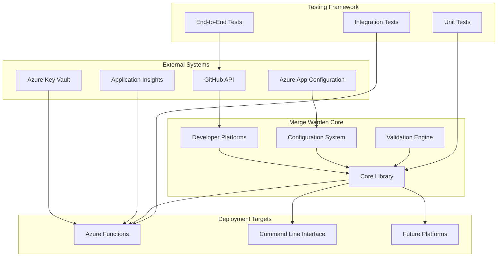
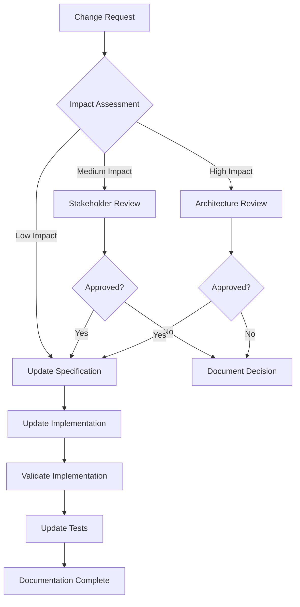

# Merge Warden Specification

**Version:** 1.0
**Last Updated:** July 20, 2025
**Status:** Living Document

## Overview

Merge Warden is a comprehensive pull request validation and governance system designed to enforce repository policies, improve code quality, and streamline development workflows. It operates as a GitHub App that automatically validates pull requests against configurable rules and provides detailed feedback to developers.

### Purpose and Goals

**Primary Goal**: Ensure all pull requests provide sufficient information for future developers to understand the changes, their rationale, and their impact on the system.

**Key Objectives**:

- **Quality Assurance**: Enforce conventional commit standards and require work item references
- **Process Automation**: Automate labeling, size assessment, and milestone synchronization
- **Governance**: Provide audit trails and bypass mechanisms for exceptional cases
- **Developer Experience**: Offer clear, actionable feedback and multiple deployment options
- **Maintainability**: Create a robust, testable, and extensible system architecture

### System Capabilities

- **Multi-Platform Deployment**: Azure Functions, CLI, and future cloud platforms
- **Configurable Validation Rules**: Title format, work item references, PR size limits
- **Intelligent Labeling**: Automatic size labeling and change type classification
- **Audit and Compliance**: Comprehensive logging and bypass tracking
- **Integration Testing**: End-to-end validation with real GitHub repositories
- **Centralized Configuration**: Azure App Configuration integration for dynamic updates

## Architecture Overview

## Specification Structure

This specification is organized into six main sections, each containing detailed documentation for specific aspects of the system:

### 📐 [Architecture](./architecture/README.md)

System design, component interactions, and deployment architectures.

- [System Overview](./architecture/system-overview.md) - High-level system architecture and data flow
- [Core Components](./architecture/core-components.md) - Core library and business logic design
- [Platform Integrations](./architecture/platform-integrations.md) - Developer platform abstractions
- [Deployment Architectures](./architecture/deployment-architectures.md) - Azure Functions, CLI, and extensibility

### 🎨 [Design](./design/README.md)

Design decisions, patterns, and system behavior specifications.

- [Configuration System](./design/configuration-system.md) - Configuration schema, validation, and lifecycle
- [Validation Engine](./design/validation-engine.md) - PR validation rules and extensibility framework
- [Labeling System](./design/labeling-system.md) - Automatic labeling and categorization
- [Bypass Mechanisms](./design/bypass-mechanisms.md) - Bypass logging, audit trails, and governance

### ⚙️ [Operations](./operations/README.md)

Deployment, monitoring, and operational procedures.

- [Deployment](./operations/deployment.md) - Infrastructure as code and deployment procedures
- [Monitoring](./operations/monitoring.md) - Logging, telemetry, and observability
- [Configuration Management](./operations/configuration-management.md) - Runtime configuration and updates
- [Release Management](./operations/release-management.md) - Release workflows and version management

### 📋 [Requirements](./requirements/README.md)

Functional and non-functional requirements for all system components.

- [Functional Requirements](./requirements/functional-requirements.md) - Core business functionality
- [Platform Requirements](./requirements/platform-requirements.md) - GitHub, Azure, and CLI requirements
- [Performance Requirements](./requirements/performance-requirements.md) - Scalability and reliability
- [Compliance Requirements](./requirements/compliance-requirements.md) - Audit, governance, and regulatory

### 🔒 [Security](./security/README.md)

Security architecture, threat model, and protection mechanisms.

- [Authentication](./security/authentication.md) - GitHub App authentication and token management
- [Authorization](./security/authorization.md) - Permission models and access control
- [Data Protection](./security/data-protection.md) - Secrets management and data handling
- [Threat Model](./security/threat-model.md) - Security threats and mitigation strategies

### 🧪 [Testing](./testing/README.md)

Comprehensive testing strategy and validation approaches.

- [Unit Testing](./testing/unit-testing.md) - Unit test patterns and requirements
- [Integration Testing](./testing/integration-testing.md) - Component integration validation
- [End-to-End Testing](./testing/end-to-end-testing.md) - Full system validation with GitHub
- [Performance Testing](./testing/performance-testing.md) - Load testing and performance validation

## Living Document Process

### Maintenance Philosophy

This specification is a **living document** that evolves with the system. It serves as:

1. **Single Source of Truth**: Authoritative documentation for all system aspects
2. **Implementation Guide**: Detailed specifications for development teams
3. **Validation Framework**: Criteria for testing implementation compliance
4. **Change Management**: Process for evaluating and implementing modifications

### Update Process

### Version Control

- **Major Changes**: Architecture modifications, new deployment targets, breaking changes
- **Minor Changes**: Feature additions, requirement updates, process improvements
- **Patch Changes**: Documentation fixes, clarifications, formatting updates

### Stakeholders

- **Development Team**: Implementation and technical decisions
- **Operations Team**: Deployment and monitoring requirements
- **Security Team**: Security architecture and compliance
- **Product Team**: Business requirements and user experience

## Implementation Tracking

### Specification Validation

Each specification section includes:

- **Acceptance Criteria**: Measurable implementation requirements
- **Test Requirements**: Validation approaches and success metrics
- **Implementation Links**: References to code, issues, and pull requests
- **Compliance Checks**: Automated validation where possible

### Task Generation

Specifications are designed to generate:

- **Implementation Tasks**: Detailed development work items
- **Testing Scenarios**: Automated and manual test cases
- **Documentation Updates**: User-facing documentation requirements
- **Deployment Procedures**: Step-by-step operational guides

## Quick Start Guide

### For Developers

1. Review [System Overview](./architecture/system-overview.md) for high-level understanding
2. Study [Core Components](./architecture/core-components.md) for implementation details
3. Follow [Unit Testing](./testing/unit-testing.md) guidelines for test-driven development

### For Operations

1. Study [Deployment](./operations/deployment.md) for infrastructure requirements
2. Review [Monitoring](./operations/monitoring.md) for observability setup
3. Follow [Configuration Management](./operations/configuration-management.md) for runtime management

### For Security

1. Review [Threat Model](./security/threat-model.md) for security landscape
2. Study [Authentication](./security/authentication.md) for access patterns
3. Follow [Data Protection](./security/data-protection.md) for compliance requirements

## Contributing to the Specification

### Making Changes

1. **Create Feature Branch**: `git checkout -b spec/feature-name`
2. **Update Relevant Sections**: Maintain consistency across related documents
3. **Update This README**: Reflect any structural or major content changes
4. **Add Implementation Tasks**: Link specifications to actionable work items
5. **Review and Validate**: Ensure completeness and consistency

### Review Process

- **Technical Review**: Development team validates implementation feasibility
- **Security Review**: Security team validates security implications
- **Operations Review**: Operations team validates deployment and monitoring impact
- **Approval**: All stakeholders sign off on changes before merge

### Standards

- Use clear, concise language appropriate for technical audiences
- Include diagrams and examples where helpful
- Maintain consistent formatting and structure
- Link related sections and external references
- Version control all changes with clear commit messages

## Contact and Support

For questions about this specification:

- **GitHub Issues**: Use the project issue tracker for bugs and enhancement requests
- **Architecture Decisions**: Tag relevant team members for technical discussions
- **Process Questions**: Refer to the living document update process above

---

## Specification Maintenance

This specification is maintained by the Merge Warden development team and reflects the current state and future direction of the system. Last updated: July 20, 2025
