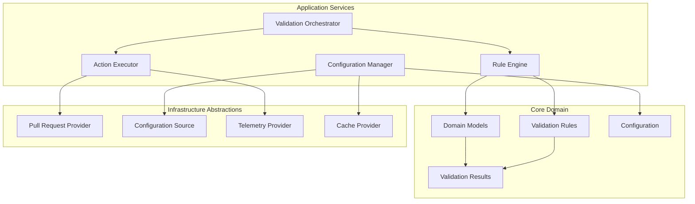

# Core Components

**Version:** 1.0
**Last Updated:** July 20, 2025

## Overview

The core components specification defines the foundational business logic and domain models that power the Merge Warden validation system. These components are platform-agnostic and designed to be shared across all deployment targets (Azure Functions, CLI, future platforms).

## Design Principles

### Platform Independence

Core components contain no cloud-specific code, enabling deployment across multiple platforms without modification.

### Domain-Driven Design

Business logic is organized around domain concepts (Pull Requests, Validation Rules, Configuration) with clear boundaries and responsibilities.

### Dependency Injection

All external dependencies are abstracted through traits, enabling comprehensive testing and platform flexibility.

### Error-First Design

Comprehensive error handling with specific error types and recovery strategies for all failure modes.

## Component Architecture



## Domain Models

### Pull Request Model

```rust
#[derive(Debug, Clone, PartialEq, Eq)]
pub struct PullRequest {
    pub number: u64,
    pub title: String,
    pub body: Option<String>,
    pub state: PullRequestState,
    pub author: User,
    pub repository: Repository,
    pub labels: Vec<Label>,
    pub milestone: Option<Milestone>,
    pub changed_files: u32,
    pub additions: u32,
    pub deletions: u32,
    pub created_at: DateTime<Utc>,
    pub updated_at: DateTime<Utc>,
}

#[derive(Debug, Clone, PartialEq, Eq)]
pub enum PullRequestState {
    Open,
    Closed,
    Merged,
}
```

### Validation Configuration

```rust
#[derive(Debug, Clone, Deserialize)]
pub struct ValidationConfig {
    pub schema_version: u32,
    pub policies: Policies,
    pub bypass_rules: Option<BypassRules>,
    pub labels: LabelConfig,
}

#[derive(Debug, Clone, Deserialize)]
pub struct Policies {
    pub pull_requests: PullRequestPolicies,
}

#[derive(Debug, Clone, Deserialize)]
pub struct PullRequestPolicies {
    pub title: TitlePolicy,
    pub work_item: WorkItemPolicy,
    pub size: SizePolicy,
}
```

### Validation Results

```rust
#[derive(Debug, Clone, PartialEq)]
pub struct ValidationResult {
    pub success: bool,
    pub rule_results: Vec<RuleResult>,
    pub actions: Vec<ValidationAction>,
    pub bypass_info: Option<BypassInfo>,
}

#[derive(Debug, Clone, PartialEq)]
pub struct RuleResult {
    pub rule_name: String,
    pub status: RuleStatus,
    pub message: Option<String>,
    pub severity: Severity,
}

#[derive(Debug, Clone, PartialEq)]
pub enum RuleStatus {
    Passed,
    Failed,
    Warning,
    Bypassed,
    Skipped,
}
```

## Validation Rules Engine

### Rule Interface

All validation rules implement the `ValidationRule` trait:

```rust
#[async_trait]
pub trait ValidationRule: Send + Sync {
    fn name(&self) -> &'static str;
    fn description(&self) -> &'static str;

    async fn validate(
        &self,
        pr: &PullRequest,
        config: &ValidationConfig,
        context: &ValidationContext,
    ) -> Result<RuleResult, ValidationError>;

    fn required_permissions(&self) -> Vec<GitHubPermission>;
}
```

### Built-in Rules

#### Title Validation Rule

```rust
pub struct TitleValidationRule;

impl TitleValidationRule {
    const CONVENTIONAL_COMMITS_PATTERN: &'static str =
        r"^(build|chore|ci|docs|feat|fix|perf|refactor|revert|style|test)(\(.+\))?(!)?: .+";

    fn validate_title(&self, title: &str) -> bool {
        regex::Regex::new(Self::CONVENTIONAL_COMMITS_PATTERN)
            .unwrap()
            .is_match(title)
    }
}
```

#### Work Item Reference Rule

```rust
pub struct WorkItemReferenceRule;

impl WorkItemReferenceRule {
    const WORK_ITEM_PATTERNS: &'static [&'static str] = &[
        r"(?i)(closes?|fixes?|resolves?)\s+#(\d+)",
        r"(?i)(relates?\s+to|references?)\s+#(\d+)",
        r"(?i)(closes?|fixes?|resolves?)\s+\w+/\w+#(\d+)",
    ];

    fn find_work_item_references(&self, body: &str) -> Vec<WorkItemReference> {
        // Implementation to extract work item references
    }
}
```

#### Size Assessment Rule

```rust
pub struct SizeAssessmentRule;

impl SizeAssessmentRule {
    const SIZE_THRESHOLDS: &'static [(u32, &'static str)] = &[
        (10, "XS"),
        (50, "S"),
        (100, "M"),
        (250, "L"),
        (500, "XL"),
        (u32::MAX, "XXL"),
    ];

    fn calculate_size_label(&self, additions: u32, deletions: u32) -> &'static str {
        let total_changes = additions + deletions;
        Self::SIZE_THRESHOLDS
            .iter()
            .find(|(threshold, _)| total_changes <= *threshold)
            .map(|(_, label)| *label)
            .unwrap_or("XXL")
    }
}
```

## Validation Orchestrator

### Main Orchestration Flow

```rust
pub struct ValidationOrchestrator<P, C, T>
where
    P: PullRequestProvider,
    C: ConfigurationProvider,
    T: TelemetryProvider,
{
    rules: Vec<Box<dyn ValidationRule>>,
    pr_provider: P,
    config_provider: C,
    telemetry: T,
}

impl<P, C, T> ValidationOrchestrator<P, C, T>
where
    P: PullRequestProvider,
    C: ConfigurationProvider,
    T: TelemetryProvider,
{
    pub async fn validate_pull_request(
        &self,
        repository: &Repository,
        pr_number: u64,
    ) -> Result<ValidationResult, OrchestrationError> {
        let start_time = Instant::now();

        // Load configuration
        let config = self.config_provider
            .get_configuration(repository)
            .await?;

        // Get PR details
        let pr = self.pr_provider
            .get_pull_request(repository, pr_number)
            .await?;

        // Create validation context
        let context = ValidationContext::new(repository, &config, start_time);

        // Apply validation rules
        let rule_results = self.apply_rules(&pr, &config, &context).await?;

        // Determine actions
        let actions = self.determine_actions(&rule_results, &pr, &config);

        // Check for bypasses
        let bypass_info = self.check_bypasses(&pr, &config, &rule_results).await?;

        // Record telemetry
        self.telemetry.record_validation_completed(
            &context,
            start_time.elapsed(),
            &rule_results,
        ).await;

        Ok(ValidationResult {
            success: rule_results.iter().all(|r| r.status != RuleStatus::Failed),
            rule_results,
            actions,
            bypass_info,
        })
    }
}
```

### Validation Context

```rust
pub struct ValidationContext {
    pub repository: Repository,
    pub config: ValidationConfig,
    pub request_id: String,
    pub timestamp: DateTime<Utc>,
    pub user_permissions: Option<UserPermissions>,
}

impl ValidationContext {
    pub fn new(
        repository: &Repository,
        config: &ValidationConfig,
        start_time: Instant,
    ) -> Self {
        Self {
            repository: repository.clone(),
            config: config.clone(),
            request_id: uuid::Uuid::new_v4().to_string(),
            timestamp: Utc::now(),
            user_permissions: None,
        }
    }
}
```

## Action Execution

### Action Types

```rust
#[derive(Debug, Clone, PartialEq)]
pub enum ValidationAction {
    AddLabel { label: String },
    RemoveLabel { label: String },
    AddComment { template: CommentTemplate, data: CommentData },
    UpdateComment { comment_id: u64, template: CommentTemplate, data: CommentData },
    DeleteComment { comment_id: u64 },
    UpdateCheckStatus { status: CheckStatus, conclusion: CheckConclusion },
    SetMilestone { milestone_id: u64 },
}

#[derive(Debug, Clone, PartialEq)]
pub struct CommentTemplate {
    pub id: String,
    pub template: String,
    pub metadata_marker: String,
}

#[derive(Debug, Clone, PartialEq)]
pub enum CheckStatus {
    Queued,
    InProgress,
    Completed,
}

#[derive(Debug, Clone, PartialEq)]
pub enum CheckConclusion {
    Success,
    Failure,
    Neutral,
    Cancelled,
    TimedOut,
    ActionRequired,
}
```

### Action Executor

```rust
pub struct ActionExecutor<P, T>
where
    P: PullRequestProvider,
    T: TelemetryProvider,
{
    pr_provider: P,
    telemetry: T,
    comment_templates: HashMap<String, CommentTemplate>,
}

impl<P, T> ActionExecutor<P, T>
where
    P: PullRequestProvider,
    T: TelemetryProvider,
{
    pub async fn execute_actions(
        &self,
        pr: &PullRequest,
        actions: Vec<ValidationAction>,
        context: &ValidationContext,
    ) -> Result<ExecutionResult, ExecutionError> {
        let mut results = Vec::new();

        for action in actions {
            let result = match action {
                ValidationAction::AddLabel { label } => {
                    self.pr_provider.add_labels(pr, vec![label.clone()]).await
                        .map(|_| ActionResult::Success { action_type: "add_label".to_string() })
                },
                ValidationAction::AddComment { template, data } => {
                    let rendered = self.render_comment_template(&template, &data)?;
                    self.pr_provider.add_comment(pr, &rendered).await
                        .map(|comment_id| ActionResult::Success {
                            action_type: "add_comment".to_string()
                        })
                },
                // ... other action types
            };

            results.push(result);
        }

        Ok(ExecutionResult { results })
    }
}
```

## Configuration Management

### Configuration Sources

```rust
#[async_trait]
pub trait ConfigurationProvider: Send + Sync {
    async fn get_configuration(
        &self,
        repository: &Repository,
    ) -> Result<ValidationConfig, ConfigurationError>;

    async fn validate_configuration(
        &self,
        config: &ValidationConfig,
    ) -> Result<(), ConfigurationError>;
}

pub struct HierarchicalConfigProvider {
    sources: Vec<Box<dyn ConfigurationSource>>,
    cache: Option<Arc<dyn CacheProvider>>,
}
```

### Configuration Hierarchy

1. **Repository Configuration**: `.github/merge-warden.toml`
2. **Azure App Configuration**: Centralized settings
3. **Environment Variables**: Runtime overrides
4. **Default Configuration**: Built-in fallbacks

```rust
impl ConfigurationProvider for HierarchicalConfigProvider {
    async fn get_configuration(
        &self,
        repository: &Repository,
    ) -> Result<ValidationConfig, ConfigurationError> {
        // Check cache first
        if let Some(cached) = self.get_cached_config(repository).await? {
            return Ok(cached);
        }

        // Load from sources in priority order
        let mut config = ValidationConfig::default();

        for source in &self.sources {
            if let Ok(source_config) = source.load_config(repository).await {
                config = config.merge(source_config)?;
            }
        }

        // Validate merged configuration
        self.validate_configuration(&config).await?;

        // Cache result
        if let Some(cache) = &self.cache {
            cache.store_config(repository, &config, Duration::from_secs(900)).await?;
        }

        Ok(config)
    }
}
```

## Error Handling

### Error Types

```rust
#[derive(Debug, thiserror::Error)]
pub enum ValidationError {
    #[error("Configuration error: {0}")]
    Configuration(#[from] ConfigurationError),

    #[error("Pull request provider error: {0}")]
    PullRequestProvider(#[from] PullRequestProviderError),

    #[error("Rule execution error: {rule_name}: {source}")]
    RuleExecution {
        rule_name: String,
        #[source]
        source: Box<dyn std::error::Error + Send + Sync>,
    },

    #[error("Validation timeout after {duration:?}")]
    Timeout { duration: Duration },

    #[error("Invalid input: {message}")]
    InvalidInput { message: String },
}

#[derive(Debug, thiserror::Error)]
pub enum ConfigurationError {
    #[error("Configuration not found")]
    NotFound,

    #[error("Invalid configuration format: {0}")]
    InvalidFormat(String),

    #[error("Configuration validation failed: {errors:?}")]
    ValidationFailed { errors: Vec<String> },

    #[error("Configuration source unavailable: {source}")]
    SourceUnavailable { source: String },
}
```

### Error Recovery Strategies

```rust
pub struct ErrorRecoveryStrategy {
    max_retries: u32,
    base_delay: Duration,
    max_delay: Duration,
    jitter: bool,
}

impl ErrorRecoveryStrategy {
    pub async fn execute_with_retry<F, T, E>(
        &self,
        operation: F,
    ) -> Result<T, E>
    where
        F: Fn() -> BoxFuture<Result<T, E>>,
        E: std::error::Error + Send + Sync + 'static,
    {
        let mut attempts = 0;
        let mut delay = self.base_delay;

        loop {
            match operation().await {
                Ok(result) => return Ok(result),
                Err(error) if attempts >= self.max_retries => return Err(error),
                Err(error) if self.is_retryable(&error) => {
                    attempts += 1;

                    if self.jitter {
                        delay = self.add_jitter(delay);
                    }

                    tokio::time::sleep(delay).await;
                    delay = std::cmp::min(delay * 2, self.max_delay);
                }
                Err(error) => return Err(error),
            }
        }
    }
}
```

## Performance Considerations

### Async Design

All I/O operations use async/await with proper error handling:

```rust
pub async fn validate_multiple_rules(
    &self,
    pr: &PullRequest,
    config: &ValidationConfig,
    context: &ValidationContext,
) -> Result<Vec<RuleResult>, ValidationError> {
    let rule_futures: Vec<_> = self.rules
        .iter()
        .map(|rule| {
            let pr = pr.clone();
            let config = config.clone();
            let context = context.clone();

            async move {
                timeout(
                    Duration::from_millis(200),
                    rule.validate(&pr, &config, &context)
                ).await
                .map_err(|_| ValidationError::Timeout {
                    duration: Duration::from_millis(200)
                })?
            }
        })
        .collect();

    // Execute rules in parallel with timeout
    let results = join_all(rule_futures).await;

    // Collect successful results, log failures
    Ok(results.into_iter().filter_map(|r| r.ok()).collect())
}
```

### Caching Strategy

```rust
#[async_trait]
pub trait CacheProvider: Send + Sync {
    async fn get<T>(&self, key: &str) -> Result<Option<T>, CacheError>
    where
        T: for<'de> Deserialize<'de> + Send;

    async fn set<T>(&self, key: &str, value: &T, ttl: Duration) -> Result<(), CacheError>
    where
        T: Serialize + Send + Sync;

    async fn invalidate(&self, pattern: &str) -> Result<(), CacheError>;
}

// Cache keys
const CONFIG_CACHE_KEY: &str = "config:repo:{owner}/{name}";
const PR_CACHE_KEY: &str = "pr:{owner}/{name}:{number}";
const ISSUE_CACHE_KEY: &str = "issue:{owner}/{name}:{number}";
```

## Testing Strategy

### Unit Testing

```rust
#[cfg(test)]
mod tests {
    use super::*;
    use mockall::predicate::*;

    #[tokio::test]
    async fn test_title_validation_success() {
        let rule = TitleValidationRule;
        let pr = create_test_pr("feat: add new feature");
        let config = ValidationConfig::default();
        let context = ValidationContext::test_context();

        let result = rule.validate(&pr, &config, &context).await.unwrap();

        assert_eq!(result.status, RuleStatus::Passed);
    }

    #[tokio::test]
    async fn test_orchestrator_with_mocks() {
        let mut mock_provider = MockPullRequestProvider::new();
        mock_provider
            .expect_get_pull_request()
            .with(eq(test_repo()), eq(123))
            .times(1)
            .returning(|_, _| Ok(create_test_pr("feat: test")));

        let orchestrator = ValidationOrchestrator::new(
            vec![Box::new(TitleValidationRule)],
            mock_provider,
            MockConfigurationProvider::new(),
            MockTelemetryProvider::new(),
        );

        let result = orchestrator
            .validate_pull_request(&test_repo(), 123)
            .await
            .unwrap();

        assert!(result.success);
    }
}
```

### Integration Testing

```rust
#[tokio::test]
#[ignore = "integration_test"]
async fn test_end_to_end_validation() {
    let github_client = create_test_github_client().await;
    let test_repo = create_test_repository(&github_client).await;
    let test_pr = create_test_pull_request(&github_client, &test_repo).await;

    let orchestrator = create_production_orchestrator(github_client);

    let result = orchestrator
        .validate_pull_request(&test_repo, test_pr.number)
        .await
        .unwrap();

    // Verify results
    assert!(result.success);
    assert!(!result.actions.is_empty());

    // Cleanup
    cleanup_test_resources(&test_repo, &test_pr).await;
}
```

## Related Documentation

- **[System Overview](./system-overview.md)**: High-level system architecture and data flow
- **[Platform Integrations](./platform-integrations.md)**: GitHub integration and provider abstractions
- **[Design - Validation Engine](../design/validation-engine.md)**: Detailed validation rule design
- **[Testing - Unit Testing](../testing/unit-testing.md)**: Comprehensive unit testing strategies
