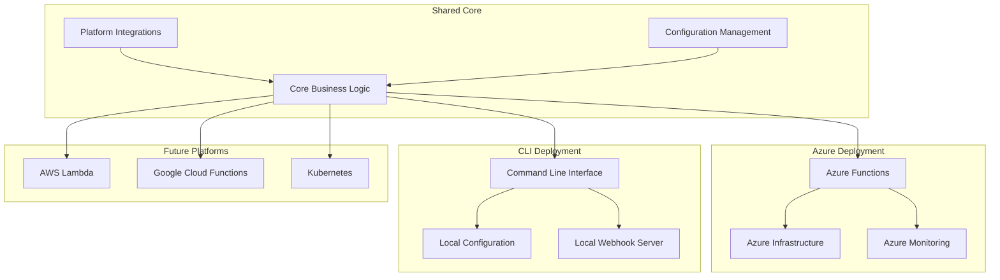
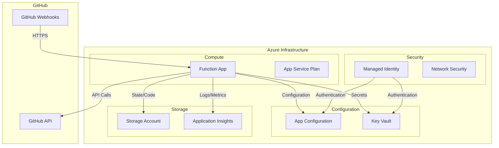
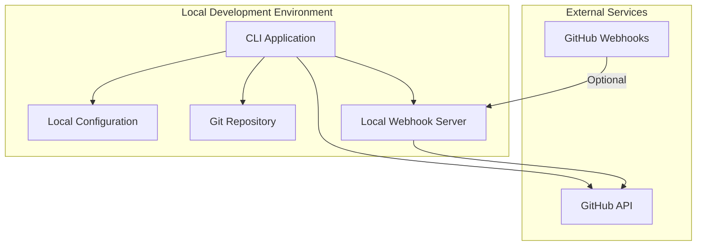

# Deployment Architectures

**Version:** 1.0
**Last Updated:** July 20, 2025

## Overview

This specification defines the deployment architectures for Merge Warden across multiple platforms, focusing on Azure Functions as the primary deployment target, CLI interface for local development and testing, and patterns for future platform support.

## Design Principles

### Platform-Specific Adaptation

Each deployment target optimizes for platform-specific capabilities while maintaining a shared core business logic.

### Resource Efficiency

Deployments are designed for cost-effectiveness and optimal resource utilization on each platform.

### Operational Excellence

Built-in monitoring, logging, and observability for production operations.

### Development Agility

Support for local development, testing, and debugging across all deployment targets.

## Architecture Overview



## Azure Functions Deployment

### Infrastructure Architecture



### Azure Function Implementation

```rust
// Azure Functions entry point
use azure_functions::prelude::*;
use merge_warden_core::{ValidationOrchestrator, Configuration};
use merge_warden_developer_platforms::GitHubProvider;

#[func]
pub async fn webhook_handler(req: HttpRequest) -> HttpResponse {
    // Initialize telemetry context
    let context = TelemetryContext::from_request(&req);
    let _guard = context.enter();

    // Verify webhook signature
    let signature = req.headers()
        .get("X-Hub-Signature-256")
        .and_then(|h| h.to_str().ok())
        .ok_or_else(|| "Missing webhook signature")?;

    let body = req.body().bytes().await?;

    if !verify_webhook_signature(&body, signature).await? {
        return HttpResponse::unauthorized();
    }

    // Parse GitHub event
    let event: GitHubEvent = serde_json::from_slice(&body)
        .map_err(|e| format!("Invalid event payload: {}", e))?;

    match event {
        GitHubEvent::PullRequest(pr_event) => {
            handle_pull_request_event(pr_event).await
        },
        GitHubEvent::PullRequestReview(review_event) => {
            handle_review_event(review_event).await
        },
        _ => {
            log::debug!("Ignoring event type: {:?}", event);
            HttpResponse::ok("Event ignored")
        }
    }
}

async fn handle_pull_request_event(
    event: PullRequestEvent,
) -> Result<HttpResponse, Box<dyn std::error::Error>> {
    // Load configuration
    let config_provider = AzureAppConfigProvider::new().await?;
    let config = config_provider
        .get_configuration(&event.repository)
        .await?;

    // Create GitHub provider
    let auth_provider = GitHubAppAuthProvider::from_key_vault().await?;
    let github_provider = GitHubProvider::new(auth_provider);

    // Create orchestrator
    let orchestrator = ValidationOrchestrator::new(
        config.create_rules(),
        github_provider,
        config_provider,
        AzureTelemetryProvider::new(),
    );

    // Process the event
    let result = orchestrator
        .validate_pull_request(&event.repository, event.pull_request.number)
        .await?;

    // Execute actions
    if !result.actions.is_empty() {
        let action_executor = ActionExecutor::new(github_provider);
        action_executor
            .execute_actions(&event.pull_request, result.actions)
            .await?;
    }

    Ok(HttpResponse::ok("Validation completed"))
}
```

### Azure Resource Configuration

```terraform
# Terraform configuration for Azure deployment
resource "azurerm_resource_group" "merge_warden" {
  name     = "rg-merge-warden-${var.environment}"
  location = var.location

  tags = {
    Environment = var.environment
    Application = "merge-warden"
    ManagedBy   = "terraform"
  }
}

resource "azurerm_app_service_plan" "merge_warden" {
  name                = "asp-merge-warden-${var.environment}"
  location            = azurerm_resource_group.merge_warden.location
  resource_group_name = azurerm_resource_group.merge_warden.name
  kind                = "FunctionApp"
  reserved            = true # Linux

  sku {
    tier = "Dynamic"
    size = "Y1"
  }

  tags = {
    Environment = var.environment
    Application = "merge-warden"
  }
}

resource "azurerm_function_app" "merge_warden" {
  name                       = "func-merge-warden-${var.environment}"
  location                   = azurerm_resource_group.merge_warden.location
  resource_group_name        = azurerm_resource_group.merge_warden.name
  app_service_plan_id        = azurerm_app_service_plan.merge_warden.id
  storage_account_name       = azurerm_storage_account.merge_warden.name
  storage_account_access_key = azurerm_storage_account.merge_warden.primary_access_key
  os_type                    = "linux"
  version                    = "~4"

  identity {
    type = "UserAssigned"
    identity_ids = [azurerm_user_assigned_identity.merge_warden.id]
  }

  app_settings = {
    FUNCTIONS_WORKER_RUNTIME         = "custom"
    FUNCTIONS_EXTENSION_VERSION      = "~4"
    APPINSIGHTS_INSTRUMENTATIONKEY   = azurerm_application_insights.merge_warden.instrumentation_key
    APP_CONFIG_ENDPOINT              = azurerm_app_configuration.merge_warden.endpoint
    AZURE_CLIENT_ID                  = azurerm_user_assigned_identity.merge_warden.client_id
    RUST_LOG                         = "info"
    WEBHOOK_SECRET_NAME              = "github-webhook-secret"
    GITHUB_APP_PRIVATE_KEY_NAME      = "github-app-private-key"
  }

  site_config {
    linux_fx_version = "CUSTOM|merge-warden:latest"

    cors {
      allowed_origins = ["https://github.com"]
    }
  }

  tags = {
    Environment = var.environment
    Application = "merge-warden"
  }
}
```

### Configuration Management

Azure App Configuration integration for centralized settings:

```rust
pub struct AzureAppConfigProvider {
    client: AppConfigurationClient,
    cache: Arc<Mutex<ConfigCache>>,
}

impl AzureAppConfigProvider {
    pub async fn new() -> Result<Self, ConfigurationError> {
        let endpoint = std::env::var("APP_CONFIG_ENDPOINT")
            .map_err(|_| ConfigurationError::MissingEnvironmentVariable {
                name: "APP_CONFIG_ENDPOINT".to_string(),
            })?;

        let credential = DefaultAzureCredential::default();
        let client = AppConfigurationClient::new(&endpoint, credential)?;

        Ok(Self {
            client,
            cache: Arc::new(Mutex::new(ConfigCache::new())),
        })
    }
}

impl ConfigurationProvider for AzureAppConfigProvider {
    async fn get_configuration(
        &self,
        repository: &Repository,
    ) -> Result<ValidationConfig, ConfigurationError> {
        let cache_key = format!("config:{}:{}", repository.owner, repository.name);

        // Check cache first
        {
            let cache = self.cache.lock().await;
            if let Some(cached_config) = cache.get(&cache_key) {
                if !cached_config.is_expired() {
                    return Ok(cached_config.config.clone());
                }
            }
        }

        // Load from App Configuration
        let config_key = format!("merge-warden:repositories:{}:{}:config",
            repository.owner, repository.name);

        let config_value = self.client
            .get_configuration_setting(&config_key, None)
            .await?;

        let config: ValidationConfig = serde_json::from_str(&config_value.value)?;

        // Validate configuration
        config.validate()?;

        // Update cache
        {
            let mut cache = self.cache.lock().await;
            cache.insert(cache_key, CachedConfig {
                config: config.clone(),
                expires_at: Instant::now() + Duration::from_secs(900), // 15 minutes
            });
        }

        Ok(config)
    }
}
```

### Secrets Management

Integration with Azure Key Vault for secure secret storage:

```rust
pub struct AzureKeyVaultProvider {
    client: SecretClient,
}

impl AzureKeyVaultProvider {
    pub async fn new() -> Result<Self, KeyVaultError> {
        let vault_url = std::env::var("KEY_VAULT_URL")
            .map_err(|_| KeyVaultError::MissingConfiguration {
                setting: "KEY_VAULT_URL".to_string(),
            })?;

        let credential = DefaultAzureCredential::default();
        let client = SecretClient::new(&vault_url, credential)?;

        Ok(Self { client })
    }

    pub async fn get_github_private_key(&self) -> Result<Vec<u8>, KeyVaultError> {
        let secret_name = std::env::var("GITHUB_APP_PRIVATE_KEY_NAME")
            .unwrap_or_else(|_| "github-app-private-key".to_string());

        let secret = self.client.get_secret(&secret_name).await?;
        Ok(secret.value.into_bytes())
    }

    pub async fn get_webhook_secret(&self) -> Result<String, KeyVaultError> {
        let secret_name = std::env::var("WEBHOOK_SECRET_NAME")
            .unwrap_or_else(|_| "github-webhook-secret".to_string());

        let secret = self.client.get_secret(&secret_name).await?;
        Ok(secret.value)
    }
}
```

### Monitoring and Telemetry

```rust
pub struct AzureTelemetryProvider {
    tracer: Box<dyn Tracer + Send + Sync>,
    metrics: Box<dyn MeterProvider + Send + Sync>,
}

impl AzureTelemetryProvider {
    pub fn new() -> Self {
        let instrumentation_key = std::env::var("APPINSIGHTS_INSTRUMENTATIONKEY")
            .expect("Application Insights instrumentation key required");

        let tracer = opentelemetry_application_insights::new_tracer(
            instrumentation_key.clone(),
        );

        let metrics = opentelemetry_application_insights::new_meter_provider(
            instrumentation_key,
        );

        Self {
            tracer: Box::new(tracer),
            metrics: Box::new(metrics),
        }
    }
}

impl TelemetryProvider for AzureTelemetryProvider {
    async fn record_validation_started(&self, context: &ValidationContext) {
        let span = self.tracer.span_builder("validation_started")
            .with_attributes(vec![
                KeyValue::new("repository.owner", context.repository.owner.clone()),
                KeyValue::new("repository.name", context.repository.name.clone()),
                KeyValue::new("request.id", context.request_id.clone()),
            ])
            .start();

        span.end();
    }

    async fn record_validation_completed(
        &self,
        context: &ValidationContext,
        duration: Duration,
        results: &[RuleResult],
    ) {
        let success_count = results.iter()
            .filter(|r| r.status == RuleStatus::Passed)
            .count();

        let failure_count = results.iter()
            .filter(|r| r.status == RuleStatus::Failed)
            .count();

        let span = self.tracer.span_builder("validation_completed")
            .with_attributes(vec![
                KeyValue::new("repository.owner", context.repository.owner.clone()),
                KeyValue::new("repository.name", context.repository.name.clone()),
                KeyValue::new("request.id", context.request_id.clone()),
                KeyValue::new("duration_ms", duration.as_millis() as i64),
                KeyValue::new("rules.success", success_count as i64),
                KeyValue::new("rules.failure", failure_count as i64),
            ])
            .start();

        span.end();

        // Record metrics
        let meter = self.metrics.meter("merge_warden");
        let validation_duration = meter.f64_histogram("validation_duration_ms")
            .with_description("Duration of validation processing in milliseconds");

        validation_duration.record(duration.as_millis() as f64, &[
            KeyValue::new("repository", format!("{}/{}",
                context.repository.owner, context.repository.name)),
        ]);
    }
}
```

## CLI Deployment

### Architecture Overview



### CLI Implementation

```rust
// CLI application structure
use clap::{Parser, Subcommand};
use merge_warden_core::{ValidationOrchestrator, Configuration};

#[derive(Parser)]
#[clap(name = "merge-warden")]
#[clap(about = "A pull request validation tool")]
struct Cli {
    #[clap(subcommand)]
    command: Commands,

    #[clap(short, long, global = true)]
    config: Option<PathBuf>,

    #[clap(short, long, global = true)]
    verbose: bool,
}

#[derive(Subcommand)]
enum Commands {
    /// Validate a specific pull request
    Check {
        /// Repository owner
        #[clap(short, long)]
        owner: String,

        /// Repository name
        #[clap(short, long)]
        repo: String,

        /// Pull request number
        #[clap(short, long)]
        pr: u64,
    },

    /// Start webhook server for continuous validation
    Server {
        /// Port to listen on
        #[clap(short, long, default_value = "8080")]
        port: u16,

        /// Host to bind to
        #[clap(long, default_value = "0.0.0.0")]
        host: String,
    },

    /// Configuration management
    Config {
        #[clap(subcommand)]
        action: ConfigCommands,
    },

    /// Authentication management
    Auth {
        #[clap(subcommand)]
        action: AuthCommands,
    },
}

#[derive(Subcommand)]
enum ConfigCommands {
    /// Initialize configuration file
    Init,

    /// Validate configuration
    Validate,

    /// Show current configuration
    Show,
}

#[derive(Subcommand)]
enum AuthCommands {
    /// Authenticate with GitHub
    GitHub {
        /// Authentication method
        #[clap(subcommand)]
        method: GitHubAuthMethod,
    },
}

#[derive(Subcommand)]
enum GitHubAuthMethod {
    /// Use Personal Access Token
    Token {
        /// GitHub Personal Access Token
        token: String,
    },

    /// Use GitHub App
    App {
        /// App ID
        app_id: u64,

        /// Installation ID
        installation_id: u64,

        /// Private key file path
        private_key: PathBuf,
    },
}
```

### Local Configuration Management

```rust
pub struct LocalConfigProvider {
    config_path: PathBuf,
    cache: Option<ValidationConfig>,
}

impl LocalConfigProvider {
    pub fn new(config_path: Option<PathBuf>) -> Self {
        let config_path = config_path.unwrap_or_else(|| {
            std::env::current_dir()
                .unwrap()
                .join(".merge-warden.toml")
        });

        Self {
            config_path,
            cache: None,
        }
    }

    pub fn initialize_config(&self) -> Result<(), ConfigurationError> {
        if self.config_path.exists() {
            return Err(ConfigurationError::AlreadyExists {
                path: self.config_path.clone(),
            });
        }

        let default_config = ValidationConfig::default();
        let toml_content = toml::to_string_pretty(&default_config)?;

        std::fs::write(&self.config_path, toml_content)?;

        println!("Configuration initialized at: {}", self.config_path.display());
        Ok(())
    }
}

impl ConfigurationProvider for LocalConfigProvider {
    async fn get_configuration(
        &self,
        repository: &Repository,
    ) -> Result<ValidationConfig, ConfigurationError> {
        // Try repository-specific config first
        let repo_config_path = std::env::current_dir()
            .unwrap()
            .join(".github")
            .join("merge-warden.toml");

        if repo_config_path.exists() {
            let content = std::fs::read_to_string(&repo_config_path)?;
            let config: ValidationConfig = toml::from_str(&content)?;
            config.validate()?;
            return Ok(config);
        }

        // Fall back to global config
        if self.config_path.exists() {
            let content = std::fs::read_to_string(&self.config_path)?;
            let config: ValidationConfig = toml::from_str(&content)?;
            config.validate()?;
            return Ok(config);
        }

        // Use default configuration
        Ok(ValidationConfig::default())
    }
}
```

### Local Webhook Server

```rust
use axum::{
    extract::{Path, State},
    http::StatusCode,
    response::Json,
    routing::{get, post},
    Router,
};

pub struct WebhookServer {
    orchestrator: ValidationOrchestrator,
    webhook_secret: String,
}

impl WebhookServer {
    pub fn new(
        orchestrator: ValidationOrchestrator,
        webhook_secret: String,
    ) -> Self {
        Self {
            orchestrator,
            webhook_secret,
        }
    }

    pub async fn run(&self, host: &str, port: u16) -> Result<(), Box<dyn std::error::Error>> {
        let app = Router::new()
            .route("/webhook", post(handle_webhook))
            .route("/health", get(health_check))
            .with_state(self.clone());

        let addr = format!("{}:{}", host, port);
        println!("Starting webhook server on {}", addr);

        axum::Server::bind(&addr.parse()?)
            .serve(app.into_make_service())
            .await?;

        Ok(())
    }
}

async fn handle_webhook(
    State(server): State<WebhookServer>,
    headers: HeaderMap,
    body: Bytes,
) -> Result<Json<serde_json::Value>, StatusCode> {
    // Verify webhook signature
    let signature = headers
        .get("X-Hub-Signature-256")
        .and_then(|h| h.to_str().ok())
        .ok_or(StatusCode::BAD_REQUEST)?;

    if !verify_webhook_signature(&body, signature, &server.webhook_secret) {
        return Err(StatusCode::UNAUTHORIZED);
    }

    // Parse event
    let event: GitHubEvent = serde_json::from_slice(&body)
        .map_err(|_| StatusCode::BAD_REQUEST)?;

    // Process event
    match event {
        GitHubEvent::PullRequest(pr_event) => {
            match server.orchestrator
                .validate_pull_request(&pr_event.repository, pr_event.pull_request.number)
                .await
            {
                Ok(_) => Ok(Json(serde_json::json!({
                    "status": "success",
                    "message": "Validation completed"
                }))),
                Err(e) => {
                    eprintln!("Validation failed: {}", e);
                    Err(StatusCode::INTERNAL_SERVER_ERROR)
                }
            }
        },
        _ => Ok(Json(serde_json::json!({
            "status": "ignored",
            "message": "Event type not processed"
        }))),
    }
}

async fn health_check() -> Json<serde_json::Value> {
    Json(serde_json::json!({
        "status": "healthy",
        "timestamp": chrono::Utc::now().to_rfc3339()
    }))
}
```

## Future Platform Support

### AWS Lambda Implementation

```rust
// Future AWS Lambda implementation
use lambda_runtime::{service_fn, Error, LambdaEvent};
use aws_lambda_events::event::apigw::ApiGatewayProxyRequest;

#[tokio::main]
async fn main() -> Result<(), Error> {
    lambda_runtime::run(service_fn(function_handler)).await
}

async fn function_handler(
    event: LambdaEvent<ApiGatewayProxyRequest>,
) -> Result<ApiGatewayProxyResponse, Error> {
    // AWS Lambda-specific implementation
    // Similar structure to Azure Functions but using AWS services
    todo!("Implement AWS Lambda handler")
}
```

### Kubernetes Deployment

```yaml
# Future Kubernetes deployment
apiVersion: apps/v1
kind: Deployment
metadata:
  name: merge-warden
  namespace: merge-warden
spec:
  replicas: 3
  selector:
    matchLabels:
      app: merge-warden
  template:
    metadata:
      labels:
        app: merge-warden
    spec:
      containers:
      - name: merge-warden
        image: merge-warden:latest
        ports:
        - containerPort: 8080
        env:
        - name: GITHUB_APP_ID
          valueFrom:
            secretKeyRef:
              name: github-app
              key: app-id
        - name: GITHUB_PRIVATE_KEY
          valueFrom:
            secretKeyRef:
              name: github-app
              key: private-key
        resources:
          requests:
            memory: "128Mi"
            cpu: "100m"
          limits:
            memory: "256Mi"
            cpu: "200m"
---
apiVersion: v1
kind: Service
metadata:
  name: merge-warden-service
  namespace: merge-warden
spec:
  selector:
    app: merge-warden
  ports:
  - protocol: TCP
    port: 80
    targetPort: 8080
  type: LoadBalancer
```

## Deployment Comparison

| Aspect | Azure Functions | CLI | AWS Lambda | Kubernetes |
|--------|----------------|-----|------------|------------|
| **Cost Model** | Pay-per-execution | None (local) | Pay-per-execution | Pay-per-resource |
| **Scaling** | Automatic | Manual | Automatic | Configurable |
| **Cold Start** | ~200ms | N/A | ~100ms | N/A |
| **Monitoring** | Azure Monitor | Local logs | CloudWatch | Prometheus/Grafana |
| **Configuration** | App Configuration | Local files | Parameter Store | ConfigMaps/Secrets |
| **Secrets** | Key Vault | Environment/Files | Secrets Manager | Kubernetes Secrets |
| **Development** | Limited local | Full local | Limited local | Full local |
| **Complexity** | Low | Low | Low | High |
| **Vendor Lock-in** | High | None | High | Low |

## Performance Considerations

### Cold Start Optimization

```rust
// Lazy static initialization for expensive resources
use once_cell::sync::Lazy;

static GITHUB_CLIENT: Lazy<GitHubClient> = Lazy::new(|| {
    GitHubClient::builder()
        .connection_pool_size(10)
        .timeout(Duration::from_secs(30))
        .build()
});

static CONFIG_CACHE: Lazy<Arc<Mutex<ConfigCache>>> = Lazy::new(|| {
    Arc::new(Mutex::new(ConfigCache::with_capacity(100)))
});

// Pre-warm function for Azure Functions
pub async fn pre_warm() -> Result<(), Box<dyn std::error::Error>> {
    // Initialize expensive resources during warm-up
    let _ = &*GITHUB_CLIENT;
    let _ = &*CONFIG_CACHE;

    // Authenticate and cache token
    let auth = GitHubAppAuthProvider::from_environment().await?;
    let _ = auth.authenticate().await?;

    Ok(())
}
```

### Resource Optimization

- **Memory Usage**: Target <128MB for Azure Functions Consumption Plan
- **Startup Time**: <2 seconds for cold start
- **Request Processing**: <5 seconds average for validation
- **Concurrent Requests**: Support 100+ concurrent validations

## Related Documentation

- **[System Overview](./system-overview.md)**: High-level system architecture
- **[Core Components](./core-components.md)**: Core business logic implementation
- **[Operations - Deployment](../operations/deployment.md)**: Detailed deployment procedures
- **[Operations - Monitoring](../operations/monitoring.md)**: Monitoring and observability setup
