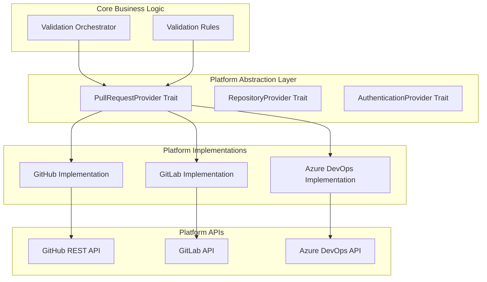

# Platform Integrations

**Version:** 1.0
**Last Updated:** July 20, 2025

## Overview

The Platform Integrations specification defines the abstraction layer that enables Merge Warden to work with multiple developer platforms. This layer provides a consistent interface for interacting with platforms like GitHub while maintaining extensibility for future platform support.

## Design Principles

### Platform Abstraction

A unified interface that abstracts platform-specific APIs and behaviors behind consistent traits and data models.

### Extensibility

Designed to support multiple platforms (GitHub, GitLab, Azure DevOps, etc.) without requiring changes to core business logic.

### Authentication Flexibility

Support for multiple authentication methods per platform (GitHub Apps, Personal Access Tokens, OAuth).

### Error Transparency

Platform-specific errors are mapped to common error types while preserving diagnostic information.

## Architecture Overview



## Core Abstractions

### Pull Request Provider Trait

The primary interface for all pull request operations:

```rust
#[async_trait]
pub trait PullRequestProvider: Send + Sync {
    type Error: std::error::Error + Send + Sync + 'static;

    // Pull Request Operations
    async fn get_pull_request(
        &self,
        repository: &Repository,
        pr_number: u64,
    ) -> Result<PullRequest, Self::Error>;

    async fn list_pull_requests(
        &self,
        repository: &Repository,
        state: Option<PullRequestState>,
        limit: Option<u32>,
    ) -> Result<Vec<PullRequest>, Self::Error>;

    // Comment Operations
    async fn add_comment(
        &self,
        repository: &Repository,
        pr_number: u64,
        body: &str,
    ) -> Result<Comment, Self::Error>;

    async fn update_comment(
        &self,
        repository: &Repository,
        comment_id: u64,
        body: &str,
    ) -> Result<Comment, Self::Error>;

    async fn delete_comment(
        &self,
        repository: &Repository,
        comment_id: u64,
    ) -> Result<(), Self::Error>;

    async fn list_comments(
        &self,
        repository: &Repository,
        pr_number: u64,
    ) -> Result<Vec<Comment>, Self::Error>;

    // Label Operations
    async fn add_labels(
        &self,
        repository: &Repository,
        pr_number: u64,
        labels: Vec<String>,
    ) -> Result<Vec<Label>, Self::Error>;

    async fn remove_label(
        &self,
        repository: &Repository,
        pr_number: u64,
        label: &str,
    ) -> Result<(), Self::Error>;

    async fn list_applied_labels(
        &self,
        repository: &Repository,
        pr_number: u64,
    ) -> Result<Vec<Label>, Self::Error>;

    async fn list_available_labels(
        &self,
        repository: &Repository,
    ) -> Result<Vec<Label>, Self::Error>;

    // Status Operations
    async fn create_check_run(
        &self,
        repository: &Repository,
        head_sha: &str,
        check: &CheckRun,
    ) -> Result<CheckRun, Self::Error>;

    async fn update_check_run(
        &self,
        repository: &Repository,
        check_run_id: u64,
        check: &CheckRun,
    ) -> Result<CheckRun, Self::Error>;

    // Milestone Operations
    async fn get_milestone(
        &self,
        repository: &Repository,
        milestone_number: u32,
    ) -> Result<Milestone, Self::Error>;

    async fn set_milestone(
        &self,
        repository: &Repository,
        pr_number: u64,
        milestone_number: Option<u32>,
    ) -> Result<(), Self::Error>;

    // Issue Operations (for work item references)
    async fn get_issue(
        &self,
        repository: &Repository,
        issue_number: u64,
    ) -> Result<Issue, Self::Error>;

    async fn list_issue_references(
        &self,
        repository: &Repository,
        pr_number: u64,
    ) -> Result<Vec<IssueReference>, Self::Error>;
}
```

### Repository Provider Trait

Operations related to repository configuration and metadata:

```rust
#[async_trait]
pub trait RepositoryProvider: Send + Sync {
    type Error: std::error::Error + Send + Sync + 'static;

    async fn get_repository(
        &self,
        owner: &str,
        name: &str,
    ) -> Result<Repository, Self::Error>;

    async fn get_file_content(
        &self,
        repository: &Repository,
        path: &str,
        reference: Option<&str>,
    ) -> Result<FileContent, Self::Error>;

    async fn get_branch_protection(
        &self,
        repository: &Repository,
        branch: &str,
    ) -> Result<BranchProtection, Self::Error>;

    async fn list_workflows(
        &self,
        repository: &Repository,
    ) -> Result<Vec<Workflow>, Self::Error>;
}
```

### Authentication Provider Trait

Platform-specific authentication handling:

```rust
#[async_trait]
pub trait AuthenticationProvider: Send + Sync {
    type Error: std::error::Error + Send + Sync + 'static;
    type Token: Clone + Send + Sync;

    async fn authenticate(&self) -> Result<Self::Token, Self::Error>;

    async fn refresh_token(&self, token: &Self::Token) -> Result<Self::Token, Self::Error>;

    async fn validate_token(&self, token: &Self::Token) -> Result<bool, Self::Error>;

    fn get_permissions(&self, token: &Self::Token) -> Vec<Permission>;
}
```

## GitHub Implementation

### GitHub Provider

The GitHub implementation of the platform abstraction layer:

```rust
pub struct GitHubProvider {
    client: GitHubClient,
    auth: Box<dyn AuthenticationProvider<Token = GitHubToken, Error = GitHubError>>,
    rate_limiter: RateLimiter,
    cache: Option<Box<dyn CacheProvider>>,
}

impl GitHubProvider {
    pub fn new(
        client: GitHubClient,
        auth: Box<dyn AuthenticationProvider<Token = GitHubToken, Error = GitHubError>>,
    ) -> Self {
        Self {
            client,
            auth,
            rate_limiter: RateLimiter::new(5000, Duration::from_secs(3600)),
            cache: None,
        }
    }

    pub fn with_cache(mut self, cache: Box<dyn CacheProvider>) -> Self {
        self.cache = Some(cache);
        self
    }
}
```

### GitHub Authentication

Multiple authentication methods for GitHub:

```rust
pub enum GitHubAuthMethod {
    GitHubApp {
        app_id: u64,
        private_key: Vec<u8>,
        installation_id: u64,
    },
    PersonalAccessToken {
        token: String,
    },
    OAuth {
        client_id: String,
        client_secret: String,
        access_token: String,
    },
}

pub struct GitHubAuthProvider {
    method: GitHubAuthMethod,
    token_cache: tokio::sync::RwLock<Option<(GitHubToken, Instant)>>,
}

impl AuthenticationProvider for GitHubAuthProvider {
    type Error = GitHubError;
    type Token = GitHubToken;

    async fn authenticate(&self) -> Result<Self::Token, Self::Error> {
        // Check cache first
        {
            let cache = self.token_cache.read().await;
            if let Some((token, created_at)) = &*cache {
                if created_at.elapsed() < Duration::from_secs(3000) { // 50 minutes
                    return Ok(token.clone());
                }
            }
        }

        // Generate new token based on auth method
        let token = match &self.method {
            GitHubAuthMethod::GitHubApp { app_id, private_key, installation_id } => {
                self.create_app_token(*app_id, private_key, *installation_id).await?
            },
            GitHubAuthMethod::PersonalAccessToken { token } => {
                GitHubToken::PersonalAccessToken(token.clone())
            },
            GitHubAuthMethod::OAuth { access_token, .. } => {
                GitHubToken::OAuth(access_token.clone())
            },
        };

        // Cache the token
        {
            let mut cache = self.token_cache.write().await;
            *cache = Some((token.clone(), Instant::now()));
        }

        Ok(token)
    }
}
```

### GitHub API Integration

Integration with GitHub's REST API using optimized patterns:

```rust
impl PullRequestProvider for GitHubProvider {
    type Error = GitHubError;

    async fn get_pull_request(
        &self,
        repository: &Repository,
        pr_number: u64,
    ) -> Result<PullRequest, Self::Error> {
        // Check cache first
        let cache_key = format!("pr:{}:{}:{}", repository.owner, repository.name, pr_number);
        if let Some(cache) = &self.cache {
            if let Ok(Some(cached_pr)) = cache.get::<PullRequest>(&cache_key).await {
                return Ok(cached_pr);
            }
        }

        // Rate limiting
        self.rate_limiter.wait_if_needed().await;

        // Get authentication token
        let token = self.auth.authenticate().await?;

        // Make API request
        let response = self.client
            .get(&format!("/repos/{}/{}/pulls/{}",
                repository.owner, repository.name, pr_number))
            .header("Authorization", format!("Bearer {}", token.as_str()))
            .header("Accept", "application/vnd.github.v3+json")
            .send()
            .await?;

        // Handle response
        match response.status() {
            StatusCode::OK => {
                let gh_pr: GitHubPullRequest = response.json().await?;
                let pr = self.convert_github_pr(gh_pr)?;

                // Cache result
                if let Some(cache) = &self.cache {
                    let _ = cache.set(&cache_key, &pr, Duration::from_secs(300)).await;
                }

                Ok(pr)
            },
            StatusCode::NOT_FOUND => Err(GitHubError::NotFound {
                resource: format!("pull request {}", pr_number),
            }),
            StatusCode::FORBIDDEN => Err(GitHubError::InsufficientPermissions {
                required: vec![Permission::PullRequestRead],
            }),
            status => Err(GitHubError::ApiError {
                status: status.as_u16(),
                message: response.text().await.unwrap_or_default(),
            }),
        }
    }

    async fn add_comment(
        &self,
        repository: &Repository,
        pr_number: u64,
        body: &str,
    ) -> Result<Comment, Self::Error> {
        // Validate input
        if body.len() > 65536 {
            return Err(GitHubError::InvalidInput {
                field: "body".to_string(),
                message: "Comment body exceeds maximum length".to_string(),
            });
        }

        // Rate limiting
        self.rate_limiter.wait_if_needed().await;

        // Get authentication token
        let token = self.auth.authenticate().await?;

        // Create comment request
        let comment_request = serde_json::json!({
            "body": body
        });

        // Make API request
        let response = self.client
            .post(&format!("/repos/{}/{}/issues/{}/comments",
                repository.owner, repository.name, pr_number))
            .header("Authorization", format!("Bearer {}", token.as_str()))
            .header("Accept", "application/vnd.github.v3+json")
            .header("Content-Type", "application/json")
            .json(&comment_request)
            .send()
            .await?;

        // Handle response
        match response.status() {
            StatusCode::CREATED => {
                let gh_comment: GitHubComment = response.json().await?;
                Ok(self.convert_github_comment(gh_comment)?)
            },
            StatusCode::FORBIDDEN => Err(GitHubError::InsufficientPermissions {
                required: vec![Permission::PullRequestWrite],
            }),
            StatusCode::UNPROCESSABLE_ENTITY => Err(GitHubError::ValidationFailed {
                errors: vec!["Invalid comment content".to_string()],
            }),
            status => Err(GitHubError::ApiError {
                status: status.as_u16(),
                message: response.text().await.unwrap_or_default(),
            }),
        }
    }
}
```

## Rate Limiting and Retry Logic

### Rate Limiter Implementation

```rust
pub struct RateLimiter {
    remaining: Arc<AtomicU32>,
    reset_time: Arc<AtomicU64>,
    requests_per_hour: u32,
    window_duration: Duration,
}

impl RateLimiter {
    pub fn new(requests_per_hour: u32, window_duration: Duration) -> Self {
        Self {
            remaining: Arc::new(AtomicU32::new(requests_per_hour)),
            reset_time: Arc::new(AtomicU64::new(0)),
            requests_per_hour,
            window_duration,
        }
    }

    pub async fn wait_if_needed(&self) {
        let now = SystemTime::now()
            .duration_since(SystemTime::UNIX_EPOCH)
            .unwrap()
            .as_secs();

        let reset_time = self.reset_time.load(Ordering::Relaxed);
        let remaining = self.remaining.load(Ordering::Relaxed);

        if remaining == 0 && now < reset_time {
            let wait_duration = Duration::from_secs(reset_time - now);
            tokio::time::sleep(wait_duration).await;
        }
    }

    pub fn update_from_headers(&self, headers: &HeaderMap) {
        if let Some(remaining_header) = headers.get("X-RateLimit-Remaining") {
            if let Ok(remaining_str) = remaining_header.to_str() {
                if let Ok(remaining) = remaining_str.parse::<u32>() {
                    self.remaining.store(remaining, Ordering::Relaxed);
                }
            }
        }

        if let Some(reset_header) = headers.get("X-RateLimit-Reset") {
            if let Ok(reset_str) = reset_header.to_str() {
                if let Ok(reset_time) = reset_str.parse::<u64>() {
                    self.reset_time.store(reset_time, Ordering::Relaxed);
                }
            }
        }
    }
}
```

### Retry Strategy

```rust
pub struct RetryStrategy {
    max_attempts: u32,
    base_delay: Duration,
    max_delay: Duration,
    backoff_multiplier: f64,
    jitter: bool,
}

impl RetryStrategy {
    pub async fn execute<F, T, E>(&self, operation: F) -> Result<T, E>
    where
        F: Fn() -> BoxFuture<'_, Result<T, E>>,
        E: IsRetryable,
    {
        let mut attempt = 0;
        let mut delay = self.base_delay;

        loop {
            match operation().await {
                Ok(result) => return Ok(result),
                Err(error) if attempt >= self.max_attempts => return Err(error),
                Err(error) if error.is_retryable() => {
                    attempt += 1;

                    if self.jitter {
                        let jitter_range = delay.as_millis() as f64 * 0.1;
                        let jitter = rand::thread_rng().gen_range(-jitter_range..=jitter_range);
                        delay = Duration::from_millis(
                            (delay.as_millis() as f64 + jitter).max(0.0) as u64
                        );
                    }

                    tokio::time::sleep(delay).await;
                    delay = std::cmp::min(
                        Duration::from_millis(
                            (delay.as_millis() as f64 * self.backoff_multiplier) as u64
                        ),
                        self.max_delay,
                    );
                },
                Err(error) => return Err(error),
            }
        }
    }
}

pub trait IsRetryable {
    fn is_retryable(&self) -> bool;
}

impl IsRetryable for GitHubError {
    fn is_retryable(&self) -> bool {
        match self {
            GitHubError::RateLimited { .. } => true,
            GitHubError::NetworkError { .. } => true,
            GitHubError::Timeout { .. } => true,
            GitHubError::ServerError { status } => *status >= 500,
            _ => false,
        }
    }
}
```

## Error Handling

### Platform Error Types

```rust
#[derive(Debug, thiserror::Error)]
pub enum GitHubError {
    #[error("Authentication failed: {message}")]
    AuthenticationFailed { message: String },

    #[error("Insufficient permissions, required: {required:?}")]
    InsufficientPermissions { required: Vec<Permission> },

    #[error("Resource not found: {resource}")]
    NotFound { resource: String },

    #[error("Rate limited, reset at: {reset_time}")]
    RateLimited { reset_time: SystemTime },

    #[error("Validation failed: {errors:?}")]
    ValidationFailed { errors: Vec<String> },

    #[error("Network error: {source}")]
    NetworkError {
        #[from]
        source: reqwest::Error,
    },

    #[error("API error: {status} - {message}")]
    ApiError { status: u16, message: String },

    #[error("Invalid input for field '{field}': {message}")]
    InvalidInput { field: String, message: String },

    #[error("Timeout after {duration:?}")]
    Timeout { duration: Duration },

    #[error("Serialization error: {source}")]
    SerializationError {
        #[from]
        source: serde_json::Error,
    },
}

// Map to common platform errors
impl From<GitHubError> for PlatformError {
    fn from(gh_error: GitHubError) -> Self {
        match gh_error {
            GitHubError::AuthenticationFailed { message } => {
                PlatformError::Authentication { message }
            },
            GitHubError::InsufficientPermissions { required } => {
                PlatformError::Authorization { required_permissions: required }
            },
            GitHubError::NotFound { resource } => {
                PlatformError::NotFound { resource }
            },
            GitHubError::RateLimited { reset_time } => {
                PlatformError::RateLimited { reset_time }
            },
            // ... other mappings
            _ => PlatformError::Unknown { source: Box::new(gh_error) },
        }
    }
}
```

## Future Platform Support

### Platform Registration

```rust
pub struct PlatformRegistry {
    providers: HashMap<PlatformType, Box<dyn PlatformProviderFactory>>,
}

impl PlatformRegistry {
    pub fn register<F>(&mut self, platform: PlatformType, factory: F)
    where
        F: PlatformProviderFactory + 'static,
    {
        self.providers.insert(platform, Box::new(factory));
    }

    pub fn create_provider(
        &self,
        platform: PlatformType,
        config: &PlatformConfig,
    ) -> Result<Box<dyn PullRequestProvider>, PlatformError> {
        let factory = self.providers.get(&platform)
            .ok_or(PlatformError::UnsupportedPlatform { platform })?;

        factory.create_provider(config)
    }
}

#[derive(Debug, Clone, PartialEq, Eq, Hash)]
pub enum PlatformType {
    GitHub,
    GitLab,
    AzureDevOps,
    Bitbucket,
}

pub trait PlatformProviderFactory: Send + Sync {
    fn create_provider(
        &self,
        config: &PlatformConfig,
    ) -> Result<Box<dyn PullRequestProvider>, PlatformError>;

    fn supported_auth_methods(&self) -> Vec<AuthMethod>;
    fn required_permissions(&self) -> Vec<Permission>;
}
```

### GitLab Implementation (Future)

```rust
pub struct GitLabProvider {
    client: GitLabClient,
    auth: Box<dyn AuthenticationProvider<Token = GitLabToken, Error = GitLabError>>,
    rate_limiter: RateLimiter,
}

impl PullRequestProvider for GitLabProvider {
    type Error = GitLabError;

    async fn get_pull_request(
        &self,
        repository: &Repository,
        pr_number: u64,
    ) -> Result<PullRequest, Self::Error> {
        // GitLab-specific implementation
        // Maps merge requests to pull request abstraction
        todo!("Implement GitLab merge request retrieval")
    }

    // ... other implementations
}
```

## Testing Strategy

### Mock Implementations

```rust
#[cfg(test)]
pub struct MockPullRequestProvider {
    pull_requests: HashMap<u64, PullRequest>,
    comments: HashMap<u64, Vec<Comment>>,
    labels: HashMap<u64, Vec<Label>>,
    should_fail: bool,
}

#[cfg(test)]
impl MockPullRequestProvider {
    pub fn new() -> Self {
        Self {
            pull_requests: HashMap::new(),
            comments: HashMap::new(),
            labels: HashMap::new(),
            should_fail: false,
        }
    }

    pub fn with_pull_request(mut self, pr: PullRequest) -> Self {
        self.pull_requests.insert(pr.number, pr);
        self
    }

    pub fn with_failure(mut self, should_fail: bool) -> Self {
        self.should_fail = should_fail;
        self
    }
}

#[cfg(test)]
#[async_trait]
impl PullRequestProvider for MockPullRequestProvider {
    type Error = MockError;

    async fn get_pull_request(
        &self,
        _repository: &Repository,
        pr_number: u64,
    ) -> Result<PullRequest, Self::Error> {
        if self.should_fail {
            return Err(MockError::TestFailure);
        }

        self.pull_requests
            .get(&pr_number)
            .cloned()
            .ok_or(MockError::NotFound)
    }

    // ... other mock implementations
}
```

### Integration Tests

```rust
#[tokio::test]
#[ignore = "integration_test"]
async fn test_github_provider_real_api() {
    let auth = GitHubAuthProvider::new(GitHubAuthMethod::PersonalAccessToken {
        token: std::env::var("GITHUB_TOKEN").expect("GITHUB_TOKEN required"),
    });

    let provider = GitHubProvider::new(
        GitHubClient::new(),
        Box::new(auth),
    );

    let repo = Repository {
        owner: "octocat".to_string(),
        name: "Hello-World".to_string(),
        platform: PlatformType::GitHub,
    };

    // Test getting a pull request
    let pr = provider.get_pull_request(&repo, 1).await;
    assert!(pr.is_ok());

    // Test listing labels
    let labels = provider.list_available_labels(&repo).await;
    assert!(labels.is_ok());
}
```

## Performance Optimizations

### Caching Strategy

- **Configuration Caching**: 15-minute TTL for repository configurations
- **PR Data Caching**: 5-minute TTL for pull request metadata
- **Issue Reference Caching**: 10-minute TTL for issue/milestone data
- **Label Caching**: 1-hour TTL for repository labels

### Batch Operations

```rust
impl GitHubProvider {
    pub async fn batch_add_labels(
        &self,
        repository: &Repository,
        pr_number: u64,
        labels: Vec<String>,
    ) -> Result<Vec<Label>, GitHubError> {
        // Single API call instead of multiple individual calls
        let token = self.auth.authenticate().await?;

        let request = serde_json::json!({
            "labels": labels
        });

        let response = self.client
            .post(&format!("/repos/{}/{}/issues/{}/labels",
                repository.owner, repository.name, pr_number))
            .header("Authorization", format!("Bearer {}", token.as_str()))
            .json(&request)
            .send()
            .await?;

        // Handle response...
    }
}
```

## Related Documentation

- **[System Overview](./system-overview.md)**: High-level system architecture
- **[Core Components](./core-components.md)**: Core business logic and domain models
- **[Security - Authentication](../security/authentication.md)**: Authentication and token management
- **[Testing - Integration Testing](../testing/integration-testing.md)**: Platform integration testing strategies
