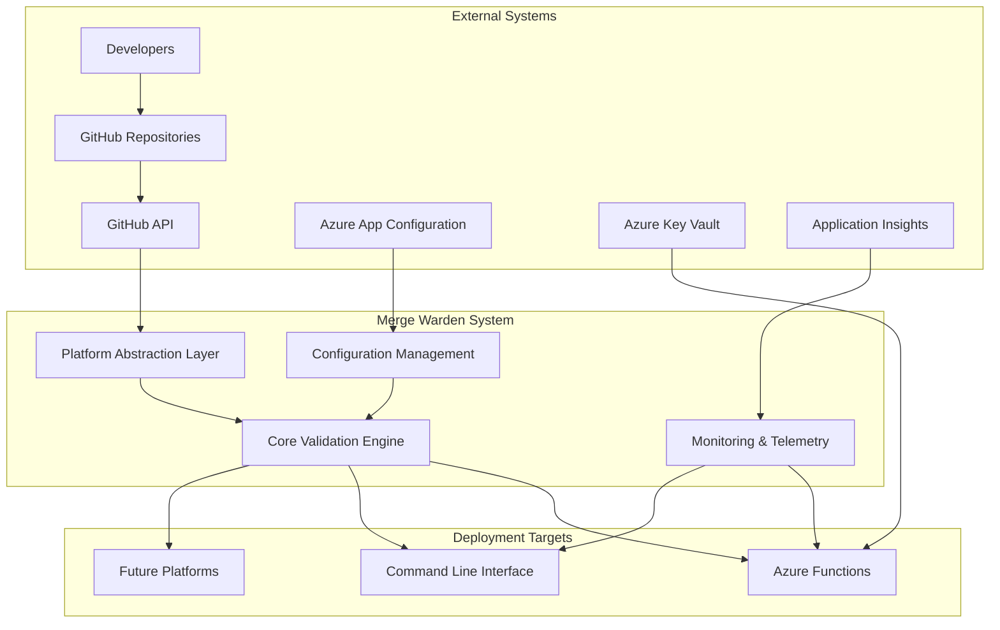
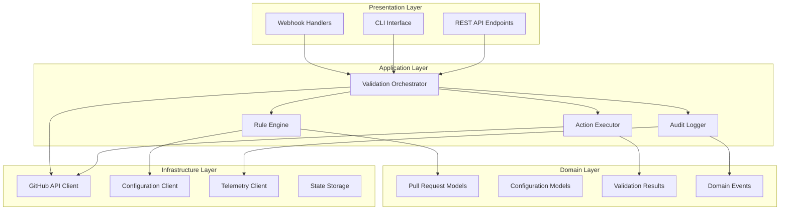
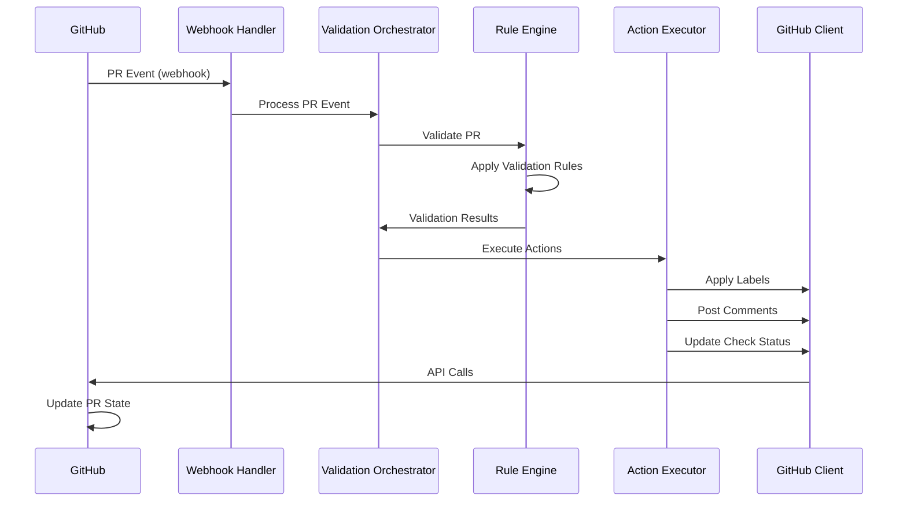
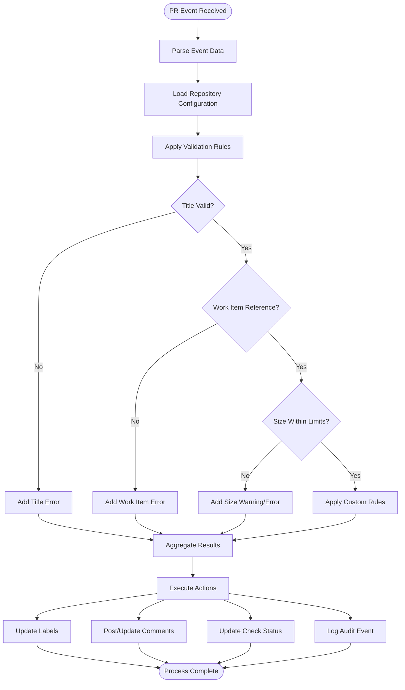
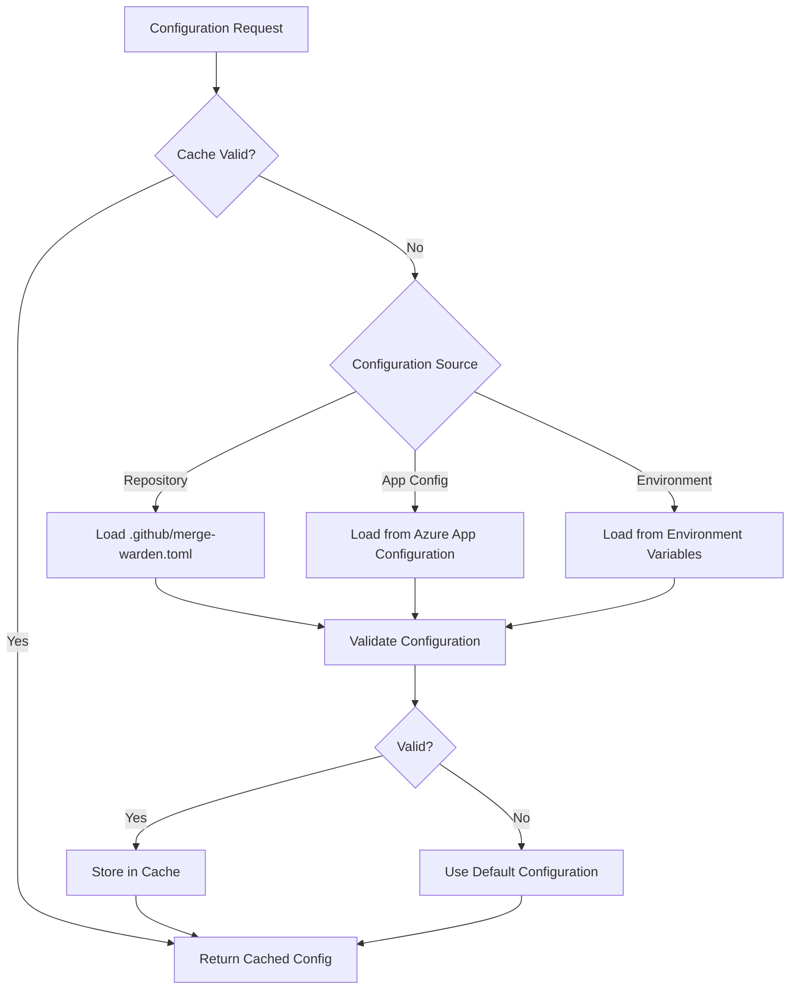
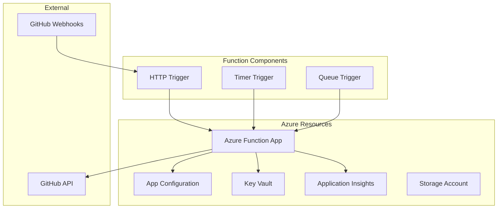
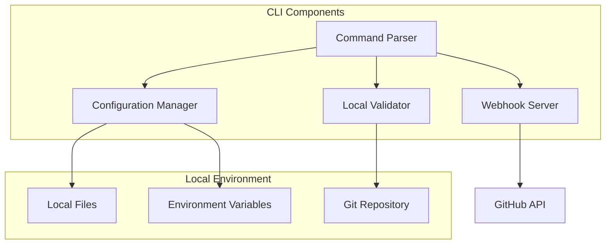
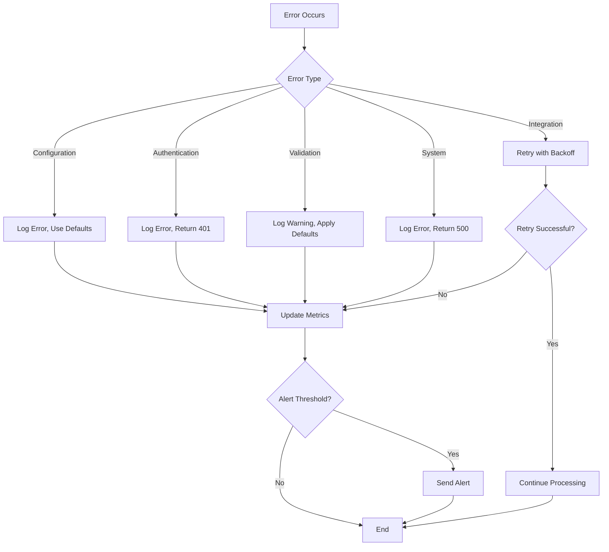

# System Overview

**Version:** 1.0
**Last Updated:** July 20, 2025

## Purpose and Scope

Merge Warden is a comprehensive pull request validation and governance system that enforces repository policies, improves code quality, and streamlines development workflows. The system operates as a GitHub App that automatically validates pull requests against configurable rules and provides detailed feedback to developers.

### Primary Goals

- **Quality Assurance**: Ensure all pull requests contain sufficient information for future developers to understand changes, rationale, and impact
- **Process Automation**: Automate validation, labeling, and feedback processes to reduce manual overhead
- **Governance**: Provide audit trails, bypass mechanisms, and compliance features for enterprise environments
- **Developer Experience**: Deliver clear, actionable feedback with minimal friction in the development workflow

### Core Capabilities

- **Configurable Validation Rules**: Title format enforcement, work item references, size limits, and custom rules
- **Intelligent Automation**: Automatic labeling, milestone synchronization, and change type classification
- **Multi-Platform Deployment**: Azure Functions, CLI interface, and extensible architecture for future platforms
- **Comprehensive Monitoring**: Detailed logging, telemetry, and audit trails for compliance and observability

## System Context



## High-Level Architecture

### Layered Architecture



### Component Interaction



## Data Flow

### PR Validation Flow



### Configuration Loading



## Core Validation Rules

### Title Validation

**Requirement**: PR titles must follow [Conventional Commits](https://www.conventionalcommits.org/) format

**Pattern**:

```regex
^(build|chore|ci|docs|feat|fix|perf|refactor|revert|style|test){1}(\([\w-]+\))?!?: .+
```

**Examples**:

- ✅ `feat: add user authentication`
- ✅ `fix(api): resolve timeout issue`
- ✅ `docs: update installation guide`
- ❌ `Add new feature`
- ❌ `Fix bug`

### Work Item Reference

**Requirement**: PR body must contain at least one GitHub issue reference

**Valid Formats**:

- `Closes #123`
- `Fixes #456`
- `Relates to #789`
- `References org/repo#123`

**Recognition Patterns**:

- Case-insensitive keywords: `closes`, `fixes`, `relates to`, `references`
- Issue formats: `#123`, `GH-123`, `org/repo#123`

### Size Assessment

**Categories**:

- **XS** (1-10 lines): Trivial changes
- **S** (11-50 lines): Small changes
- **M** (51-100 lines): Medium changes
- **L** (101-250 lines): Large changes
- **XL** (251-500 lines): Extra large changes
- **XXL** (500+ lines): Should be split (configurable failure)

## GitHub Permissions

The GitHub App requires the following repository permissions:

### Required Permissions

- **Metadata**: Read (basic repository information)
- **Contents**: Read (access repository files for configuration)
- **Pull Requests**: Write (add labels, comments, update status)
- **Issues**: Read (access issue information for work item validation)
- **Checks**: Write (create check runs for validation status)

### Optional Permissions

- **Repository Administration**: Read (access branch protection rules)
- **Actions**: Read (access workflow run information)

## Deployment Patterns

### Azure Functions Architecture



### CLI Architecture



## Error Handling Strategy

### Error Categories

1. **Configuration Errors**: Invalid configuration, missing required settings
2. **Authentication Errors**: Invalid credentials, expired tokens, insufficient permissions
3. **Validation Errors**: Business rule violations, invalid input data
4. **Integration Errors**: GitHub API failures, network timeouts, rate limiting
5. **System Errors**: Internal failures, resource exhaustion, unexpected conditions

### Error Response Patterns



## Performance Considerations

### Scalability Requirements

- **Concurrency**: Handle multiple PR events simultaneously
- **Rate Limiting**: Respect GitHub API rate limits (5000 requests/hour)
- **Resource Usage**: Minimize memory and CPU footprint
- **Cold Start**: Optimize Azure Functions cold start performance

### Caching Strategy

- **Configuration Caching**: Cache repository configurations for 15 minutes
- **GitHub Data Caching**: Cache issue/milestone data for 5 minutes
- **Rule Results Caching**: Cache validation results for identical PR content

### Monitoring Metrics

- **Request Latency**: Time from webhook receipt to completion
- **GitHub API Usage**: API calls per repository, rate limit consumption
- **Error Rates**: Error frequency by type and repository
- **Cache Hit Rates**: Configuration and data cache effectiveness

## Security Architecture

### Threat Model Summary

- **Input Validation**: Sanitize all webhook payloads and configuration data
- **Authentication**: Secure GitHub App authentication with private key rotation
- **Authorization**: Principle of least privilege for all operations
- **Data Protection**: Encrypt sensitive data at rest and in transit
- **Audit Logging**: Comprehensive audit trails for all operations

### Security Controls

- **Webhook Verification**: Validate GitHub webhook signatures
- **Token Management**: Secure storage and rotation of authentication tokens
- **Access Control**: Role-based access to configuration and bypass functions
- **Monitoring**: Real-time security event monitoring and alerting

## Related Documentation

- **[Core Components](./core-components.md)**: Detailed component design and interfaces
- **[Platform Integrations](./platform-integrations.md)**: GitHub and future platform integrations
- **[Deployment Architectures](./deployment-architectures.md)**: Specific deployment target details
- **[Security](../security/README.md)**: Comprehensive security specifications
- **[Operations](../operations/README.md)**: Deployment and monitoring procedures
