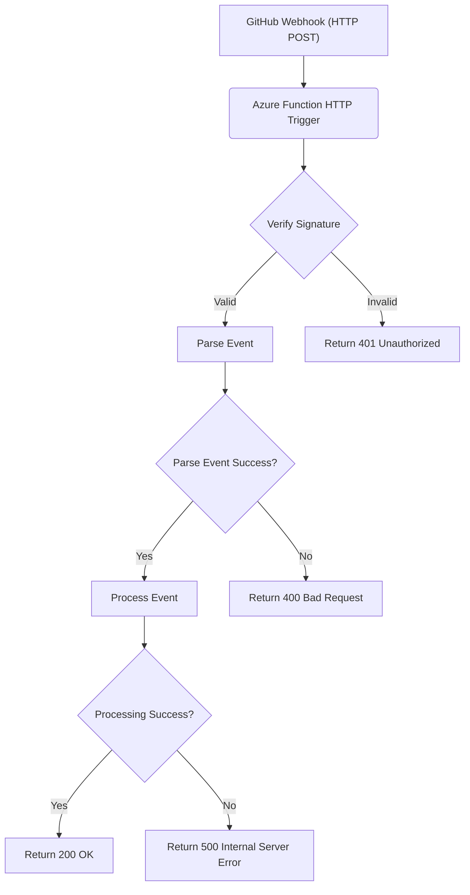
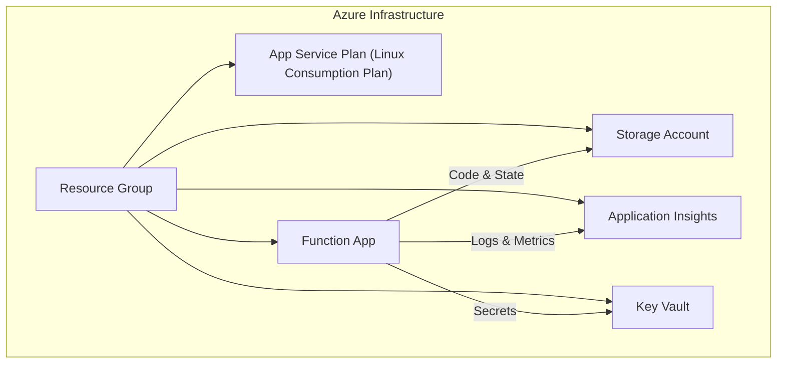
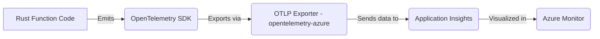
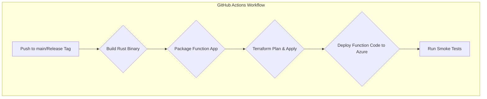

# Azure Functions Deployment Specification

This document outlines the design and implementation plan for deploying the Merge Warden application as an Azure Function.

## 1. Overview

The Azure Functions deployment will leverage the existing core logic and developer platform integrations to provide functionality similar to the AWS Lambda deployment. It will receive GitHub webhook events via HTTP triggers, verify them, process them using the core application logic, and respond accordingly.

The primary goal is code reuse, minimizing platform-specific code.



## 2. Architecture

### 2.1. Code Structure

A new crate `crates/azure-functions` will be created. It will depend on `crates/core` and `crates/developer_platforms`.

```
merge-warden/
├── crates/
│   ├── core/
│   ├── developer_platforms/
│   ├── aws-lambda/
│   └── azure-functions/  <-- New Crate
│       ├── Cargo.toml
│       └── src/
│           ├── main.rs       # Entry point, function definition
│           └── telemetry.rs  # OpenTelemetry setup
├── specs/
│   └── azure_functions.md <-- This document
└── ops/
    └── azure/            <-- New Terraform configuration
        ├── main.tf
        ├── variables.tf
        └── outputs.tf
```

### 2.2. Azure Resources

The deployment will utilize the following Azure resources, managed via Terraform:

- **Resource Group:** A container for all related resources.
- **App Service Plan:** Defines the underlying compute resources (Linux Consumption Plan recommended).
  - **Why Linux Consumption Plan?**
    - **Cost Efficiency:** The Linux Consumption Plan follows a pay-per-execution model, meaning you only pay for the compute resources used during function execution. This is ideal for workloads with variable or low traffic.
    - **Auto-Scaling:** Automatically scales out to handle traffic spikes without requiring manual intervention or over-provisioning.
    - **Cold Start Optimization:** While cold starts are inherent to the Consumption Plan, the Linux runtime has been optimized to reduce cold start times compared to older Windows-based plans.
    - **Environment Consistency:** Provides a consistent Linux-based environment, which aligns with the Rust runtime and simplifies dependency management.
- **Storage Account:** Required by Azure Functions for state management and code deployment.
- **Function App:** The core Azure Functions resource hosting the Rust code.
- **Application Insights:** For monitoring, logging, and tracing.
- **Key Vault:** To securely store secrets like the GitHub App private key.
- **Managed Identity (User-Assigned):** To grant the Function App secure access to Key Vault without storing credentials in application settings.



## 3. Implementation Details

### 3.1. Rust Crate (`crates/azure-functions`)

- **Dependencies:** `azure_functions`, `tokio`, `serde`, `serde_json`, `log`, `opentelemetry`, `opentelemetry-azure`, `crates/core`, `crates/developer_platforms`.
- **Function Trigger:** An HTTP trigger (`req: HttpRequest`) will receive the webhook POST requests.
- **Webhook Verification:** Reuse `developer_platforms::github::verify_webhook`.
- **Event Processing:** Reuse `core::process_webhook_event`.
- **Telemetry:** Initialize OpenTelemetry using `opentelemetry-azure` exporter, configured via `telemetry.rs`.

```rust
// crates/azure-functions/src/main.rs (Illustrative)
use azure_functions::{
    bindings::{HttpRequest, HttpResponse},
    func, Context,
};
use log::info;
use merge_warden_core::process_webhook_event;
use merge_warden_developer_platforms::github::verify_webhook;
use std::env;

mod telemetry;

#[func]
#[binding(name = "req", methods = "post", route = "github/webhook")]
pub async fn handle_github_webhook(req: HttpRequest, ctx: Context) -> HttpResponse {
    // Initialize telemetry (consider doing this once at startup if possible)
    let instrumentation_key = env::var("APPINSIGHTS_INSTRUMENTATIONKEY")
        .expect("APPINSIGHTS_INSTRUMENTATIONKEY not set");
    telemetry::init_telemetry(&instrumentation_key);

    info!("Received GitHub webhook request: {:?}", req.method());

    // Enhanced error handling
    match verify_webhook(&req).await {
        Ok(event) => match process_webhook_event(event).await {
            Ok(_) => HttpResponse::build().status(200).body("Webhook processed successfully").finish(),
            Err(e) => {
                log::error!("Error processing webhook: {}", e);
                match e {
                    // Example: Add specific error cases
                    merge_warden_core::Error::InvalidPayload => HttpResponse::build().status(400).body("Invalid payload").finish(),
                    merge_warden_core::Error::Unauthorized => HttpResponse::build().status(403).body("Forbidden").finish(),
                    _ => HttpResponse::build().status(500).body("Internal Server Error").finish(),
                }
            }
        },
        Err(e) => {
            log::error!("Webhook verification failed: {}", e);
            HttpResponse::build().status(401).body("Unauthorized").finish()
        }
    }
}
```

### 3.2. Terraform Configuration (`terraform/azure`)

- **Provider:** `azurerm` version `~> 3.85`.
- **Terraform Version:** `>= 1.5`.
- **Region:** `australiaeast` (Sydney).
- **Resources:** Define resources listed in section 2.2.

- **Environment-Specific Variables:**
  - Use Terraform variables to manage environment-specific settings, such as resource names, regions, and secrets.
  - Define a `variables.tf` file to declare variables and a `terraform.tfvars` file to provide values for each environment.

  Example `variables.tf`:

  ```hcl
  variable "environment" {
    description = "The environment for the deployment (e.g., dev, staging, prod)."
    type        = string
  }

  variable "github_app_id" {
    description = "The GitHub App ID."
    type        = string
  }

  variable "github_private_key" {
    description = "The GitHub App private key."
    type        = string
    sensitive   = true
  }
  ```

  Example `terraform.tfvars` (for `dev` environment):

  ```hcl
  environment       = "dev"
  github_app_id     = "123456"
  github_private_key = "<private-key-content>"
  ```

- **Secrets Management:**
  - Store sensitive values, such as the GitHub private key, in Azure Key Vault.
  - Use Terraform to create Key Vault secrets and reference them in the Function App configuration.

  Example Key Vault secret creation:

  ```hcl
  resource "azurerm_key_vault_secret" "github_private_key" {
    name         = "github-private-key"
    value        = var.github_private_key
    key_vault_id = azurerm_key_vault.main.id
  }
  ```

- **Environment-Specific Resource Names:**
  - Append the environment name to resource names to avoid conflicts and improve clarity.

  Example:

  ```hcl
  resource "azurerm_resource_group" "merge_warden" {
    name     = "rg-merge-warden-${var.environment}"
    location = "australiaeast"
  }
  ```

- **Application Settings:**
  - `APPINSIGHTS_INSTRUMENTATIONKEY`: Automatically configured by Azure/Terraform.
  - `GITHUB_APP_ID`: Passed from Terraform variable.
  - `GITHUB_PRIVATE_KEY_SECRET_URI`: Key Vault secret URI for the private key.
  - `RUST_LOG`: Set to appropriate level (e.g., `info`).

```hcl
# terraform/azure/main.tf (Illustrative Snippets)
terraform {
  required_version = ">= 1.5"
  required_providers {
    azurerm = {
      source  = "hashicorp/azurerm"
      version = "~> 3.85"
    }
  }
}

provider "azurerm" {
  features {}
}

resource "azurerm_resource_group" "merge_warden" {
  name     = "rg-merge-warden-${var.environment}"
  location = "australiaeast"
}

# ... Key Vault, Managed Identity, App Insights ...

resource "azurerm_service_plan" "main" {
  name                = "asp-merge-warden-${var.environment}"
  resource_group_name = azurerm_resource_group.merge_warden.name
  location            = azurerm_resource_group.merge_warden.location
  os_type             = "Linux"
  sku_name            = "Y1" # Consumption Plan
}

resource "azurerm_linux_function_app" "main" {
  name                = "func-merge-warden-${var.environment}"
  resource_group_name = azurerm_resource_group.merge_warden.name
  location            = azurerm_resource_group.merge_warden.location

  storage_account_name         = azurerm_storage_account.main.name
  storage_account_access_key = azurerm_storage_account.main.primary_access_key
  service_plan_id            = azurerm_service_plan.main.id

  site_config {
    application_stack {
      # Configure for custom Rust handler
      custom_handler {
        # Details depend on deployment method
      }
    }
    always_on = false # For Consumption plan
  }

  app_settings = {
    "FUNCTIONS_WORKER_RUNTIME" = "custom"
    "APPINSIGHTS_INSTRUMENTATIONKEY" = azurerm_application_insights.main.instrumentation_key
    "GITHUB_APP_ID" = var.github_app_id
    "GITHUB_PRIVATE_KEY" = "@Microsoft.KeyVault(SecretUri=${azurerm_key_vault_secret.github_private_key.id})"
    "RUST_LOG" = "info,merge_warden=debug" # Example
  }

  identity {
    type         = "UserAssigned"
    identity_ids = [azurerm_user_assigned_identity.main.id]
  }
}
```

## 4. Observability

### 4.1. Strategy

Leverage OpenTelemetry for standardized telemetry data (logs, traces, metrics). Export data to Application Insights for visualization and alerting within the Azure ecosystem.



### 4.2. Implementation

- Use the `opentelemetry` and `opentelemetry-azure` crates.
- Initialize the tracer and logger provider in `telemetry.rs`, configuring the Application Insights exporter with the instrumentation key obtained from environment variables (`APPINSIGHTS_INSTRUMENTATIONKEY`).
- Utilize `tracing` spans and events throughout the core and Azure function code for detailed tracing.

```rust
// crates/azure-functions/src/telemetry.rs (Illustrative)
use opentelemetry::sdk::{trace as sdktrace, Resource};
use opentelemetry::semconv::resource::SERVICE_NAME;
use opentelemetry::{global, trace::TraceError};
use opentelemetry_azure::exporter::ExporterConfig;
use tracing_subscriber::layer::SubscriberExt;
use tracing_subscriber::util::SubscriberInitExt;
use tracing_subscriber::{EnvFilter, Registry};

pub fn init_telemetry(instrumentation_key: &str) -> Result<(), TraceError> {
    let exporter_config = ExporterConfig::builder()
        .instrumentation_key(instrumentation_key.to_string())
        .build();
    let exporter = opentelemetry_azure::exporter::new_pipeline(exporter_config)
        .with_client(reqwest::Client::new()) // Use an async client
        .build_traces_exporter()?;

    let provider = sdktrace::TracerProvider::builder()
        .with_batch_exporter(exporter, opentelemetry::runtime::Tokio)
        .with_config(sdktrace::config().with_resource(Resource::new(vec![
            SERVICE_NAME.string("merge-warden-azure-function"),
        ])))
        .build();

    let tracer = provider.tracer("merge-warden");
    global::set_tracer_provider(provider);

    let filter_layer = EnvFilter::try_from_default_env()
        .or_else(|_| EnvFilter::try_new("info"))
        .unwrap();
    let telemetry_layer = tracing_opentelemetry::layer().with_tracer(tracer);

    Registry::default()
        .with(filter_layer)
        .with(telemetry_layer)
        .init();

    Ok(())
}
```

## 5. Deployment Process (CI/CD)

- **Build:** Compile the Rust `azure-functions` crate in release mode (`cargo build --release --target x86_64-unknown-linux-gnu`). The specific target might vary based on the Azure Functions Linux runtime.
- **Package:** Create a deployment package suitable for Azure Functions custom handlers. This includes:
  1. The compiled binary (e.g., `merge-warden-azure-functions`).
  2. A `host.json` file to configure the Azure Functions runtime.
  3. A `function.json` file for each function, specifying bindings and triggers.
  4. Any additional configuration files or dependencies required by the function.

  Example `host.json`:

  ```json
  {
    "version": "2.0",
    "logging": {
      "applicationInsights": {
        "samplingExcludedTypes": "Request",
        "samplingSettings": {
          "isEnabled": true
        }
      }
    }
  }
  ```

  Example `function.json`:

  ```json
  {
    "bindings": [
      {
        "authLevel": "function",
        "type": "httpTrigger",
        "direction": "in",
        "name": "req",
        "methods": ["post"]
      },
      {
        "type": "http",
        "direction": "out",
        "name": "$return"
      }
    ]
  }
  ```

- **Terraform:** Use a CI/CD pipeline (e.g., GitHub Actions) to run `terraform plan` and `terraform apply` for the `terraform/azure` configuration. This provisions/updates the infrastructure.
- **Deploy Function Code:** Use Azure CLI (`az functionapp deployment source config-zip`) or other Azure deployment methods to upload the packaged Rust binary to the Function App provisioned by Terraform.

  Example deployment command:

  ```bash
  az functionapp deployment source config-zip \
    --resource-group <resource-group-name> \
    --name <function-app-name> \
    --src <path-to-zip-file>
  ```

- **Post-Deployment Verification:**
  1. Run smoke tests to ensure the function endpoint is responsive.
  2. Verify logs in Application Insights for any errors or warnings.
  3. Confirm that the function processes webhook events as expected.



## 6. Security Considerations

- **Webhook Secret:** While GitHub signatures are verified, consider adding an Azure Function access key or using Azure AD authentication for an additional layer of security on the HTTP endpoint if needed, although signature verification is generally sufficient.
- **Key Vault Access:** Strictly control access to the Key Vault using Managed Identity and Azure RBAC.
- **Least Privilege:** Ensure the Function App's Managed Identity has only the necessary permissions (e.g., read secrets from Key Vault).
- **Dependencies:** Regularly scan Rust dependencies for vulnerabilities using `cargo audit`.

## 7. Testing Strategy

- **Unit Tests:** Continue writing unit tests for core logic within `crates/core` and `crates/developer_platforms`. Add unit tests within `crates/azure-functions` for any Azure-specific logic (e.g., request parsing, telemetry setup).
- **Integration Tests:** Develop integration tests that mock GitHub webhook requests and assert the function's behavior, potentially running against a locally hosted function environment or a dedicated test environment in Azure.
- **End-to-End Tests:** (Optional) Tests involving actual GitHub interactions triggered by the deployed Azure Function in a staging environment.
- **Smoke Tests:** Basic tests run post-deployment to verify the function endpoint is responsive and basic processing works.

## 8. Future Considerations

- **Durable Functions:** For more complex, stateful workflows if needed in the future.
- **Alternative Triggers:** Explore other triggers (e.g., Queue Storage) if webhook delivery proves unreliable or for different use cases.
- **Cost Optimization:** Monitor Consumption Plan usage and costs.

## 9. Cost Optimization

To ensure the Azure Functions deployment remains cost-effective, the following strategies and tools are recommended:

### 9.1. Monitoring Costs

- **Azure Cost Management and Billing:** Use Azure's built-in cost management tools to monitor and analyze spending.
  - Set up budgets and alerts to notify when spending exceeds predefined thresholds.
  - Use cost analysis to identify high-cost resources and optimize their usage.

### 9.2. Optimizing Resource Usage

- **Linux Consumption Plan:**
  - The Linux Consumption Plan is recommended for its pay-per-execution model, which minimizes costs for low-traffic scenarios.
  - Ensure that the function's execution time and memory usage are optimized to reduce costs.
- **Application Insights Sampling:**
  - Enable sampling in Application Insights to reduce the volume of telemetry data collected and stored.
  - Configure sampling settings in the `host.json` file to balance cost and observability.

### 9.3. Automation and Scaling

- **Auto-Scaling:**
  - Leverage the auto-scaling capabilities of the Consumption Plan to handle traffic spikes without over-provisioning resources.
- **Idle Resource Cleanup:**
  - Periodically review and delete unused resources, such as old storage accounts or unused secrets in Key Vault.

### 9.4. Tools and Best Practices

- **Azure Advisor:**
  - Use Azure Advisor to receive recommendations for cost optimization, including underutilized resources and potential savings.
- **Third-Party Tools:**
  - Consider using third-party tools like CloudHealth or Spot.io for advanced cost management and optimization.

By implementing these strategies, the Azure Functions deployment can remain cost-efficient while maintaining performance and reliability.

## 10. Documentation

To ensure the Azure Function is well-documented and easy to maintain, follow these guidelines:

### 10.1. Code Documentation

- **Function-Level Documentation:**
  - Add docstrings to all public functions and modules using `///` for Rust documentation comments.
  - Include examples of usage where applicable.

  Example:

  ```rust
  /// Handles GitHub webhook events.
  ///
  /// # Arguments
  ///
  /// * `req` - The HTTP request containing the webhook payload.
  /// * `ctx` - The Azure Functions context.
  ///
  /// # Returns
  ///
  /// An HTTP response indicating the result of the webhook processing.
  #[func]
  #[binding(name = "req", methods = "post", route = "github/webhook")]
  pub async fn handle_github_webhook(req: HttpRequest, ctx: Context) -> HttpResponse {
      // Function implementation
  }
  ```

- **Module-Level Documentation:**
  - Use `//!` for module-level comments to describe the purpose and functionality of the module.

### 10.2. Infrastructure Documentation

- **Terraform Configuration:**
  - Add comments to all Terraform resources and variables to explain their purpose.
  - Use `#` for comments and `##` for module-level documentation.

  Example:

  ```hcl
  ## Resource Group
  # This resource group contains all resources for the Merge Warden Azure Function.
  resource "azurerm_resource_group" "merge_warden" {
    name     = "rg-merge-warden-${var.environment}"
    location = "australiaeast"
  }
  ```

### 10.3. README Files

- **Crate README:**
  - Add a `README.md` file to the `crates/azure-functions` directory.
  - Include an overview of the crate, its purpose, and how to use it.

  Example:

  ```markdown
  # Azure Functions Crate

  This crate implements the Azure Functions deployment for the Merge Warden application. It provides an HTTP-triggered function to process GitHub webhook events.

  ## Usage

  1. Set up the required environment variables:
     - `APPINSIGHTS_INSTRUMENTATIONKEY`
     - `GITHUB_APP_ID`
     - `GITHUB_PRIVATE_KEY_SECRET_URI`
  2. Deploy the function using the provided Terraform configuration.
  3. Monitor the function using Application Insights.
  ```

- **Infrastructure README:**
  - Add a `README.md` file to the `terraform/azure` directory.
  - Include an overview of the Terraform configuration, how to set up variables, and how to deploy the infrastructure.

  Example:

  ```markdown
  # Azure Infrastructure Configuration

  This directory contains the Terraform configuration for deploying the Merge Warden Azure Function.

  ## Setup

  1. Install Terraform (version >= 1.5).
  2. Configure environment-specific variables in `terraform.tfvars`.
  3. Run `terraform init` to initialize the configuration.
  4. Run `terraform plan` to review the changes.
  5. Run `terraform apply` to deploy the infrastructure.
  ```
