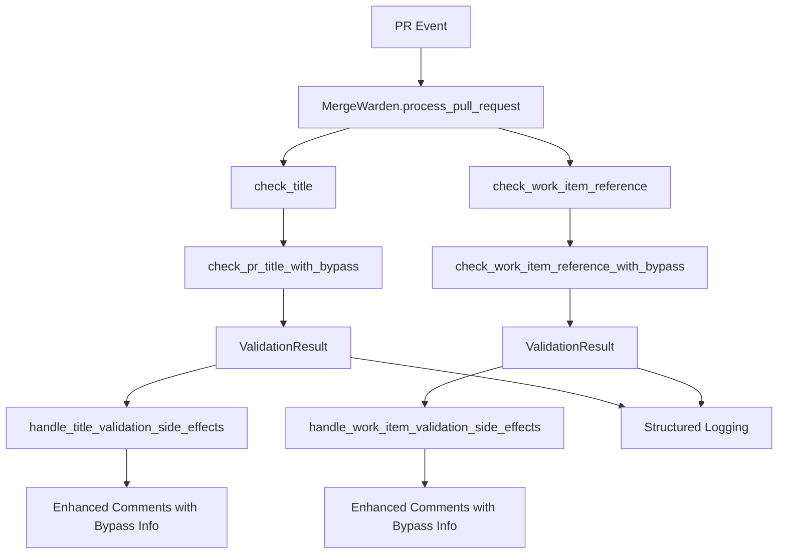

# Bypass Logging and Indication Enhancement Specification

## Problem Description

The current bypass functionality in Merge Warden allows authorized users to bypass validation
rules but lacks observability and user communication features. Specifically:

1. **No audit trail**: When a bypass is used, there's no logging to track who bypassed what rule
2. **No user indication**: Comments and labels don't indicate that validation was bypassed rather
   than actually valid
3. **Poor observability**: Operations teams cannot monitor bypass usage patterns or detect
   potential abuse

This creates compliance and transparency issues in environments where audit trails are required.

## Surrounding Context

The current bypass implementation (Work Item #16) provides:

- Rule-specific bypass configuration for title and work item validation
- User-based bypass permissions via configuration
- CLI management of bypass rules
- Integration with core validation logic

However, the implementation treats bypassed PRs identically to genuinely valid PRs, making it
impossible to distinguish between the two cases in logs, comments, or metrics.

## Proposed Solution

Enhance the bypass system to provide comprehensive logging and user indication when bypasses are
used, ensuring full transparency and audit compliance.

### Alternatives Considered

1. **Post-hoc logging**: Log bypass usage after validation completes
   - **Rejected**: Would require separate logging calls and could miss edge cases

2. **External audit service**: Send bypass events to separate audit service
   - **Rejected**: Adds complexity and external dependencies

3. **Enhanced return types**: Modify validation functions to return detailed results including
   bypass information
   - **Selected**: Provides comprehensive information flow and maintains single responsibility

## Design

### Architecture Overview



### Data Structures

#### ValidationResult

Enhanced result type that carries validation outcome and bypass information:

```rust
/// Result of a validation check including bypass information
pub struct ValidationResult {
    /// Whether the validation passed (either valid content or bypassed)
    pub is_valid: bool,

    /// Whether a bypass rule was used to make this validation pass
    pub bypass_used: bool,

    /// Detailed information about the bypass, if used
    pub bypass_info: Option<BypassInfo>,
}
```

#### BypassInfo

Detailed information about which bypass was used:

```rust
/// Information about a bypass that was used
pub struct BypassInfo {
    /// The type of validation rule that was bypassed
    pub rule_type: BypassRuleType,

    /// The username of the user who had bypass permissions
    pub user: String,
}

/// Types of validation rules that can be bypassed
#[derive(Debug, Clone, PartialEq)]
pub enum BypassRuleType {
    TitleConvention,
    WorkItemReference,
}
```

### Enhanced Function Signatures

#### Bypass Check Functions

```rust
// Current: Returns only boolean
pub fn can_bypass_title_validation(user: Option<&User>, bypass_rule: &BypassRule) -> bool

// Enhanced: Returns bypass information if applicable
pub fn check_title_bypass(user: Option<&User>, bypass_rule: &BypassRule) -> Option<BypassInfo>
```

#### Validation Functions

```rust
// Current: Returns only boolean
pub fn check_pr_title_with_bypass(pr: &PullRequest, bypass_rule: &BypassRule) -> bool

// Enhanced: Returns detailed validation result
pub fn check_pr_title_with_bypass(pr: &PullRequest, bypass_rule: &BypassRule) -> ValidationResult
```

### Logging Strategy

#### Bypass Usage Logging

When a bypass is used, log at INFO level for audit trails:

```rust
info!(
    repository_owner = repo_owner,
    repository = repo_name,
    pull_request = pr.number,
    user = bypass_info.user,
    rule_type = ?bypass_info.rule_type,
    pr_title = pr.title,
    pr_author = pr.author.as_ref().map(|u| &u.login),
    "Validation bypass used"
);
```

#### Normal Validation Logging

Continue existing DEBUG level logging for normal validation flow:

```rust
debug!(
    repository_owner = repo_owner,
    repository = repo_name,
    pull_request = pr.number,
    is_valid = result.is_valid,
    "PR title validation completed"
);
```

### Enhanced Comment Generation

#### Bypassed Title Validation

When title validation is bypassed, generate enhanced comment:

```markdown
⚠️ **Title Validation Bypassed**

The PR title validation was bypassed for user `{user}`.
- Original title: `{title}`
- Bypass rule: Title Convention
- Bypassed by: {user}

**Note**: This PR may not follow conventional commit format but was allowed due to bypass
permissions.

---
For more information about conventional commits, see: https://www.conventionalcommits.org/
```

#### Bypassed Work Item Validation

When work item validation is bypassed:

```markdown
⚠️ **Work Item Validation Bypassed**

The work item reference validation was bypassed for user `{user}`.
- PR description may not contain required work item references
- Bypass rule: Work Item Reference
- Bypassed by: {user}

**Note**: This PR was allowed to proceed without work item references due to bypass permissions.
```

#### Valid Without Bypass

When validation passes normally, use existing comment format with no bypass indication.

### Integration Points

#### CheckResult Enhancement

Update the main result structure to include bypass information:

```rust
/// Result of processing a pull request through Merge Warden
#[derive(Debug, Clone)]
pub struct CheckResult {
    /// Whether the PR title follows the Conventional Commits format or was bypassed
    pub title_valid: bool,

    /// Whether the PR description references a work item or was bypassed
    pub work_item_referenced: bool,

    /// Labels that were added to the PR based on its content
    pub labels: Vec<String>,

    /// Information about any bypasses that were used
    pub bypasses_used: Vec<BypassInfo>,
}
```

### Security and Audit Considerations

1. **Immutable Audit Trail**: All bypass usage is logged with structured data that cannot be
   easily modified
2. **User Attribution**: Every bypass is attributed to a specific user login
3. **Rule Tracking**: Each bypass logs which specific validation rule was bypassed
4. **Timestamp Correlation**: Structured logging provides automatic timestamps for correlation
5. **Non-repudiation**: Bypass information is included in PR comments as permanent record

### Performance Impact

- **Minimal overhead**: Enhanced return types add negligible memory usage
- **No additional API calls**: Logging and comment generation use existing infrastructure
- **Backwards compatible**: Public API signatures remain unchanged

## Implementation Phases

### Phase 1: Enhanced Data Types

- Create `ValidationResult` and `BypassInfo` structures
- Add to core crate with comprehensive documentation and examples

### Phase 2: Update Bypass Functions

- Modify bypass check functions to return `Option<BypassInfo>`
- Update unit tests to verify new return types

### Phase 3: Update Validation Functions

- Modify title and work item validation functions to return `ValidationResult`
- Add structured logging for bypass usage
- Update unit tests for new behavior

### Phase 4: Update Main Logic

- Modify `MergeWarden` to handle `ValidationResult` types
- Update side-effect handlers to process bypass information
- Update `CheckResult` to include bypass information

### Phase 5: Enhanced Comment Generation

- Update comment text generation to include bypass information
- Different templates for bypassed vs. valid content
- Add audit information to comments

### Phase 6: Comprehensive Testing

- Update all existing tests for new return types
- Add specific tests for bypass logging
- Add integration tests for comment generation
- Verify audit trail completeness

## Success Criteria

### Functional Requirements

1. **Audit Trail**: All bypass usage is logged at INFO level with structured data including:
   - Repository owner and name
   - PR number and title
   - User who bypassed the rule
   - Rule type that was bypassed
   - Timestamp (automatic via logging framework)

2. **User Indication**: Comments clearly indicate when validation was bypassed vs. actually valid:
   - Bypass comments include warning indicators and specific bypass information
   - Valid comments use existing format without bypass indication
   - Bypass information is permanently recorded in PR comments

3. **API Compatibility**: Public API remains backwards compatible:
   - `MergeWarden.process_pull_request()` signature unchanged
   - `CheckResult` enhanced but existing fields preserved
   - Configuration structure unchanged

### Non-Functional Requirements

1. **Performance**: Less than 5% performance impact on validation processing
2. **Reliability**: All existing tests continue to pass
3. **Maintainability**: New code follows existing patterns and conventions
4. **Observability**: Bypass usage can be monitored via structured logs

## Conclusion

This enhancement provides comprehensive observability and transparency for bypass usage while
maintaining backwards compatibility and minimal performance impact. The implementation follows
existing architectural patterns and provides clear audit trails for compliance requirements.

The phased approach ensures each component can be thoroughly tested before proceeding, reducing
the risk of introducing bugs or breaking existing functionality.
