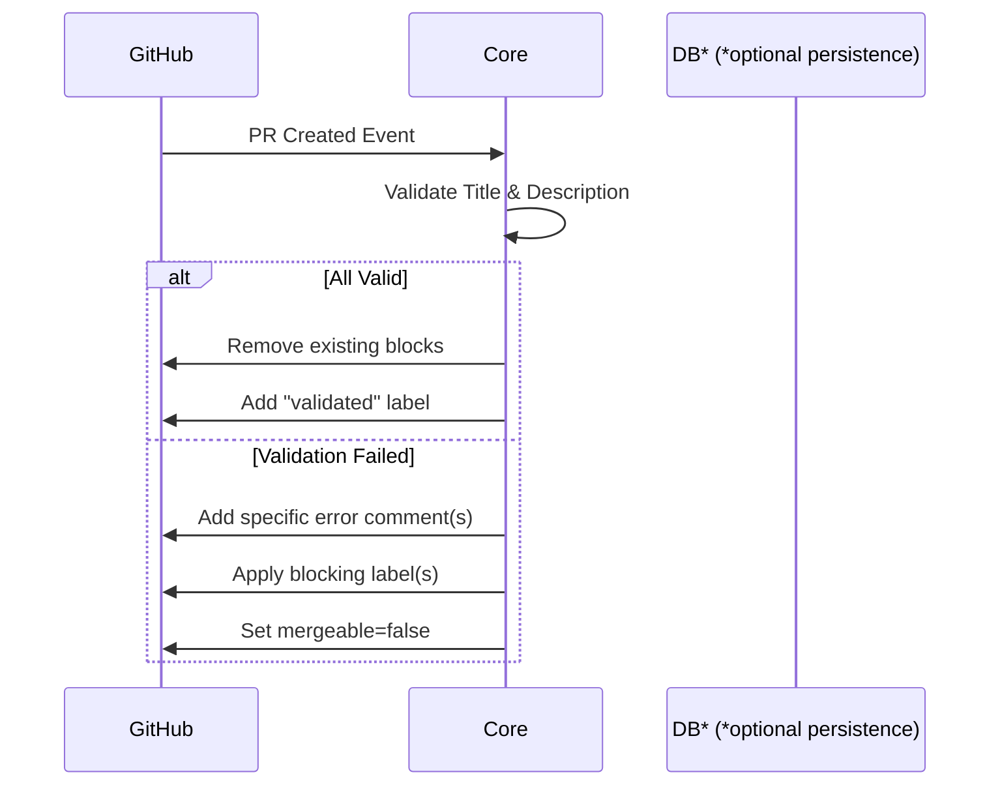
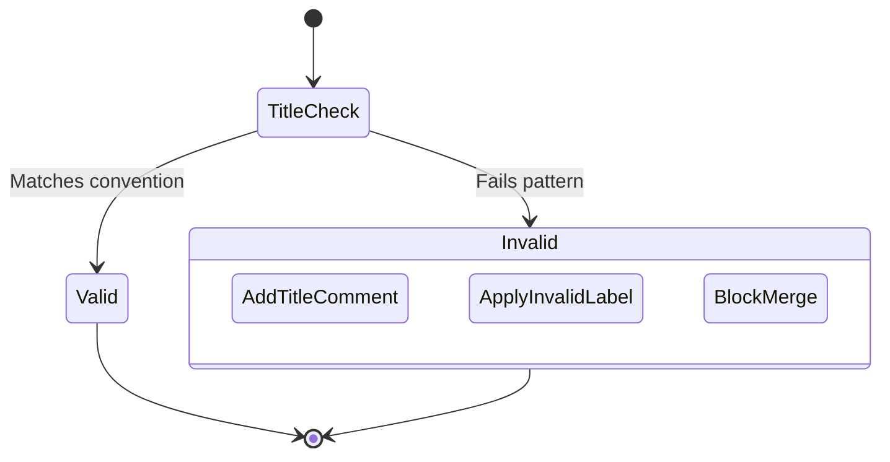
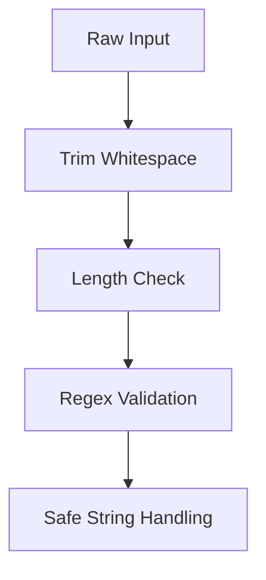

# Core Crate Specification

This specification describes the core crate for the Merge Warden service.

## Purpose

The core crate contains the business logic for PR validation and is designed to be shared across:

- AWS Lambda
- Azure Functions
- CLI
- Future deployment targets

## Requirements

- The PR title must follow the [Conventional Commits](https://www.conventionalcommits.org/) format. Acceptable prefixes are:
  - build
  - chore
  - ci
  - docs
  - feat
  - fix
  - perf
  - refactor
  - revert
  - style
  - test
- The PR body must contain at least one GitHub issue reference in the following formats:
  - `#123`
  - `GH-123`
  - `org/repo#123`
- Work item references may be prefixed with one of the following prefixes. Prefixes are case-insensitive:
  - `closes`
  - `fixes`
  - `relates to`
  - `references`
- If the PR title or description is invalid, the service should:
  - Apply the `invalid-title` label
  - Block the PR from being merged
  - Post a comment with specific details on what is wrong or missing with the title
- If the PR description is missing a work item reference, the service should:
  - Apply a `missing-workitem` label
  - Block the PR from being merged
  - Post a comment with an example of a valid work item reference
- If the PR title is updated to be valid, the service should:
  - Remove the `invalid-title` label
  - Unblock the PR from being merged but only if all the other validations pass
  - Remove any previous comments about the title being invalid
- If the PR description is updated to contain a work item reference, the service should:
  - Remove the `missing-workitem` label
  - Unblock the PR from being merged but only if all the other validations pass
  - Remove any previous comments about the work item reference being missing
- The service should be able to handle multiple PR events concurrently

## Key Use Cases

### 1. PR Created (Initial Validation)



### 2. PR Title Updated



### 3. PR Description Updated (Work Item Reference)

```mermaid
flowchart TD
    A[Check Description] --> B{Contains WI Reference?}
    B -->|Yes| C[Remove "missing-wi" label]
    B -->|Yes| D[Delete previous WI comment]
    B -->|No| E[Add "missing-wi" label]
    B -->|No| F[Post WI help comment]
```

## Security Considerations

### 1. Input Sanitization & Validation



- **PR Title/Description Parsing**:
  - Max length enforcement (title: 100 chars, description: 10k chars)
  - Disallow control characters except newlines in descriptions
  - Use Rust's `regex-lite` with timeout for pattern matching
  - HTML/Markdown sanitization (strip tags from comment templates)

- **GitHub API Responses**:
  - Validate response sizes before parsing
  - Limit maximum JSON depth (5 levels)
  - Timeout for API calls (30s)

### 2. GitHub API Rate Management

```rust
// Example rate limiter implementation
struct RateLimiter {
    remaining: AtomicU32,
    reset_time: AtomicU64,
}

impl RateLimiter {
    fn update_from_headers(&self, headers: &HeaderMap) {
        // Parse X-RateLimit-Remaining and X-RateLimit-Reset
    }

    fn wait_if_needed(&self) -> impl Future<Output = ()> {
        // Async wait until rate limit resets
    }
}
```

- **Throttling Strategies**:
  - 5000 API calls/hour max per installation
  - Bulk operations queue with 10 req/s ceiling
  - Jittered exponential backoff (50ms → 5s)

### 3. Denial of Service Protection

| Layer          | Protection                         | Implementation Notes              |
|----------------|------------------------------------|------------------------------------|
| Input Validation | Max PR body size (1MB)            | Reject oversized payloads early   |
| Processing     | Timeout per check (200ms)         | Tokio's `timeout` future          |
| API Layer      | Request signature verification     | GitHub's webhook HMAC validation  |
| Resource       | Memory caps per invocation        | 128MB max usage before abort      |

### 4. Code Security Practices

- **Safe Dependencies**:
  - Audit with `cargo-audit`
  - Pinning dependency versions
  - `#[forbid(unsafe_code)]` in all modules

- **API Credential Handling**:
  - Encrypted at rest using OS keyring
  - Short-lived tokens (1h validity)
  - Automatic rotation via GitHub App

- **Logging Security**:

  ```rust
  // Sanitize logs
  fn log_pr_event(pr: &PullRequest) {
      debug!("PR {} by {}: {}",
          pr.number,
          pr.user.login, // OK
          truncate(pr.body, 50) // Limited to 50 chars
      );
  }
  ```

## Implementation Considerations

### 1. Comment Management

- Track comments via GitHub API's comment ID
- Update existing comments instead of creating new ones
- Use hidden metadata markers in comments for identification
- Implement comment "versioning" to handle multiple updates

### 2. State Handling

- Idempotent operations for retry safety
- ETag handling for GitHub resources
- Rate limit awareness (retry-after headers)

### 3. Error Recovery

- Separate transient vs permanent errors
- Retry strategy for GitHub API failures
- Circuit breaker pattern for repeated failures

## Coding Rules

1. **Architecture**:
   - Keep platform-agnostic (no cloud-specific code)
   - Async/await for all I/O operations

2. **Error Handling**:

   ```rust
   #[derive(Debug, thiserror::Error)]
   enum ValidationError {
       #[error("Title validation failed: {0}")]
       Title(String),
       #[error("Missing work item reference")]
       WorkItem,
   }
   ```

3. **Testing**:
   - 100% unit test coverage for validation logic
   - Mock GitHub API responses
   - Property-based testing for regex patterns
   - Snapshot testing for comment templates

4. **Performance**:
   - <50ms per validation check
   - Cache GitHub API responses where safe
   - Parallelize independent checks

## Validation State Matrix

| Event Type | Title Valid | WI Present | Action |
|------------|-------------|------------|--------|
| Create     | Yes         | Yes        | Allow merge |
| Create     | No          | Any        | Block + create title comment |
| Create     | Yes         | No         | Block + create WI comment |
| Update     | Yes→No      | Any        | Block + Update or create title comment |
| Update     | No→Yes      | Yes        | Unblock + Remove comment |
| Update     | Any         | Yes→No     | Block + Update or create WI comment |
