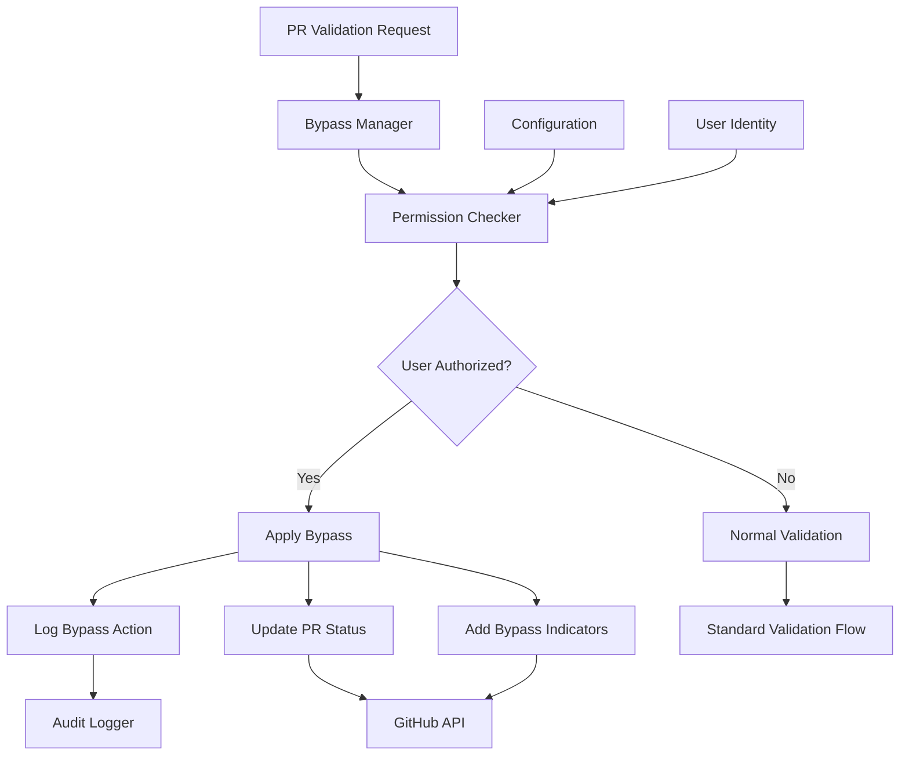

# Bypass Mechanisms

**Version:** 1.0
**Last Updated:** July 22, 2025

## Overview

The bypass mechanisms provide authorized users the ability to override validation rules in exceptional circumstances while maintaining comprehensive audit trails and transparency. This system ensures compliance requirements are met while enabling operational flexibility when needed.

## Design Principles

### Security First

All bypass operations require explicit authorization and are subject to strict permission controls to prevent abuse and maintain system integrity.

### Complete Audit Trail

Every bypass action is logged with detailed context, enabling compliance reporting and security monitoring.

### Transparency

Bypass usage is clearly communicated to all stakeholders through comments, labels, and status indicators.

### Least Privilege

Bypass permissions are granted on a rule-by-rule basis with minimal scope to reduce security risk.

## Bypass Architecture



## Core Data Structures

### ValidationResult with Bypass Information

```rust
/// Result of a validation check including bypass information
#[derive(Debug, Clone, PartialEq)]
pub struct ValidationResult {
    /// Whether the validation passed (either valid content or bypassed)
    pub success: bool,

    /// Detailed information about the bypass, if used
    pub bypass_info: Option<BypassInfo>,

    /// Additional context for the validation result
    pub message: Option<String>,

    /// Suggestions for addressing validation failures
    pub suggestions: Vec<String>,
}

impl ValidationResult {
    /// Create a successful validation result
    pub fn success() -> Self {
        Self {
            success: true,
            bypass_info: None,
            message: None,
            suggestions: vec![],
        }
    }

    /// Create a failed validation result
    pub fn failure(message: String, suggestions: Vec<String>) -> Self {
        Self {
            success: false,
            bypass_info: None,
            message: Some(message),
            suggestions,
        }
    }

    /// Create a bypassed validation result
    pub fn bypassed(bypass_info: BypassInfo) -> Self {
        Self {
            success: true,
            bypass_info: Some(bypass_info),
            message: Some(format!(
                "Validation bypassed by {} ({})",
                bypass_info.bypassed_by,
                bypass_info.rule_type
            )),
            suggestions: vec![],
        }
    }

    /// Check if this result represents a bypass
    pub fn is_bypassed(&self) -> bool {
        self.bypass_info.is_some()
    }
}
```

### BypassInfo

```rust
/// Detailed information about a bypass that was used
#[derive(Debug, Clone, PartialEq)]
pub struct BypassInfo {
    /// The type of validation rule that was bypassed
    pub rule_type: BypassRuleType,

    /// Username of the person who triggered the bypass
    pub bypassed_by: String,

    /// Timestamp when the bypass was applied
    pub bypassed_at: DateTime<Utc>,

    /// Optional reason provided for the bypass
    pub reason: Option<String>,

    /// The bypass mechanism used (configuration-based, emergency, etc.)
    pub mechanism: BypassMechanism,
}

#[derive(Debug, Clone, PartialEq)]
pub enum BypassRuleType {
    TitleValidation,
    WorkItemReference,
    PrSize,
    CustomRule(String),
}

#[derive(Debug, Clone, PartialEq)]
pub enum BypassMechanism {
    /// User is listed in configuration bypass rules
    ConfigurationBased,
    /// Emergency bypass triggered by admin
    Emergency,
    /// Temporary bypass with expiration
    Temporary { expires_at: DateTime<Utc> },
}
```

## Bypass Manager

### Permission Management

```rust
pub struct BypassManager {
    config: Arc<MergeWardenConfig>,
    user_resolver: Arc<dyn UserResolver>,
}

impl BypassManager {
    pub async fn check_bypass(
        &self,
        pull_request: &PullRequest,
        rule_name: &str,
        user: &User,
    ) -> Option<BypassInfo> {
        // Check if user has bypass permission for this rule
        if !self.has_bypass_permission(user, rule_name).await {
            return None;
        }

        // Check for emergency bypass conditions
        if let Some(emergency_info) = self.check_emergency_bypass(rule_name).await {
            return Some(BypassInfo {
                rule_type: BypassRuleType::from_rule_name(rule_name),
                bypassed_by: user.login.clone(),
                bypassed_at: Utc::now(),
                reason: emergency_info.reason,
                mechanism: BypassMechanism::Emergency,
            });
        }

        // Apply configuration-based bypass
        Some(BypassInfo {
            rule_type: BypassRuleType::from_rule_name(rule_name),
            bypassed_by: user.login.clone(),
            bypassed_at: Utc::now(),
            reason: None,
            mechanism: BypassMechanism::ConfigurationBased,
        })
    }

    async fn has_bypass_permission(&self, user: &User, rule_name: &str) -> bool {
        let bypass_rules = match &self.config.bypass_rules {
            Some(rules) => rules,
            None => return false,
        };

        match rule_name {
            "title_validation" => {
                bypass_rules.title_validation
                    .as_ref()
                    .map(|users| users.contains(&user.login))
                    .unwrap_or(false)
            }
            "work_item_reference" => {
                bypass_rules.work_item_validation
                    .as_ref()
                    .map(|users| users.contains(&user.login))
                    .unwrap_or(false)
            }
            "pr_size" => {
                bypass_rules.size_validation
                    .as_ref()
                    .map(|users| users.contains(&user.login))
                    .unwrap_or(false)
            }
            _ => {
                // Check custom rule bypasses
                bypass_rules.custom_rules
                    .get(rule_name)
                    .map(|users| users.contains(&user.login))
                    .unwrap_or(false)
            }
        }
    }
}
```

### Configuration Structure

```toml
[bypass_rules]
# Users who can bypass title validation
title_validation = ["admin", "release-manager"]

# Users who can bypass work item validation
work_item_validation = ["hotfix-team", "admin"]

# Users who can bypass size validation
size_validation = ["architect", "admin"]

# Emergency bypass settings
[bypass_rules.emergency]
enabled = false
allowed_users = ["admin", "on-call-engineer"]
max_duration_hours = 24

# Custom rule bypasses
[bypass_rules.custom_rules]
security_scan = ["security-team", "admin"]
performance_check = ["performance-team"]
```

## Bypass Indication System

### Enhanced Comments

```rust
impl CommentManager {
    pub async fn post_validation_comment(
        &self,
        pr: &PullRequest,
        validation_results: &[ValidationResult],
    ) -> Result<(), CommentError> {
        let mut comment_parts = vec![];

        for result in validation_results {
            if !result.success {
                // Standard validation failure
                comment_parts.push(self.format_failure_message(result));
            } else if result.is_bypassed() {
                // Bypass indication
                comment_parts.push(self.format_bypass_message(result));
            }
        }

        if !comment_parts.is_empty() {
            let comment = self.build_comment(&comment_parts)?;
            self.github_client.add_comment(
                &pr.repository,
                pr.number,
                &comment,
            ).await?;
        }

        Ok(())
    }

    fn format_bypass_message(&self, result: &ValidationResult) -> String {
        let bypass_info = result.bypass_info.as_ref().unwrap();

        format!(
            "⚠️ **Validation Bypassed**: {}\n\
            **Bypassed by**: {}\n\
            **Timestamp**: {}\n\
            **Mechanism**: {}\n\
            {}\n\
            \n\
            > **Note**: This PR bypassed normal validation rules. \
            Please ensure manual review covers the bypassed requirements.",
            self.format_rule_type(&bypass_info.rule_type),
            bypass_info.bypassed_by,
            bypass_info.bypassed_at.format("%Y-%m-%d %H:%M:%S UTC"),
            self.format_mechanism(&bypass_info.mechanism),
            bypass_info.reason
                .as_ref()
                .map(|r| format!("**Reason**: {}", r))
                .unwrap_or_default()
        )
    }

    fn format_rule_type(&self, rule_type: &BypassRuleType) -> &'static str {
        match rule_type {
            BypassRuleType::TitleValidation => "Title Format Validation",
            BypassRuleType::WorkItemReference => "Work Item Reference Validation",
            BypassRuleType::PrSize => "PR Size Validation",
            BypassRuleType::CustomRule(name) => name,
        }
    }

    fn format_mechanism(&self, mechanism: &BypassMechanism) -> String {
        match mechanism {
            BypassMechanism::ConfigurationBased => "Configuration-based bypass".to_string(),
            BypassMechanism::Emergency => "Emergency bypass".to_string(),
            BypassMechanism::Temporary { expires_at } => {
                format!("Temporary bypass (expires: {})",
                    expires_at.format("%Y-%m-%d %H:%M:%S UTC"))
            }
        }
    }
}
```

### Bypass Labels

```rust
impl LabelManager {
    pub async fn apply_bypass_labels(
        &self,
        pr: &PullRequest,
        validation_results: &[ValidationResult],
    ) -> Result<(), LabelError> {
        let bypassed_rules: Vec<_> = validation_results.iter()
            .filter(|r| r.is_bypassed())
            .collect();

        if bypassed_rules.is_empty() {
            // Remove bypass labels if no bypasses active
            self.remove_bypass_labels(pr).await?;
            return Ok(());
        }

        // Apply general bypass indicator
        self.apply_label(pr, &Label {
            name: "validation-bypassed".to_string(),
            color: "#FFA500".to_string(), // Orange
            description: Some("PR has bypassed validation rules".to_string()),
        }).await?;

        // Apply specific bypass labels
        for result in &bypassed_rules {
            if let Some(bypass_info) = &result.bypass_info {
                let label = self.get_bypass_label_for_rule(&bypass_info.rule_type);
                self.apply_label(pr, &label).await?;
            }
        }

        Ok(())
    }

    fn get_bypass_label_for_rule(&self, rule_type: &BypassRuleType) -> Label {
        match rule_type {
            BypassRuleType::TitleValidation => Label {
                name: "bypass: title".to_string(),
                color: "#FFA500".to_string(),
                description: Some("Title validation bypassed".to_string()),
            },
            BypassRuleType::WorkItemReference => Label {
                name: "bypass: work-item".to_string(),
                color: "#FFA500".to_string(),
                description: Some("Work item validation bypassed".to_string()),
            },
            BypassRuleType::PrSize => Label {
                name: "bypass: size".to_string(),
                color: "#FFA500".to_string(),
                description: Some("Size validation bypassed".to_string()),
            },
            BypassRuleType::CustomRule(name) => Label {
                name: format!("bypass: {}", name),
                color: "#FFA500".to_string(),
                description: Some(format!("{} validation bypassed", name)),
            },
        }
    }
}
```

## Audit and Logging

### Structured Logging

```rust
pub struct BypassAuditor {
    logger: Arc<dyn StructuredLogger>,
}

impl BypassAuditor {
    pub async fn log_bypass_usage(
        &self,
        pr: &PullRequest,
        bypass_info: &BypassInfo,
        context: &ValidationContext,
    ) -> Result<(), AuditError> {
        let audit_event = BypassAuditEvent {
            event_type: "validation_bypass".to_string(),
            timestamp: Utc::now(),
            repository: pr.repository.full_name(),
            pull_request_number: pr.number,
            rule_type: bypass_info.rule_type.clone(),
            bypassed_by: bypass_info.bypassed_by.clone(),
            bypass_mechanism: bypass_info.mechanism.clone(),
            reason: bypass_info.reason.clone(),
            pr_author: pr.author.login.clone(),
            pr_title: pr.title.clone(),
            correlation_id: context.correlation_id.clone(),
        };

        // Log to structured logger (Application Insights, etc.)
        self.logger.log_event("bypass_audit", &audit_event).await?;

        // Also log as warning for operational monitoring
        log::warn!(
            "Validation bypass used: rule={:?} user={} pr={}#{} mechanism={:?}",
            bypass_info.rule_type,
            bypass_info.bypassed_by,
            pr.repository.full_name(),
            pr.number,
            bypass_info.mechanism
        );

        Ok(())
    }
}

#[derive(Debug, Serialize)]
struct BypassAuditEvent {
    event_type: String,
    timestamp: DateTime<Utc>,
    repository: String,
    pull_request_number: u64,
    rule_type: BypassRuleType,
    bypassed_by: String,
    bypass_mechanism: BypassMechanism,
    reason: Option<String>,
    pr_author: String,
    pr_title: String,
    correlation_id: String,
}
```

### Monitoring and Alerting

```rust
pub struct BypassMonitor {
    metrics: Arc<dyn MetricsCollector>,
    alerting: Arc<dyn AlertingService>,
}

impl BypassMonitor {
    pub async fn record_bypass_metrics(&self, bypass_info: &BypassInfo) {
        // Increment bypass counters
        self.metrics.increment_counter(
            "bypass_usage_total",
            &[
                ("rule_type", format!("{:?}", bypass_info.rule_type)),
                ("mechanism", format!("{:?}", bypass_info.mechanism)),
            ],
        ).await;

        // Track bypass frequency for anomaly detection
        self.metrics.histogram(
            "bypass_frequency",
            1.0,
            &[("bypassed_by", bypass_info.bypassed_by.clone())],
        ).await;
    }

    pub async fn check_bypass_anomalies(
        &self,
        user: &str,
        time_window: Duration,
    ) -> Result<(), MonitoringError> {
        let bypass_count = self.metrics.query_count(
            "bypass_usage_total",
            time_window,
            &[("bypassed_by", user.to_string())],
        ).await?;

        // Alert on excessive bypass usage
        if bypass_count > BYPASS_THRESHOLD_PER_HOUR {
            self.alerting.send_alert(Alert {
                severity: AlertSeverity::Warning,
                title: "Excessive bypass usage detected".to_string(),
                description: format!(
                    "User {} has used {} bypasses in the last hour",
                    user, bypass_count
                ),
                tags: vec![
                    ("user".to_string(), user.to_string()),
                    ("bypass_count".to_string(), bypass_count.to_string()),
                ],
            }).await?;
        }

        Ok(())
    }
}
```

## Security Considerations

### Access Control

```rust
impl BypassManager {
    pub async fn validate_bypass_request(
        &self,
        user: &User,
        rule_name: &str,
        pr: &PullRequest,
    ) -> Result<BypassValidation, SecurityError> {
        // Check user authentication
        if !self.user_resolver.is_authenticated(user).await? {
            return Ok(BypassValidation::Denied(
                "User not authenticated".to_string()
            ));
        }

        // Check user authorization for this rule
        if !self.has_bypass_permission(user, rule_name).await {
            return Ok(BypassValidation::Denied(
                format!("User {} not authorized for {} bypass", user.login, rule_name)
            ));
        }

        // Check for rate limiting
        if self.is_rate_limited(user, rule_name).await? {
            return Ok(BypassValidation::RateLimited(
                "Too many bypass attempts".to_string()
            ));
        }

        // Check for emergency conditions
        if self.is_emergency_bypass_required(rule_name, pr).await? {
            return Ok(BypassValidation::RequiresEmergency);
        }

        Ok(BypassValidation::Approved)
    }
}

#[derive(Debug)]
pub enum BypassValidation {
    Approved,
    Denied(String),
    RateLimited(String),
    RequiresEmergency,
}
```

### Bypass Abuse Prevention

```rust
impl BypassManager {
    async fn is_rate_limited(&self, user: &User, rule_name: &str) -> Result<bool, SecurityError> {
        let key = format!("bypass:{}:{}", user.login, rule_name);
        let window = Duration::hours(1);
        let limit = self.get_rate_limit_for_rule(rule_name);

        let current_count = self.rate_limiter.get_count(&key, window).await?;
        Ok(current_count >= limit)
    }

    fn get_rate_limit_for_rule(&self, rule_name: &str) -> u32 {
        match rule_name {
            "title_validation" => 5,    // 5 bypasses per hour
            "work_item_reference" => 3, // 3 bypasses per hour
            "pr_size" => 2,            // 2 bypasses per hour
            _ => 1,                    // 1 bypass per hour for custom rules
        }
    }
}
```

## Testing Strategy

### Unit Testing

- Bypass permission checking logic
- Validation result generation with bypass information
- Comment and label formatting
- Audit logging functionality

### Integration Testing

- End-to-end bypass workflows
- GitHub API integration for comments and labels
- Structured logging integration
- Rate limiting and security controls

### Security Testing

- Unauthorized bypass attempts
- Rate limiting effectiveness
- Audit trail integrity
- Permission escalation prevention

### Test Cases

```rust
#[cfg(test)]
mod tests {
    use super::*;

    #[tokio::test]
    async fn test_authorized_user_can_bypass() {
        let bypass_manager = create_bypass_manager_with_config(
            r#"
            [bypass_rules]
            title_validation = ["admin"]
            "#
        );

        let user = User { login: "admin".to_string() };
        let pr = create_test_pr();

        let result = bypass_manager.check_bypass(&pr, "title_validation", &user).await;
        assert!(result.is_some());

        let bypass_info = result.unwrap();
        assert_eq!(bypass_info.bypassed_by, "admin");
        assert_eq!(bypass_info.rule_type, BypassRuleType::TitleValidation);
    }

    #[tokio::test]
    async fn test_unauthorized_user_cannot_bypass() {
        let bypass_manager = create_bypass_manager_with_config(
            r#"
            [bypass_rules]
            title_validation = ["admin"]
            "#
        );

        let user = User { login: "regular-user".to_string() };
        let pr = create_test_pr();

        let result = bypass_manager.check_bypass(&pr, "title_validation", &user).await;
        assert!(result.is_none());
    }

    #[tokio::test]
    async fn test_bypass_comment_formatting() {
        let comment_manager = CommentManager::new(Arc::new(MockGitHubClient::new()));

        let validation_result = ValidationResult::bypassed(BypassInfo {
            rule_type: BypassRuleType::TitleValidation,
            bypassed_by: "admin".to_string(),
            bypassed_at: Utc::now(),
            reason: Some("Emergency hotfix".to_string()),
            mechanism: BypassMechanism::Emergency,
        });

        let message = comment_manager.format_bypass_message(&validation_result);
        assert!(message.contains("⚠️ **Validation Bypassed**"));
        assert!(message.contains("**Bypassed by**: admin"));
        assert!(message.contains("**Reason**: Emergency hotfix"));
        assert!(message.contains("Emergency bypass"));
    }
}
```

## Compliance and Reporting

### Audit Reports

```rust
pub struct BypassReportGenerator {
    audit_store: Arc<dyn AuditStore>,
}

impl BypassReportGenerator {
    pub async fn generate_monthly_report(
        &self,
        year: i32,
        month: u32,
    ) -> Result<BypassReport, ReportError> {
        let start_date = NaiveDate::from_ymd(year, month, 1).and_hms(0, 0, 0);
        let end_date = if month == 12 {
            NaiveDate::from_ymd(year + 1, 1, 1)
        } else {
            NaiveDate::from_ymd(year, month + 1, 1)
        }.and_hms(0, 0, 0);

        let events = self.audit_store.query_events(
            start_date,
            end_date,
            Some("validation_bypass".to_string()),
        ).await?;

        Ok(BypassReport {
            period: format!("{}-{:02}", year, month),
            total_bypasses: events.len(),
            bypasses_by_rule: self.group_by_rule_type(&events),
            bypasses_by_user: self.group_by_user(&events),
            bypasses_by_repository: self.group_by_repository(&events),
            anomalies: self.detect_anomalies(&events),
        })
    }
}

#[derive(Debug, Serialize)]
pub struct BypassReport {
    pub period: String,
    pub total_bypasses: usize,
    pub bypasses_by_rule: HashMap<String, usize>,
    pub bypasses_by_user: HashMap<String, usize>,
    pub bypasses_by_repository: HashMap<String, usize>,
    pub anomalies: Vec<BypassAnomaly>,
}
```

## Related Specifications

- [Validation Engine](./validation-engine.md) - How bypass mechanisms integrate with validation rules
- [Configuration System](./configuration-system.md) - Bypass rule configuration management
- [Security Authentication](../security/authentication.md) - User authentication and authorization
- [Operations Monitoring](../operations/monitoring.md) - Operational monitoring and alerting
