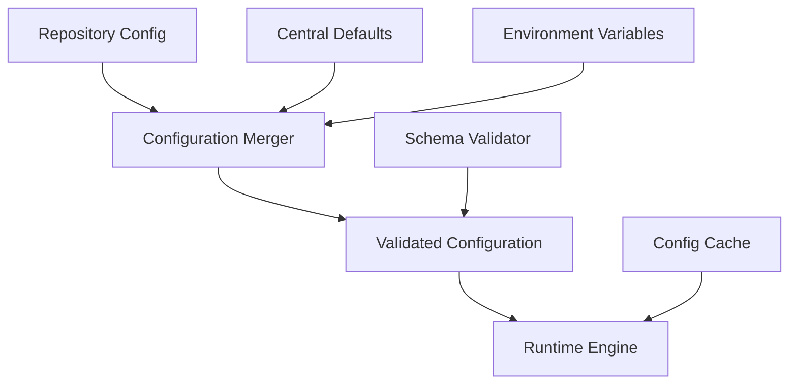

# Configuration System

**Version:** 1.0
**Last Updated:** July 22, 2025

## Overview

The configuration system provides centralized, flexible, and extensible configuration management for Merge Warden across all deployment targets. It supports repository-specific configuration, centralized settings, runtime updates, and comprehensive validation.

## Design Principles

### Configuration as Code

Repository-specific configuration is stored in version control alongside code, enabling configuration changes to be reviewed, tested, and rolled back through standard development workflows.

### Hierarchical Configuration

Configuration is applied in layers with clear precedence rules, enabling both centralized defaults and repository-specific customization.

### Schema Validation

All configuration is validated against a versioned schema to ensure correctness and provide clear error messages for invalid configurations.

### Dynamic Updates

Support for runtime configuration updates without service restarts, enabling operational flexibility and reduced downtime.

## Configuration Architecture



## Configuration Sources

### Repository Configuration

Primary configuration source stored in `.github/merge-warden.toml`:

```toml
schemaVersion = 1

[policies.pullRequests.prTitle]
format = "conventional-commits"
allowed_types = ["feat", "fix", "docs", "chore", "refactor", "test"]

[policies.pullRequests.workItem]
required = true
pattern = "#\\d+"
allowed_prefixes = ["closes", "fixes", "relates to", "references"]

[policies.pullRequests.prSize]
enabled = true
fail_on_oversized = false
size_thresholds = { xs = 10, s = 50, m = 100, l = 250, xl = 500 }

[change_type_labels]
enabled = true
create_if_missing = true

[bypass_rules]
title_validation = ["admin", "release-manager"]
work_item_validation = ["hotfix-team"]
```

### Azure App Configuration

Centralized configuration for operational settings:

```json
{
  "merge-warden:default:enforce_title_convention": "true",
  "merge-warden:default:require_work_items": "true",
  "merge-warden:bypass:emergency_bypass_enabled": "false",
  "merge-warden:monitoring:telemetry_level": "info"
}
```

### Environment Variables

Platform-specific and security-sensitive configuration:

```bash
# Azure Functions
APP_CONFIG_ENDPOINT=https://merge-warden-config.azconfig.io
GITHUB_APP_ID=123456
GITHUB_WEBHOOK_SECRET=secret

# CLI
MERGE_WARDEN_CONFIG_PATH=/path/to/config.toml
GITHUB_TOKEN=ghp_token
```

## Configuration Schema

### Schema Versioning

```rust
#[derive(Debug, Deserialize)]
pub struct MergeWardenConfig {
    #[serde(rename = "schemaVersion")]
    pub schema_version: u32,
    pub policies: Option<Policies>,
    pub change_type_labels: Option<ChangeTypeLabels>,
    pub bypass_rules: Option<BypassRules>,
}
```

### Policy Configuration

```rust
#[derive(Debug, Deserialize)]
pub struct Policies {
    #[serde(rename = "pullRequests")]
    pub pull_requests: PullRequestPolicies,
}

#[derive(Debug, Deserialize)]
pub struct PullRequestPolicies {
    #[serde(rename = "prTitle")]
    pub title: Option<TitlePolicy>,
    #[serde(rename = "workItem")]
    pub work_item: Option<WorkItemPolicy>,
    #[serde(rename = "prSize")]
    pub size: Option<SizePolicy>,
}
```

### Validation Rules

```rust
impl MergeWardenConfig {
    pub fn validate(&self) -> Result<(), ConfigurationError> {
        // Schema version compatibility check
        if self.schema_version < MIN_SUPPORTED_VERSION {
            return Err(ConfigurationError::UnsupportedSchemaVersion(
                self.schema_version
            ));
        }

        // Validate policy configurations
        if let Some(policies) = &self.policies {
            policies.validate()?;
        }

        Ok(())
    }
}
```

## Configuration Loading

### Loading Strategy

```rust
pub struct ConfigurationLoader {
    app_config_client: Option<AppConfigurationClient>,
    cache: Arc<Mutex<ConfigurationCache>>,
}

impl ConfigurationLoader {
    pub async fn load_configuration(
        &self,
        repository: &Repository,
    ) -> Result<MergeWardenConfig, ConfigurationError> {
        // 1. Load repository-specific configuration
        let repo_config = self.load_repository_config(repository).await?;

        // 2. Load centralized defaults
        let default_config = self.load_default_config().await?;

        // 3. Apply environment overrides
        let env_overrides = self.load_environment_overrides();

        // 4. Merge configurations with precedence
        let merged_config = self.merge_configurations(
            repo_config,
            default_config,
            env_overrides,
        )?;

        // 5. Validate final configuration
        merged_config.validate()?;

        Ok(merged_config)
    }
}
```

### Caching Strategy

```rust
pub struct ConfigurationCache {
    entries: HashMap<String, CacheEntry>,
    ttl: Duration,
}

impl ConfigurationCache {
    pub fn get(&self, key: &str) -> Option<&MergeWardenConfig> {
        self.entries.get(key)
            .filter(|entry| !entry.is_expired())
            .map(|entry| &entry.config)
    }

    pub fn put(&mut self, key: String, config: MergeWardenConfig) {
        self.entries.insert(key, CacheEntry {
            config,
            expires_at: Instant::now() + self.ttl,
        });
    }
}
```

## Error Handling

### Configuration Errors

```rust
#[derive(Debug, thiserror::Error)]
pub enum ConfigurationError {
    #[error("Unsupported schema version: {0}")]
    UnsupportedSchemaVersion(u32),

    #[error("Invalid configuration: {0}")]
    ValidationError(String),

    #[error("Failed to load repository configuration: {0}")]
    RepositoryConfigError(String),

    #[error("Failed to load App Configuration: {0}")]
    AppConfigError(String),

    #[error("Configuration merge conflict: {0}")]
    MergeConflict(String),
}
```

### Fallback Behavior

```rust
impl ConfigurationLoader {
    async fn load_with_fallback(
        &self,
        repository: &Repository,
    ) -> MergeWardenConfig {
        match self.load_configuration(repository).await {
            Ok(config) => config,
            Err(e) => {
                log::warn!("Failed to load configuration: {}, using defaults", e);
                self.get_safe_defaults()
            }
        }
    }

    fn get_safe_defaults(&self) -> MergeWardenConfig {
        MergeWardenConfig {
            schema_version: CURRENT_SCHEMA_VERSION,
            policies: Some(Policies::default()),
            change_type_labels: Some(ChangeTypeLabels::default()),
            bypass_rules: None,
        }
    }
}
```

## Testing Strategy

### Unit Tests

- Configuration parsing and validation
- Schema compatibility checks
- Merge logic for multiple configuration sources
- Cache behavior and expiration

### Integration Tests

- Repository configuration loading from GitHub
- Azure App Configuration integration
- Environment variable override behavior
- End-to-end configuration loading workflows

### Configuration Test Cases

```rust
#[cfg(test)]
mod tests {
    use super::*;

    #[test]
    fn test_valid_configuration_parsing() {
        let config_toml = r#"
            schemaVersion = 1

            [policies.pullRequests.prTitle]
            format = "conventional-commits"
        "#;

        let config: MergeWardenConfig = toml::from_str(config_toml).unwrap();
        assert_eq!(config.schema_version, 1);
        config.validate().unwrap();
    }

    #[test]
    fn test_invalid_schema_version() {
        let config = MergeWardenConfig {
            schema_version: 0,
            policies: None,
            change_type_labels: None,
            bypass_rules: None,
        };

        assert!(matches!(
            config.validate(),
            Err(ConfigurationError::UnsupportedSchemaVersion(0))
        ));
    }
}
```

## Migration and Compatibility

### Schema Evolution

```rust
pub const CURRENT_SCHEMA_VERSION: u32 = 1;
pub const MIN_SUPPORTED_VERSION: u32 = 1;

// Future schema migrations
impl MergeWardenConfig {
    pub fn migrate_from_v1_to_v2(mut self) -> Self {
        // Example migration logic
        self.schema_version = 2;
        // ... migration transformations
        self
    }
}
```

### Backward Compatibility

The configuration system maintains backward compatibility for at least two major schema versions, with clear deprecation warnings and migration guidance for users.

## Security Considerations

### Sensitive Data Handling

- Secrets (API keys, tokens) are never stored in repository configuration
- Azure Key Vault integration for secure secret management
- Environment variable validation to prevent accidental secret exposure

### Configuration Validation

- Input sanitization for all configuration values
- Regular expression validation for patterns and formats
- Size limits on configuration files and values

## Related Specifications

- [Validation Engine](./validation-engine.md) - How configuration drives validation behavior
- [Operations Configuration Management](../operations/configuration-management.md) - Operational configuration procedures
- [Security Data Protection](../security/data-protection.md) - Secure handling of configuration data
