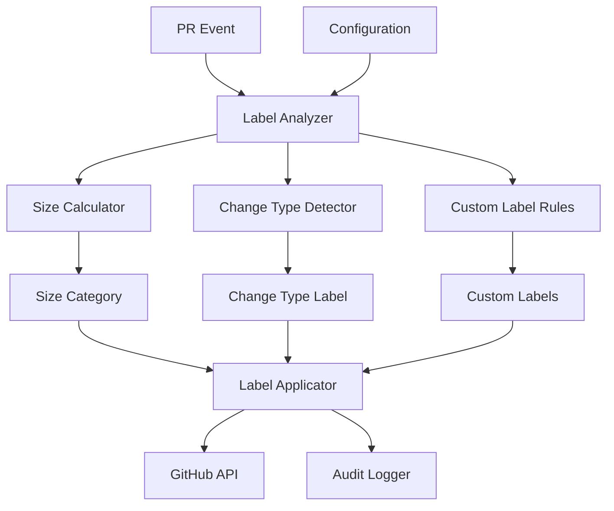

# Labeling System

**Version:** 1.0
**Last Updated:** July 22, 2025

## Overview

The labeling system provides automatic categorization and visual indicators for pull requests based on size, change type, and other characteristics. It helps reviewers quickly assess PRs and enforces project policies through intelligent labeling strategies.

## Design Principles

### Automatic Classification

Labels are applied automatically based on PR content and metadata, reducing manual overhead and ensuring consistency across the repository.

### Visual Communication

Labels provide immediate visual feedback about PR characteristics, helping reviewers prioritize and allocate appropriate time for reviews.

### Configurable Thresholds

Size categories and change type mappings are configurable per repository to accommodate different project needs and review practices.

### Audit and Transparency

All labeling actions are logged and traceable, supporting compliance requirements and operational observability.

## Labeling Architecture



## PR Size Labeling

### Size Categories

Industry-standard size categories based on research showing optimal review effectiveness:

| Label | Size Range | Color | Description | Review Time |
|-------|------------|-------|-------------|-------------|
| `size/XS` | 1-10 lines | `#3CBF00` | Trivial changes | 5-10 minutes |
| `size/S` | 11-50 lines | `#5D9801` | Small changes | 15-30 minutes |
| `size/M` | 51-100 lines | `#A8A800` | Medium changes | 30-60 minutes |
| `size/L` | 101-250 lines | `#DFAB00` | Large changes | 1-2 hours |
| `size/XL` | 251-500 lines | `#FE6D00` | Extra large changes | 2-4 hours |
| `size/XXL` | 500+ lines | `#FE2C01` | Should be split | 4+ hours |

### Size Calculation

```rust
pub struct PullRequestSizeCalculator;

impl PullRequestSizeCalculator {
    pub async fn calculate_size(
        &self,
        pr: &PullRequest,
        github_client: &dyn PullRequestProvider,
    ) -> Result<PrSizeInfo, SizeCalculationError> {
        let files = github_client.get_pull_request_files(
            &pr.repository,
            pr.number,
        ).await?;

        let mut total_additions = 0;
        let mut total_deletions = 0;
        let mut modified_files = 0;
        let mut excluded_files = 0;

        for file in &files {
            if self.should_exclude_file(&file.filename) {
                excluded_files += 1;
                continue;
            }

            total_additions += file.additions;
            total_deletions += file.deletions;
            modified_files += 1;
        }

        Ok(PrSizeInfo {
            total_changes: total_additions + total_deletions,
            additions: total_additions,
            deletions: total_deletions,
            modified_files,
            excluded_files,
            total_files: files.len(),
        })
    }

    fn should_exclude_file(&self, filename: &str) -> bool {
        // Exclude generated files, lock files, etc.
        const EXCLUDED_PATTERNS: &[&str] = &[
            "package-lock.json",
            "yarn.lock",
            "Cargo.lock",
            "poetry.lock",
            ".min.js",
            ".min.css",
            "/dist/",
            "/build/",
            "/__generated__/",
        ];

        EXCLUDED_PATTERNS.iter().any(|pattern| filename.contains(pattern))
    }
}

#[derive(Debug, Clone)]
pub struct PrSizeInfo {
    pub total_changes: u32,
    pub additions: u32,
    pub deletions: u32,
    pub modified_files: usize,
    pub excluded_files: usize,
    pub total_files: usize,
}
```

### Size Categorization

```rust
#[derive(Debug, Clone, PartialEq, Eq)]
pub enum SizeCategory {
    XS,  // 1-10 lines
    S,   // 11-50 lines
    M,   // 51-100 lines
    L,   // 101-250 lines
    XL,  // 251-500 lines
    XXL, // 500+ lines
}

impl SizeCategory {
    pub fn from_line_count(lines: u32, thresholds: &SizeThresholds) -> Self {
        match lines {
            n if n <= thresholds.xs => SizeCategory::XS,
            n if n <= thresholds.s => SizeCategory::S,
            n if n <= thresholds.m => SizeCategory::M,
            n if n <= thresholds.l => SizeCategory::L,
            n if n <= thresholds.xl => SizeCategory::XL,
            _ => SizeCategory::XXL,
        }
    }

    pub fn label(&self) -> &'static str {
        match self {
            SizeCategory::XS => "size/XS",
            SizeCategory::S => "size/S",
            SizeCategory::M => "size/M",
            SizeCategory::L => "size/L",
            SizeCategory::XL => "size/XL",
            SizeCategory::XXL => "size/XXL",
        }
    }

    pub fn color(&self) -> &'static str {
        match self {
            SizeCategory::XS => "#3CBF00",
            SizeCategory::S => "#5D9801",
            SizeCategory::M => "#A8A800",
            SizeCategory::L => "#DFAB00",
            SizeCategory::XL => "#FE6D00",
            SizeCategory::XXL => "#FE2C01",
        }
    }

    pub fn description(&self) -> &'static str {
        match self {
            SizeCategory::XS => "Trivial changes",
            SizeCategory::S => "Small changes",
            SizeCategory::M => "Medium changes",
            SizeCategory::L => "Large changes",
            SizeCategory::XL => "Extra large changes",
            SizeCategory::XXL => "Should be split",
        }
    }

    pub fn should_fail_check(&self, config: &SizePolicy) -> bool {
        config.fail_on_oversized && *self == SizeCategory::XXL
    }
}

#[derive(Debug, Clone, Deserialize)]
pub struct SizeThresholds {
    pub xs: u32,
    pub s: u32,
    pub m: u32,
    pub l: u32,
    pub xl: u32,
}

impl Default for SizeThresholds {
    fn default() -> Self {
        Self {
            xs: 10,
            s: 50,
            m: 100,
            l: 250,
            xl: 500,
        }
    }
}
```

## Change Type Labeling

### Conventional Commit Mapping

```rust
pub struct ChangeTypeLabelManager;

impl ChangeTypeLabelManager {
    pub fn detect_change_type(&self, pr: &PullRequest) -> Option<ChangeType> {
        // Extract type from conventional commit title
        let title = &pr.title;
        let conventional_commit_regex = Regex::new(
            r"^(build|chore|ci|docs|feat|fix|perf|refactor|revert|style|test)(\(.+\))?!?:"
        ).unwrap();

        if let Some(captures) = conventional_commit_regex.captures(title) {
            if let Some(commit_type) = captures.get(1) {
                return ChangeType::from_conventional_commit(commit_type.as_str());
            }
        }

        // Fallback to heuristic detection
        self.detect_from_files_and_description(pr)
    }

    pub async fn apply_change_type_labels(
        &self,
        pr: &PullRequest,
        change_type: ChangeType,
        config: &ChangeTypeLabelsConfig,
        github_client: &dyn PullRequestProvider,
    ) -> Result<(), LabelingError> {
        let labels = self.get_labels_for_change_type(&change_type, config);

        for label in labels {
            // Create label if it doesn't exist
            if config.create_if_missing {
                self.ensure_label_exists(&label, github_client, &pr.repository).await?;
            }

            // Apply label to PR
            github_client.add_label(&pr.repository, pr.number, &label.name).await?;
        }

        Ok(())
    }
}

#[derive(Debug, Clone, PartialEq, Eq)]
pub enum ChangeType {
    Feature,
    BugFix,
    Documentation,
    Chore,
    Refactor,
    Test,
    Performance,
    Style,
    CI,
    Build,
    Revert,
}

impl ChangeType {
    pub fn from_conventional_commit(commit_type: &str) -> Option<Self> {
        match commit_type.to_lowercase().as_str() {
            "feat" => Some(ChangeType::Feature),
            "fix" => Some(ChangeType::BugFix),
            "docs" => Some(ChangeType::Documentation),
            "chore" => Some(ChangeType::Chore),
            "refactor" => Some(ChangeType::Refactor),
            "test" => Some(ChangeType::Test),
            "perf" => Some(ChangeType::Performance),
            "style" => Some(ChangeType::Style),
            "ci" => Some(ChangeType::CI),
            "build" => Some(ChangeType::Build),
            "revert" => Some(ChangeType::Revert),
            _ => None,
        }
    }

    pub fn default_labels(&self) -> Vec<String> {
        match self {
            ChangeType::Feature => vec!["enhancement".to_string(), "feature".to_string()],
            ChangeType::BugFix => vec!["bug".to_string(), "bugfix".to_string()],
            ChangeType::Documentation => vec!["documentation".to_string()],
            ChangeType::Chore => vec!["chore".to_string(), "maintenance".to_string()],
            ChangeType::Refactor => vec!["refactor".to_string()],
            ChangeType::Test => vec!["testing".to_string()],
            ChangeType::Performance => vec!["performance".to_string()],
            ChangeType::Style => vec!["style".to_string()],
            ChangeType::CI => vec!["ci".to_string()],
            ChangeType::Build => vec!["build".to_string()],
            ChangeType::Revert => vec!["revert".to_string()],
        }
    }
}
```

### Configuration

```toml
[change_type_labels]
enabled = true
create_if_missing = true

[change_type_labels.conventional_commit_mappings]
feat = ["enhancement", "feature"]
fix = ["bug", "bugfix"]
docs = ["documentation"]
chore = ["maintenance"]
refactor = ["refactor"]
test = ["testing"]
perf = ["performance"]
style = ["style"]
ci = ["ci"]
build = ["build"]
revert = ["revert"]

[change_type_labels.fallback_label_settings]
name_format = "type: {change_type}"
create_if_missing = true

[change_type_labels.detection_strategy]
exact_match = true
prefix_match = true
description_match = true
```

## Label Management

### Label Applicator

```rust
pub struct LabelApplicator {
    github_client: Arc<dyn PullRequestProvider>,
}

impl LabelApplicator {
    pub async fn apply_size_label(
        &self,
        pr: &PullRequest,
        size_category: SizeCategory,
        config: &SizePolicy,
    ) -> Result<(), LabelingError> {
        // Remove existing size labels
        self.remove_size_labels(pr).await?;

        // Create size label if needed
        let label = Label {
            name: size_category.label().to_string(),
            color: size_category.color().to_string(),
            description: Some(size_category.description().to_string()),
        };

        self.ensure_label_exists(&label, &pr.repository).await?;

        // Apply new size label
        self.github_client.add_label(
            &pr.repository,
            pr.number,
            &label.name,
        ).await?;

        // Log labeling action
        log::info!(
            "Applied size label '{}' to PR #{} ({})",
            label.name,
            pr.number,
            pr.repository.full_name()
        );

        Ok(())
    }

    async fn remove_size_labels(&self, pr: &PullRequest) -> Result<(), LabelingError> {
        let current_labels = self.github_client.get_labels(
            &pr.repository,
            pr.number,
        ).await?;

        for label in current_labels {
            if label.name.starts_with("size/") {
                self.github_client.remove_label(
                    &pr.repository,
                    pr.number,
                    &label.name,
                ).await?;
            }
        }

        Ok(())
    }

    async fn ensure_label_exists(
        &self,
        label: &Label,
        repository: &Repository,
    ) -> Result<(), LabelingError> {
        match self.github_client.get_repository_label(repository, &label.name).await {
            Ok(_) => Ok(()), // Label already exists
            Err(_) => {
                // Create the label
                self.github_client.create_label(repository, label).await
            }
        }
    }
}

#[derive(Debug, Clone)]
pub struct Label {
    pub name: String,
    pub color: String,
    pub description: Option<String>,
}
```

### Intelligent Label Cleanup

```rust
impl LabelApplicator {
    pub async fn cleanup_outdated_labels(
        &self,
        pr: &PullRequest,
        current_change_type: ChangeType,
        config: &ChangeTypeLabelsConfig,
    ) -> Result<(), LabelingError> {
        let current_labels = self.github_client.get_labels(
            &pr.repository,
            pr.number,
        ).await?;

        let expected_labels = self.get_labels_for_change_type(&current_change_type, config);
        let expected_label_names: HashSet<_> = expected_labels.iter()
            .map(|l| &l.name)
            .collect();

        // Remove labels that are no longer relevant
        for label in current_labels {
            if self.is_change_type_label(&label.name, config)
                && !expected_label_names.contains(&label.name)
            {
                self.github_client.remove_label(
                    &pr.repository,
                    pr.number,
                    &label.name,
                ).await?;

                log::info!(
                    "Removed outdated label '{}' from PR #{} ({})",
                    label.name,
                    pr.number,
                    pr.repository.full_name()
                );
            }
        }

        Ok(())
    }
}
```

## Error Handling

### Labeling Errors

```rust
#[derive(Debug, thiserror::Error)]
pub enum LabelingError {
    #[error("GitHub API error: {0}")]
    GitHubApiError(String),

    #[error("Size calculation failed: {0}")]
    SizeCalculationError(#[from] SizeCalculationError),

    #[error("Label creation failed: {0}")]
    LabelCreationError(String),

    #[error("Invalid configuration: {0}")]
    ConfigurationError(String),
}

#[derive(Debug, thiserror::Error)]
pub enum SizeCalculationError {
    #[error("Failed to fetch PR files: {0}")]
    FilesFetchError(String),

    #[error("Invalid file data: {0}")]
    InvalidFileData(String),
}
```

### Fallback Strategies

```rust
impl LabelApplicator {
    pub async fn apply_labels_with_fallback(
        &self,
        pr: &PullRequest,
        size_info: PrSizeInfo,
        change_type: Option<ChangeType>,
        config: &LabelingConfig,
    ) -> Result<LabelingResult, LabelingError> {
        let mut results = LabelingResult::new();

        // Apply size label with fallback
        match self.apply_size_label(pr, size_info.into(), &config.size).await {
            Ok(_) => results.size_label_applied = true,
            Err(e) => {
                log::warn!("Failed to apply size label: {}", e);
                results.errors.push(e.to_string());
            }
        }

        // Apply change type labels with fallback
        if let Some(change_type) = change_type {
            match self.apply_change_type_labels(pr, change_type, &config.change_type).await {
                Ok(_) => results.change_type_labels_applied = true,
                Err(e) => {
                    log::warn!("Failed to apply change type labels: {}", e);
                    results.errors.push(e.to_string());
                }
            }
        }

        Ok(results)
    }
}

#[derive(Debug, Clone)]
pub struct LabelingResult {
    pub size_label_applied: bool,
    pub change_type_labels_applied: bool,
    pub errors: Vec<String>,
}
```

## Testing Strategy

### Unit Testing

- Size calculation logic with various file types
- Change type detection from conventional commits
- Label creation and cleanup logic
- Configuration parsing and validation

### Integration Testing

- End-to-end labeling workflows
- GitHub API integration for label management
- Error handling and recovery scenarios
- Performance with large PRs

### Test Cases

```rust
#[cfg(test)]
mod tests {
    use super::*;

    #[tokio::test]
    async fn test_size_calculation_excludes_generated_files() {
        let calculator = PullRequestSizeCalculator;
        let files = vec![
            PrFile { filename: "src/main.rs".to_string(), additions: 50, deletions: 10 },
            PrFile { filename: "package-lock.json".to_string(), additions: 1000, deletions: 0 },
            PrFile { filename: "dist/app.min.js".to_string(), additions: 500, deletions: 0 },
        ];

        let size_info = calculator.calculate_size_from_files(files);

        assert_eq!(size_info.total_changes, 60); // Only main.rs counted
        assert_eq!(size_info.excluded_files, 2);
    }

    #[test]
    fn test_change_type_detection_from_conventional_commit() {
        let manager = ChangeTypeLabelManager;

        let pr = PullRequest {
            title: "feat(auth): add user authentication".to_string(),
            // ... other fields
        };

        let change_type = manager.detect_change_type(&pr);
        assert_eq!(change_type, Some(ChangeType::Feature));
    }

    #[test]
    fn test_size_categorization_with_custom_thresholds() {
        let thresholds = SizeThresholds {
            xs: 5,
            s: 25,
            m: 75,
            l: 200,
            xl: 400,
        };

        assert_eq!(SizeCategory::from_line_count(3, &thresholds), SizeCategory::XS);
        assert_eq!(SizeCategory::from_line_count(50, &thresholds), SizeCategory::M);
        assert_eq!(SizeCategory::from_line_count(500, &thresholds), SizeCategory::XXL);
    }
}
```

## Performance Considerations

### Caching

- Cache label existence checks to reduce GitHub API calls
- Cache file content analysis for unchanged PRs
- Cache change type detection results

### Batch Operations

- Batch label application/removal operations
- Optimize GitHub API usage to stay within rate limits
- Prioritize critical labeling operations

## Security Considerations

### Input Validation

- Sanitize file names and content before processing
- Validate label names conform to GitHub requirements
- Limit size calculation to prevent resource exhaustion

### Permission Management

- Ensure minimal required permissions for label management
- Audit label creation and modification operations
- Protect against label spam or abuse

## Related Specifications

- [Validation Engine](./validation-engine.md) - How labeling integrates with validation rules
- [Configuration System](./configuration-system.md) - Labeling configuration management
- [Platform Integrations](../architecture/platform-integrations.md) - GitHub API integration patterns
