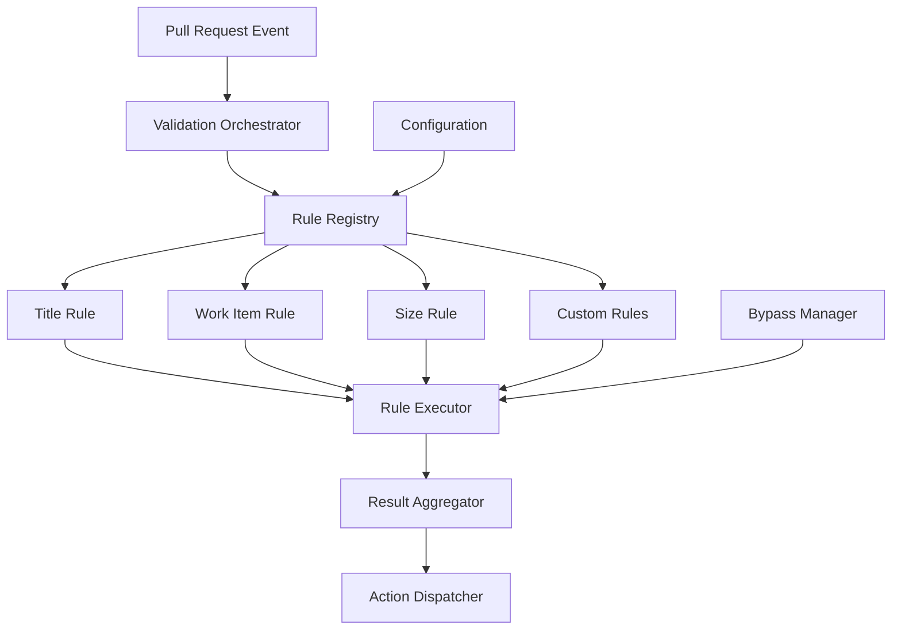

# Validation Engine

**Version:** 1.0
**Last Updated:** July 22, 2025

## Overview

The validation engine is the core component responsible for evaluating pull requests against configured rules and policies. It provides an extensible framework for implementing validation rules, executing them efficiently, and collecting comprehensive results.

## Design Principles

### Rule-Based Architecture

Validation logic is organized into discrete, composable rules that can be enabled, disabled, or customized through configuration without code changes.

### Extensible Framework

New validation rules can be added through a well-defined trait interface, enabling custom validations for specific repository requirements.

### Fail-Fast Execution

Validation stops on the first critical failure to minimize resource usage and provide quick feedback to developers.

### Comprehensive Results

Detailed validation results include pass/fail status, error messages, suggested fixes, and bypass information for audit trails.

## Engine Architecture



## Core Interfaces

### ValidationRule Trait

```rust
#[async_trait]
pub trait ValidationRule: Send + Sync {
    /// Unique identifier for this rule
    fn name(&self) -> &'static str;

    /// Human-readable description for documentation
    fn description(&self) -> &'static str;

    /// Required GitHub permissions for this rule
    fn required_permissions(&self) -> Vec<GitHubPermission>;

    /// Execute the validation rule
    async fn validate(
        &self,
        context: &ValidationContext,
    ) -> Result<RuleResult, ValidationError>;

    /// Whether this rule should block PR merging on failure
    fn is_blocking(&self) -> bool {
        true
    }

    /// Custom help message for when this rule fails
    fn help_message(&self, context: &ValidationContext) -> String {
        format!("Rule '{}' failed validation", self.name())
    }
}
```

### ValidationContext

```rust
pub struct ValidationContext {
    pub pull_request: PullRequest,
    pub repository: Repository,
    pub configuration: MergeWardenConfig,
    pub github_client: Arc<dyn PullRequestProvider>,
    pub bypass_manager: Arc<BypassManager>,
}

impl ValidationContext {
    pub fn should_bypass_rule(&self, rule_name: &str) -> Option<BypassInfo> {
        self.bypass_manager.check_bypass(
            &self.pull_request,
            rule_name,
            &self.configuration,
        )
    }
}
```

### RuleResult

```rust
#[derive(Debug, Clone, PartialEq)]
pub struct RuleResult {
    pub rule_name: String,
    pub status: RuleStatus,
    pub severity: Severity,
    pub message: Option<String>,
    pub suggestions: Vec<String>,
    pub bypass_info: Option<BypassInfo>,
}

#[derive(Debug, Clone, PartialEq)]
pub enum RuleStatus {
    Passed,
    Failed,
    Skipped,
    Bypassed,
}

#[derive(Debug, Clone, PartialEq)]
pub enum Severity {
    Error,    // Blocks PR merging
    Warning,  // Informational only
    Info,     // Advisory feedback
}
```

## Built-in Validation Rules

### Title Validation Rule

```rust
pub struct TitleValidationRule;

#[async_trait]
impl ValidationRule for TitleValidationRule {
    fn name(&self) -> &'static str {
        "title_validation"
    }

    fn description(&self) -> &'static str {
        "Validates PR titles follow conventional commit format"
    }

    fn required_permissions(&self) -> Vec<GitHubPermission> {
        vec![GitHubPermission::ReadPullRequests]
    }

    async fn validate(
        &self,
        context: &ValidationContext,
    ) -> Result<RuleResult, ValidationError> {
        // Check for bypass first
        if let Some(bypass_info) = context.should_bypass_rule(self.name()) {
            return Ok(RuleResult {
                rule_name: self.name().to_string(),
                status: RuleStatus::Bypassed,
                severity: Severity::Info,
                message: Some("Title validation bypassed".to_string()),
                suggestions: vec![],
                bypass_info: Some(bypass_info),
            });
        }

        let title = &context.pull_request.title;
        let policy = context.configuration.policies
            .as_ref()
            .and_then(|p| p.pull_requests.title.as_ref());

        let is_valid = match policy.map(|p| &p.format) {
            Some(TitleFormat::ConventionalCommits) => {
                self.validate_conventional_commits(title, policy)
            }
            _ => true, // Default to valid if no policy
        };

        if is_valid {
            Ok(RuleResult {
                rule_name: self.name().to_string(),
                status: RuleStatus::Passed,
                severity: Severity::Info,
                message: Some("Title follows conventional commit format".to_string()),
                suggestions: vec![],
                bypass_info: None,
            })
        } else {
            Ok(RuleResult {
                rule_name: self.name().to_string(),
                status: RuleStatus::Failed,
                severity: Severity::Error,
                message: Some("Title does not follow conventional commit format".to_string()),
                suggestions: vec![
                    "Use format: type(scope): description".to_string(),
                    "Valid types: feat, fix, docs, chore, refactor, test".to_string(),
                ],
                bypass_info: None,
            })
        }
    }

    fn help_message(&self, context: &ValidationContext) -> String {
        let allowed_types = context.configuration.policies
            .as_ref()
            .and_then(|p| p.pull_requests.title.as_ref())
            .map(|t| &t.allowed_types)
            .unwrap_or(&DEFAULT_ALLOWED_TYPES);

        format!(
            "⚠️ **Title Format Required**\n\
             Please use Conventional Commit format:\n\
             `<type>(<scope>): <description>`\n\n\
             Valid types: {}\n\n\
             Examples:\n\
             - feat: add user authentication\n\
             - fix(api): resolve timeout issue\n\
             - docs: update installation guide",
            allowed_types.join(", ")
        )
    }
}

impl TitleValidationRule {
    fn validate_conventional_commits(
        &self,
        title: &str,
        policy: Option<&TitlePolicy>,
    ) -> bool {
        let pattern = policy
            .and_then(|p| p.pattern.as_ref())
            .unwrap_or(&DEFAULT_CONVENTIONAL_COMMIT_PATTERN);

        let regex = Regex::new(pattern).unwrap();
        regex.is_match(title)
    }
}
```

### Work Item Reference Rule

```rust
pub struct WorkItemReferenceRule;

#[async_trait]
impl ValidationRule for WorkItemReferenceRule {
    fn name(&self) -> &'static str {
        "work_item_reference"
    }

    fn description(&self) -> &'static str {
        "Validates PR description contains work item references"
    }

    fn required_permissions(&self) -> Vec<GitHubPermission> {
        vec![GitHubPermission::ReadPullRequests, GitHubPermission::ReadIssues]
    }

    async fn validate(
        &self,
        context: &ValidationContext,
    ) -> Result<RuleResult, ValidationError> {
        // Check for bypass
        if let Some(bypass_info) = context.should_bypass_rule(self.name()) {
            return Ok(RuleResult {
                rule_name: self.name().to_string(),
                status: RuleStatus::Bypassed,
                severity: Severity::Info,
                message: Some("Work item validation bypassed".to_string()),
                suggestions: vec![],
                bypass_info: Some(bypass_info),
            });
        }

        let description = context.pull_request.body.as_ref().unwrap_or(&String::new());
        let policy = context.configuration.policies
            .as_ref()
            .and_then(|p| p.pull_requests.work_item.as_ref());

        // Skip if not required
        if !policy.map(|p| p.required).unwrap_or(true) {
            return Ok(RuleResult {
                rule_name: self.name().to_string(),
                status: RuleStatus::Skipped,
                severity: Severity::Info,
                message: Some("Work item validation disabled".to_string()),
                suggestions: vec![],
                bypass_info: None,
            });
        }

        let work_items = self.extract_work_item_references(description, policy)?;

        if work_items.is_empty() {
            Ok(RuleResult {
                rule_name: self.name().to_string(),
                status: RuleStatus::Failed,
                severity: Severity::Error,
                message: Some("No work item references found".to_string()),
                suggestions: vec![
                    "Add a work item reference like: Closes #123".to_string(),
                    "Valid prefixes: closes, fixes, relates to, references".to_string(),
                ],
                bypass_info: None,
            })
        } else {
            // Validate work items exist
            self.validate_work_items_exist(context, &work_items).await
        }
    }

    fn help_message(&self, _context: &ValidationContext) -> String {
        "🔗 **Work Item Needed**\n\
         Please reference a GitHub issue using:\n\
         `Closes #123` or `Relates to #456`\n\n\
         You can add this to the PR description body.".to_string()
    }
}
```

### PR Size Rule

```rust
pub struct PullRequestSizeRule;

#[async_trait]
impl ValidationRule for PullRequestSizeRule {
    fn name(&self) -> &'static str {
        "pr_size"
    }

    fn description(&self) -> &'static str {
        "Validates PR size and applies appropriate labels"
    }

    fn required_permissions(&self) -> Vec<GitHubPermission> {
        vec![
            GitHubPermission::ReadPullRequests,
            GitHubPermission::WritePullRequests,
        ]
    }

    async fn validate(
        &self,
        context: &ValidationContext,
    ) -> Result<RuleResult, ValidationError> {
        let policy = context.configuration.policies
            .as_ref()
            .and_then(|p| p.pull_requests.size.as_ref());

        // Skip if disabled
        if !policy.map(|p| p.enabled).unwrap_or(false) {
            return Ok(RuleResult {
                rule_name: self.name().to_string(),
                status: RuleStatus::Skipped,
                severity: Severity::Info,
                message: Some("PR size validation disabled".to_string()),
                suggestions: vec![],
                bypass_info: None,
            });
        }

        let size_info = self.calculate_pr_size(context).await?;
        let size_category = self.categorize_size(&size_info, policy);

        // Apply size label
        self.apply_size_label(context, &size_category).await?;

        // Check if oversized PRs should fail
        let should_fail = policy
            .map(|p| p.fail_on_oversized)
            .unwrap_or(false) && size_category == SizeCategory::XXL;

        if should_fail {
            Ok(RuleResult {
                rule_name: self.name().to_string(),
                status: RuleStatus::Failed,
                severity: Severity::Error,
                message: Some(format!(
                    "PR is too large ({} lines changed). Consider splitting into smaller PRs.",
                    size_info.total_changes
                )),
                suggestions: vec![
                    "Split large changes into multiple smaller PRs".to_string(),
                    "Focus each PR on a single logical change".to_string(),
                ],
                bypass_info: None,
            })
        } else {
            Ok(RuleResult {
                rule_name: self.name().to_string(),
                status: RuleStatus::Passed,
                severity: Severity::Info,
                message: Some(format!(
                    "PR size: {} ({} lines)",
                    size_category, size_info.total_changes
                )),
                suggestions: vec![],
                bypass_info: None,
            })
        }
    }
}
```

## Validation Orchestrator

### Execution Engine

```rust
pub struct ValidationOrchestrator {
    rules: Vec<Box<dyn ValidationRule>>,
    config_loader: Arc<ConfigurationLoader>,
}

impl ValidationOrchestrator {
    pub async fn validate_pull_request(
        &self,
        pull_request: &PullRequest,
        repository: &Repository,
        github_client: Arc<dyn PullRequestProvider>,
    ) -> Result<ValidationResult, ValidationError> {
        // Load configuration
        let config = self.config_loader
            .load_configuration(repository)
            .await?;

        // Create validation context
        let context = ValidationContext {
            pull_request: pull_request.clone(),
            repository: repository.clone(),
            configuration: config,
            github_client,
            bypass_manager: Arc::new(BypassManager::new()),
        };

        // Execute rules
        let mut results = Vec::new();
        for rule in &self.rules {
            match rule.validate(&context).await {
                Ok(result) => {
                    results.push(result.clone());

                    // Fail fast on critical errors (unless bypassed)
                    if result.status == RuleStatus::Failed
                        && result.severity == Severity::Error
                        && rule.is_blocking()
                    {
                        break;
                    }
                }
                Err(e) => {
                    log::error!("Rule {} failed with error: {}", rule.name(), e);
                    results.push(RuleResult {
                        rule_name: rule.name().to_string(),
                        status: RuleStatus::Failed,
                        severity: Severity::Error,
                        message: Some(format!("Rule execution failed: {}", e)),
                        suggestions: vec![],
                        bypass_info: None,
                    });
                    break;
                }
            }
        }

        // Aggregate results
        let success = results.iter().all(|r|
            r.status != RuleStatus::Failed || r.severity != Severity::Error
        );

        Ok(ValidationResult {
            success,
            results,
            bypass_info: self.collect_bypass_info(&results),
        })
    }
}
```

### Rule Registry

```rust
pub struct RuleRegistry {
    rules: HashMap<String, Box<dyn ValidationRule>>,
}

impl RuleRegistry {
    pub fn new() -> Self {
        let mut registry = Self {
            rules: HashMap::new(),
        };

        // Register built-in rules
        registry.register_rule(Box::new(TitleValidationRule));
        registry.register_rule(Box::new(WorkItemReferenceRule));
        registry.register_rule(Box::new(PullRequestSizeRule));

        registry
    }

    pub fn register_rule(&mut self, rule: Box<dyn ValidationRule>) {
        self.rules.insert(rule.name().to_string(), rule);
    }

    pub fn get_enabled_rules(&self, config: &MergeWardenConfig) -> Vec<&dyn ValidationRule> {
        self.rules.values()
            .map(|r| r.as_ref())
            .filter(|rule| self.is_rule_enabled(rule.name(), config))
            .collect()
    }

    fn is_rule_enabled(&self, rule_name: &str, config: &MergeWardenConfig) -> bool {
        match rule_name {
            "title_validation" => config.policies
                .as_ref()
                .and_then(|p| p.pull_requests.title.as_ref())
                .is_some(),
            "work_item_reference" => config.policies
                .as_ref()
                .and_then(|p| p.pull_requests.work_item.as_ref())
                .map(|w| w.required)
                .unwrap_or(true),
            "pr_size" => config.policies
                .as_ref()
                .and_then(|p| p.pull_requests.size.as_ref())
                .map(|s| s.enabled)
                .unwrap_or(false),
            _ => true, // Custom rules enabled by default
        }
    }
}
```

## Error Handling

### Validation Errors

```rust
#[derive(Debug, thiserror::Error)]
pub enum ValidationError {
    #[error("GitHub API error: {0}")]
    GitHubApiError(String),

    #[error("Configuration error: {0}")]
    ConfigurationError(#[from] ConfigurationError),

    #[error("Rule execution failed: {0}")]
    RuleExecutionError(String),

    #[error("Invalid pull request data: {0}")]
    InvalidPullRequestData(String),
}
```

### Recovery Strategies

```rust
impl ValidationOrchestrator {
    async fn validate_with_recovery(
        &self,
        context: &ValidationContext,
    ) -> ValidationResult {
        match self.validate_pull_request(context).await {
            Ok(result) => result,
            Err(e) => {
                log::error!("Validation failed: {}", e);

                // Return a failed result with error information
                ValidationResult {
                    success: false,
                    results: vec![RuleResult {
                        rule_name: "system".to_string(),
                        status: RuleStatus::Failed,
                        severity: Severity::Error,
                        message: Some(format!("Validation system error: {}", e)),
                        suggestions: vec![
                            "Check system logs for details".to_string(),
                            "Retry the operation".to_string(),
                        ],
                        bypass_info: None,
                    }],
                    bypass_info: None,
                }
            }
        }
    }
}
```

## Testing Strategy

### Unit Testing

- Individual rule validation logic
- Rule result aggregation
- Error handling and recovery
- Configuration-driven behavior

### Integration Testing

- End-to-end validation workflows
- GitHub API integration
- Bypass mechanism integration
- Performance under load

### Rule Testing Framework

```rust
#[cfg(test)]
mod tests {
    use super::*;

    #[tokio::test]
    async fn test_title_validation_conventional_commits() {
        let rule = TitleValidationRule;
        let context = create_test_context(
            "feat: add user authentication",
            Some(conventional_commits_config()),
        );

        let result = rule.validate(&context).await.unwrap();
        assert_eq!(result.status, RuleStatus::Passed);
    }

    #[tokio::test]
    async fn test_title_validation_invalid_format() {
        let rule = TitleValidationRule;
        let context = create_test_context(
            "Invalid title format",
            Some(conventional_commits_config()),
        );

        let result = rule.validate(&context).await.unwrap();
        assert_eq!(result.status, RuleStatus::Failed);
        assert_eq!(result.severity, Severity::Error);
    }

    fn create_test_context(title: &str, config: Option<MergeWardenConfig>) -> ValidationContext {
        ValidationContext {
            pull_request: PullRequest {
                title: title.to_string(),
                body: Some("Test PR description".to_string()),
                // ... other fields
            },
            repository: Repository::test_repository(),
            configuration: config.unwrap_or_default(),
            github_client: Arc::new(MockGitHubClient::new()),
            bypass_manager: Arc::new(BypassManager::new()),
        }
    }
}
```

## Performance Considerations

### Parallel Rule Execution

For non-dependent rules, validation can be executed in parallel to improve performance:

```rust
impl ValidationOrchestrator {
    pub async fn validate_parallel(
        &self,
        context: &ValidationContext,
    ) -> Result<ValidationResult, ValidationError> {
        let futures: Vec<_> = self.rules.iter()
            .map(|rule| rule.validate(context))
            .collect();

        let results = futures::future::join_all(futures).await;

        // Process results...
    }
}
```

### Caching

- Configuration caching to avoid repeated loads
- GitHub API response caching for unchanged PRs
- Rule result caching for expensive validations

## Related Specifications

- [Configuration System](./configuration-system.md) - How configuration drives validation behavior
- [Bypass Mechanisms](./bypass-mechanisms.md) - Bypass integration and audit trails
- [Core Components](../architecture/core-components.md) - Core validation abstractions
