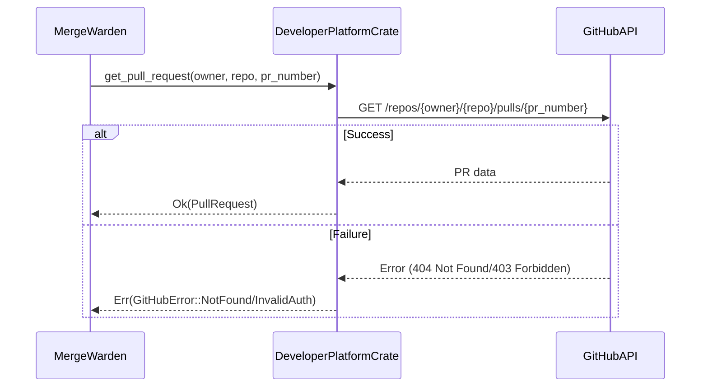
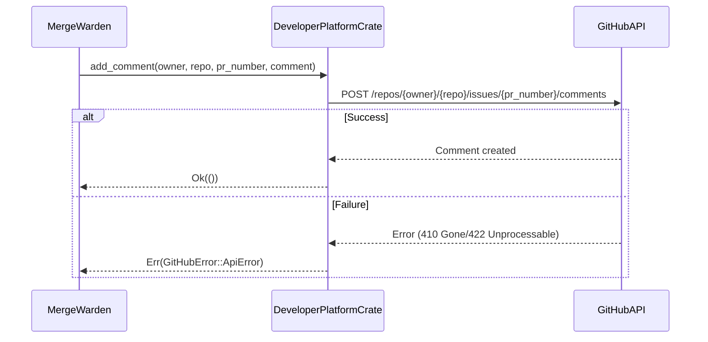
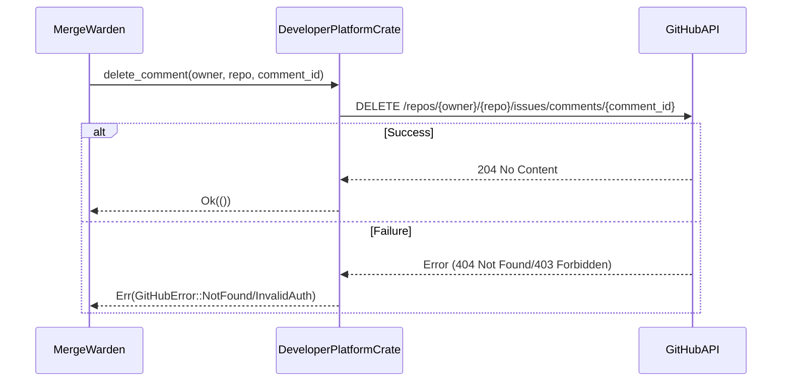
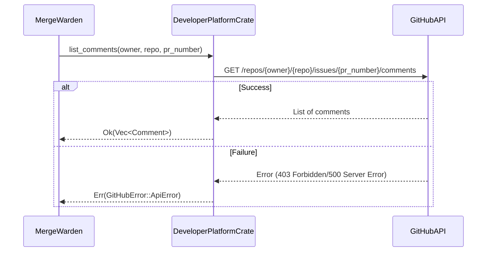
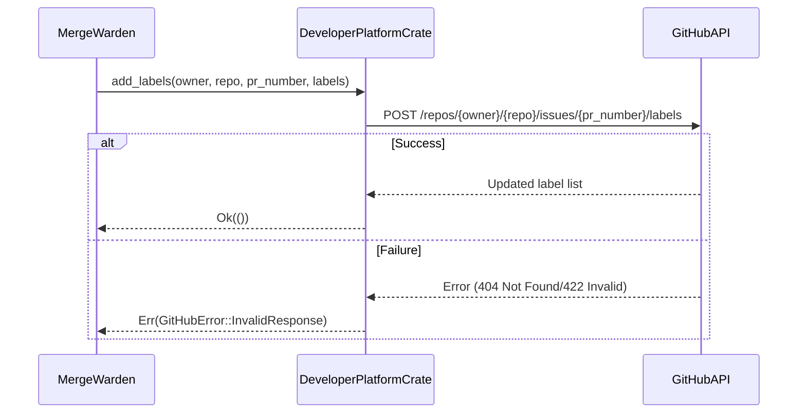
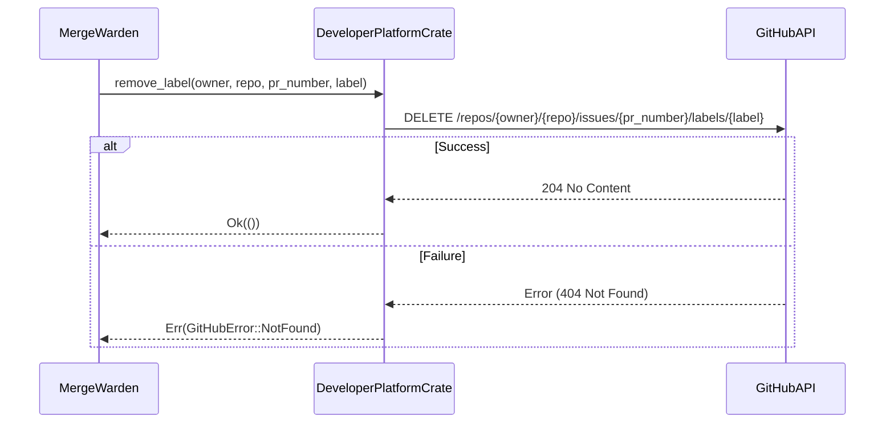
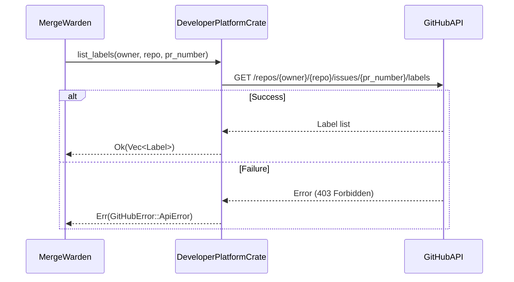
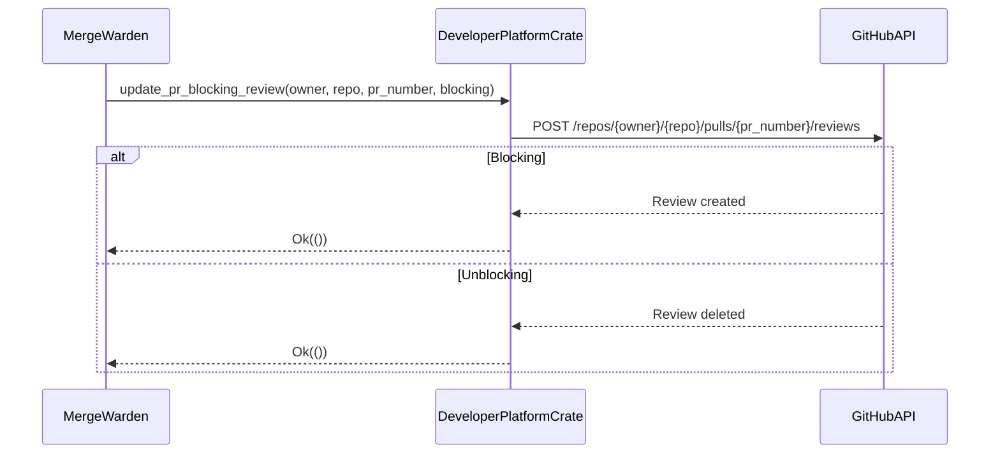
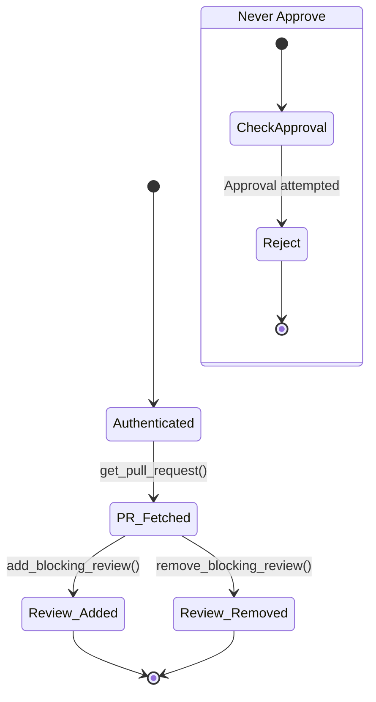
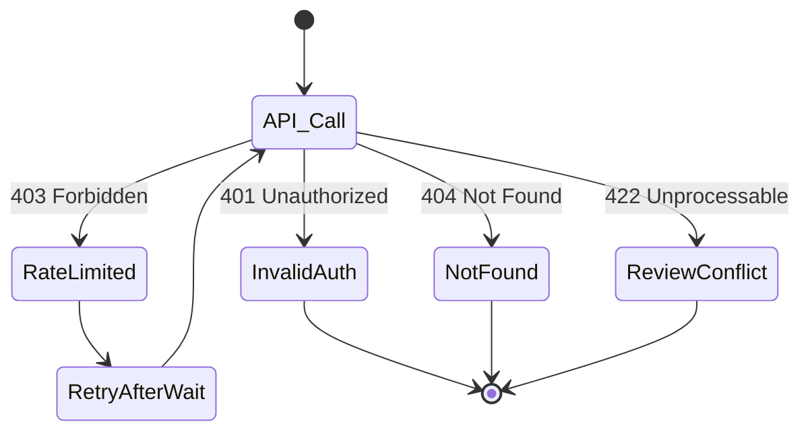

# developer_platforms Crate Specification

This specification describes the `developer_platforms` crate for the Merge Warden service.

## Purpose

The `developer_platforms` crate provides ways to authenticate with different developer platforms and
provides an API for working with these platforms. Initially the crate will support GitHub, but it
should be designed to be extensible to support other platforms in the future.

The crate defines and implements the `PullRequestProvider` trait, which allows the Merge Warden service to
interact with pull requests related to a repository.

## Requirements

- Authentication with GitHub using different methods:
  - GitHub App authentication using an app ID and private key.
  - Personal access token authentication.
- Definition of the `PullRequestProvider` trait with the following functions:
  - `get_pull_request`: Retrieves a pull request from GitHub.
  - `add_comment`: Adds a comment to a pull request.
  - `delete_comment`: Deletes a comment from a pull request.
  - `list_comments`: Lists all comments on a pull request.
  - `add_labels`: Adds labels to a pull request.
  - `remove_label`: Removes a label from a pull request.
  - `list_labels`: Lists all labels on a pull request.
  - `update_pr_blocking_review`: Adds or removes a blocking review from the PR.
- Implementation of the `PullRequestProvider` trait.
- The application should never add an approving review to the PR.

## Key Use Cases

### 1. Getting a Pull Request

In order to interact with a pull request the service first needs to obtain the information about that
pull request. The `PullRequestProvider::get_pull_request` function is used to retrieve the pull request
data from the platform.



**Failure Points:**

- Invalid PR number or repository path (NotFound)
- Expired or insufficient permissions (InvalidAuth)
- Rate limiting during high-frequency checks
- Malformed API response parsing failures

### 2. Adding a Comment to a Pull Request

If the service needs to provide feedback or information to the developer, it can add a comment to the
pull request. The `PullRequestProvider::add_comment` function is used to add a comment to the pull request.



**Failure Points:**

- Invalid repository or PR reference (Gone)
- Comment body exceeds GitHub's length limits (Unprocessable)
- Authentication token scope limitations
- Concurrent comment creation conflicts

### 3. Deleting a Comment from a Pull Request

Once the developer has addressed all the issues in the pull request, the service can delete the
comments that are no longer relevant. The `PullRequestProvider::delete_comment` function is used to
delete a comment from the pull request.



**Failure Points:**

- Comment ID might be invalid or already deleted (NotFound)
- Authentication credentials may have expired (InvalidAuth)
- Network connectivity issues during API call
- Rate limiting preventing immediate retry

### 4. Listing Comments on a Pull Request

In order to find the comments that may need to be edited or removed the service needs to list all the
comments on a pull request. The `PullRequestProvider::list_comments` function is used to list all the
comments on a pull request.



**Failure Points:**

- PR number might be invalid (NotFound)
- Large comment lists exceeding response size limits
- Pagination handling for comments spanning multiple pages
- Partial failure in parsing comment data

### 5. Adding Labels to a Pull Request

If the service finds issues with the pull request, it can add labels to the PR to indicate the issues.
The `PullRequestProvider::add_labels` function is used to add labels to a pull request.



**Failure Points:**

- Invalid label names that don't exist in the repo
- Attempting to add duplicate labels
- Label list exceeding GitHub's per-issue limit (100 labels)
- Case sensitivity mismatches in label names

### 6. Removing Labels from a Pull Request

Once the developer has addressed all the issues in the pull request, the service can remove the labels
that are no longer relevant. The `PullRequestProvider::remove_label` function is used to remove a label
from a pull request.



**Failure Points:**

- Label not present on PR (NotFound)
- Case-sensitive label name mismatches
- Temporary API outages during deletion
- Caching inconsistencies after removal

### 7. Listing Labels on a Pull Request

In order to determine which labels are already present on a pull request, the service needs to list all
the labels on the pull request. The `PullRequestProvider::list_labels` function is used to list all the
labels on a pull request.



**Failure Points:**

- Repository archived (Forbidden)
- Pagination token expiration
- Rate limiting on frequent listing
- Label cache staleness

### 8. Updating Pull Request Blocking Review

The service needs to update the mergeable state of a pull request to block or unblock merging. This
is done by adding a review that requests changes to the PR. If the issues are removed then the review
is removed. The service should never add an approving review to the PR.



**Failure Points:**

- Invalid PR number or repository path (NotFound)
- Expired or insufficient permissions (InvalidAuth)
- Rate limiting during high-frequency checks
- Malformed API response parsing failures

## Trait Behavior

### Normal Operation



### Error Conditions



## Security Considerations

### 1. Input Validation

- Validate GitHub API responses using schema validation
- Sanitize comment content using HTML escaping
- Validate review state transitions:
  - Only allow changing from PENDING → APPROVED/REQUEST_CHANGES
  - Never allow APPROVED → REQUEST_CHANGES without intermediate state
- Regex patterns for validation:

  ```rust
  // Issue reference validation
  const ISSUE_REF_REGEX: &str = r"^(GH-|#)\d+$";
  // Label name validation
  const LABEL_REGEX: &str = r"^[a-z0-9-]{1,50}$";
  // Review comment validation (Merge Warden generated)
  const REVIEW_COMMENT_REGEX: &str = r"^\[MW-\d+\].+";
  ```

### 2. Credential Handling

- GitHub App private keys should be stored securely and accessed only when needed.
- Personal access tokens should be treated as secrets and not exposed in logs or other public places.

### 2. API Rate Limiting

- The crate should handle GitHub API rate limits gracefully, retrying requests when necessary.
- Consider using a rate limiting library to avoid exceeding the rate limit.

### 3. Input Sanitization and Validation

- Validate all inputs from the GitHub API to prevent injection attacks.
- Sanitize all outputs to the GitHub API to prevent cross-site scripting (XSS) attacks.

### 4. Denial of Service Protection

- Limit the number of requests that can be made to the GitHub API.
- Limit the size of the data that can be received from the GitHub API.

## Implementation Considerations

### 1. Error Handling

- The crate should use the `thiserror` crate for error handling.
- Errors should be descriptive and provide context to help with debugging.

### 2. Using the `octocrab` Crate

- The crate should use the `octocrab` crate for interacting with the GitHub API.
- The `octocrab` crate should be configured with appropriate authentication credentials.

### 3. Comment Management

- Track comments via GitHub API's comment ID.
- Update existing comments instead of creating new ones.

### 4. State Handling

- Implement idempotent operations for retry safety.
- Use ETag handling for GitHub resources.
- Be aware of rate limits (retry-after headers).

## Coding Rules

1. **Architecture**:

- Use async/await for all I/O operations
- Implement the `PullRequestProvider` trait to provide a consistent interface for interacting with Git providers

2. **Error Handling**:

Use the `thiserror` crate for error handling and define custom error types for different error conditions.

```rust
#[derive(Debug, thiserror::Error)]
pub enum GitHubError {
    #[error("Authentication failed: {0}")]
    AuthError(String),
    #[error("API request failed: {0}")]
    ApiError(#[from] octocrab::Error),
    #[error("Rate limit exceeded")]
    RateLimitExceeded,
    #[error("Invalid response format")]
    InvalidResponse,
    #[error("Review operation conflict: {0}")]
    ReviewConflict(String),
    #[error("Invalid review state transition attempted")]
    InvalidStateTransition,
    #[error("Approval attempted - blocked by policy")]
    ApprovalProhibited,
}
```

- Use Rust's Result and Option types for error handling
- Always check the result of API calls and handle errors explicitly. Try to minimize the use of
    `unwrap` without checking the result.

3. **Testing**:

Tests are stored in a separate file called `<file_name_under_test>_tests.rs` and are included in the
main file using the following code:

    ```rust
    #[cfg(test)]
    #[path = "lib_tests.rs"]
    mod tests;
    ```

- Follow project's *_tests.rs pattern
- Mock GitHub API using wiremock
- Test error conditions and edge cases
- Aim for 100% test coverage

4. **Comment Management**:

- Use core crate's hidden metadata markers
- Implement comment versioning as defined in core spec
