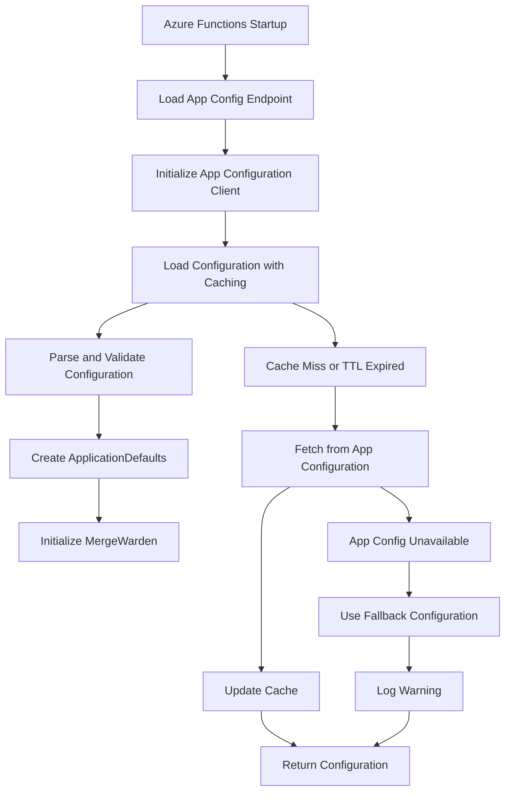

# Configuration Management

Centralized configuration management strategy for Merge Warden across all deployment targets, including Azure Functions, CLI, and future platforms.

## Overview

Configuration management provides a unified approach to handling application settings, deployment-specific configurations, and runtime parameters across different environments and deployment targets. The system supports both centralized cloud-based configuration and local configuration files.

## Configuration Sources

### Primary Sources

1. **Azure App Configuration** (Cloud deployments)
   - Centralized configuration store
   - Dynamic updates without redeployment
   - Environment-specific settings
   - Audit trail and version history

2. **Local Configuration Files** (CLI and development)
   - Repository-specific `.github/merge-warden.toml`
   - Environment-specific configuration files
   - Development and testing overrides

3. **Environment Variables** (Fallback)
   - System-level configuration
   - Container deployment settings
   - Legacy compatibility

### Configuration Hierarchy

Priority order (highest to lowest):

1. Command-line arguments (CLI only)
2. Environment variables
3. Azure App Configuration
4. Local configuration files
5. Built-in defaults

## Azure App Configuration Integration

### Architecture



### Configuration Key Structure

```toml
# Application-level settings
application:enforce_title_convention = true
application:require_work_items = true

# Bypass rules configuration
bypass_rules:title:enabled = true
bypass_rules:title:users = ["admin", "security-team"]
bypass_rules:work_item:enabled = true
bypass_rules:work_item:users = ["admin", "release-manager"]

# Logging configuration
logging:level = "info"
logging:rust_log = "merge_warden=debug"

# Performance settings
performance:cache_ttl_minutes = 10
performance:max_concurrent_requests = 100
```

### Caching Strategy

- **Cache TTL**: 10 minutes (production), 1 minute (development)
- **Cache Key**: Hash of configuration key set
- **Invalidation**: TTL-based with manual refresh capability
- **Memory Limits**: Bounded cache size to prevent memory leaks

### Error Handling

```rust
pub enum ConfigError {
    AppConfigUnavailable,
    InvalidConfiguration(String),
    NetworkTimeout,
    AuthenticationFailure,
    CacheError(String),
}

impl ConfigErrorHandler {
    pub fn handle_error(&self, error: ConfigError) -> ApplicationDefaults {
        match error {
            ConfigError::AppConfigUnavailable => {
                warn!("App Configuration unavailable, using defaults");
                ApplicationDefaults::default()
            }
            ConfigError::InvalidConfiguration(key) => {
                warn!("Invalid configuration for key: {}, using default", key);
                self.get_default_for_key(&key)
            }
            // ... other error cases
        }
    }
}
```

## Local Configuration Management

### Repository Configuration

Each repository can provide custom configuration through `.github/merge-warden.toml`:

```toml
schemaVersion = 1

[policies.pullRequests.prTitle]
format = "conventional-commits"

[policies.pullRequests.workItem]
required = true
pattern = "#\\d+"

[policies.pullRequests.prSize]
enabled = true
fail_on_oversized = false
```

### CLI Configuration

The CLI supports multiple configuration sources:

1. **Command-line flags**: Override any configuration value
2. **Environment variables**: Standard environment variable support
3. **Configuration files**: Local TOML files for reusable settings
4. **Default values**: Sensible defaults for all options

```bash
# Command-line override
merge-warden check --enforce-title-convention=false

# Environment variable
export MERGE_WARDEN_REQUIRE_WORK_ITEMS=false

# Configuration file
merge-warden check --config ./custom-config.toml
```

## Configuration Validation

### Schema Validation

```rust
pub trait ConfigValidator {
    fn validate(&self) -> Result<(), Vec<ValidationError>>;
}

pub struct ConfigurationValidator;

impl ConfigurationValidator {
    pub fn validate_application_config(
        &self,
        config: &ApplicationDefaults
    ) -> Result<(), Vec<ValidationError>> {
        let mut errors = Vec::new();

        // Validate bypass rules
        if let Err(e) = self.validate_bypass_rules(&config.bypass_rules) {
            errors.extend(e);
        }

        // Validate patterns
        if let Err(e) = self.validate_regex_patterns(config) {
            errors.extend(e);
        }

        // Validate thresholds
        if let Err(e) = self.validate_thresholds(config) {
            errors.extend(e);
        }

        if errors.is_empty() { Ok(()) } else { Err(errors) }
    }
}
```

### Runtime Validation

- **Type safety**: Strong typing for all configuration values
- **Range validation**: Ensure numeric values are within acceptable ranges
- **Pattern validation**: Validate regex patterns at load time
- **Dependency validation**: Ensure configuration dependencies are met

## Environment-Specific Configuration

### Development Environment

```toml
# Fast iteration settings
logging:level = "debug"
performance:cache_ttl_minutes = 1
bypass_rules:title:enabled = false  # Strict enforcement for testing
```

### Staging Environment

```toml
# Production-like with enhanced logging
logging:level = "info"
performance:cache_ttl_minutes = 5
bypass_rules:title:enabled = true
bypass_rules:title:users = ["staging-admin"]
```

### Production Environment

```toml
# Optimized for performance and reliability
logging:level = "warn"
performance:cache_ttl_minutes = 10
performance:max_concurrent_requests = 1000
bypass_rules:title:enabled = true
bypass_rules:title:users = ["admin", "security-team", "release-manager"]
```

## Configuration Deployment

### Azure Functions

1. **Infrastructure**: Terraform provisions App Configuration resource
2. **Permissions**: Managed identity grants access to App Configuration
3. **Initialization**: Functions app loads configuration at startup
4. **Updates**: Configuration changes reflect after cache TTL expires

### CLI Deployment

1. **Installation**: Configuration templates included with CLI
2. **Repository Setup**: Configuration wizard for new repositories
3. **Updates**: Configuration files managed through standard Git workflow

## Monitoring and Observability

### Configuration Metrics

- Configuration load success/failure rates
- Cache hit/miss ratios
- Configuration refresh frequencies
- Fallback configuration usage

### Telemetry Events

```rust
pub enum ConfigTelemetryEvent {
    ConfigurationLoaded {
        source: String,
        cache_hit: bool,
        load_time_ms: u64,
    },
    ConfigurationError {
        error_type: String,
        fallback_used: bool,
    },
    ConfigurationRefresh {
        keys_updated: Vec<String>,
        refresh_time_ms: u64,
    },
}
```

### Alerting

- **Configuration unavailable**: Alert when App Configuration is unreachable
- **Invalid configuration**: Alert on configuration validation failures
- **Fallback usage**: Alert when using fallback configuration in production
- **Performance degradation**: Alert on slow configuration loads

## Security Considerations

### Access Control

- **Azure App Configuration**: Role-based access control (RBAC)
- **Managed Identity**: No stored credentials in application code
- **Least Privilege**: Minimal required permissions for each component

### Sensitive Configuration

- **Secrets**: Stored in Azure Key Vault, not App Configuration
- **API Keys**: Retrieved separately from secure storage
- **Encryption**: App Configuration encrypts data at rest and in transit

### Audit Trail

- **Configuration Changes**: Full audit log in Azure App Configuration
- **Access Logging**: Track configuration access patterns
- **Change Management**: Configuration changes require proper approval

## Migration Strategy

### Phase 1: Infrastructure Setup

- Deploy Azure App Configuration resources
- Configure RBAC permissions
- Establish configuration key structure

### Phase 2: Application Integration

- Implement App Configuration client
- Add caching and error handling
- Migrate from environment variables

### Phase 3: Validation and Testing

- Comprehensive testing of configuration loading
- Validate fallback mechanisms
- Performance testing under load

### Phase 4: Production Rollout

- Gradual rollout with monitoring
- Fallback to environment variables if needed
- Full migration with cleanup

## Future Enhancements

### Planned Features

- **Dynamic Reconfiguration**: Real-time configuration updates without restart
- **Configuration Profiles**: Environment-specific configuration profiles
- **Configuration Templates**: Reusable configuration templates
- **Configuration API**: REST API for configuration management

### Advanced Scenarios

- **Multi-tenant Configuration**: Repository-specific configuration overrides
- **Feature Flags**: Dynamic feature enablement through configuration
- **A/B Testing**: Configuration-driven experimentation
- **Configuration Validation**: Pre-deployment configuration validation

## Related Documents

- **[Configuration System](../design/configuration-system.md)**: Detailed configuration schema
- **[Deployment Architectures](../architecture/deployment-architectures.md)**: Deployment-specific configuration
- **[Security](../security/README.md)**: Security considerations for configuration management
