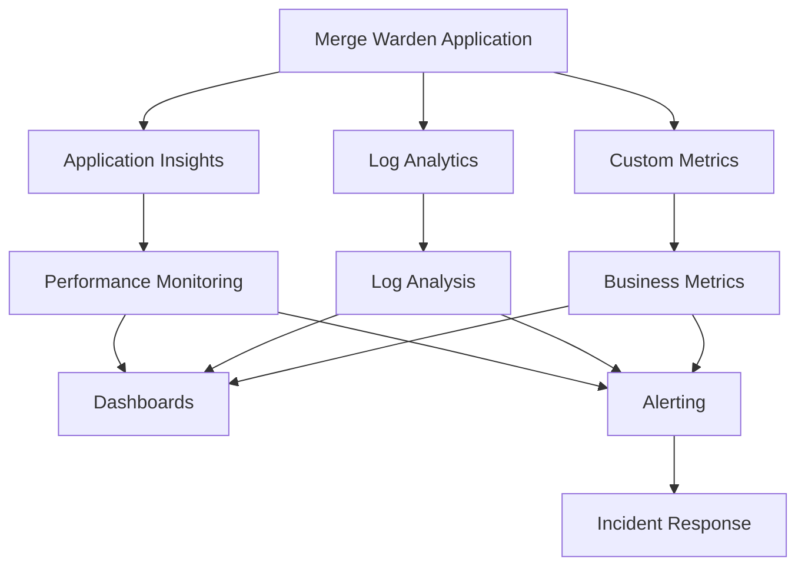

# Monitoring and Observability

Comprehensive monitoring, logging, and observability strategy for Merge Warden across all deployment targets and operational scenarios.

## Overview

This document defines the monitoring architecture, metrics collection, alerting strategies, and observability practices for maintaining operational excellence in Merge Warden deployments. It covers application performance monitoring, business metrics, security monitoring, and operational dashboards.

## Monitoring Architecture

### Core Components

**Azure Monitor (Primary Platform)**

- Application Insights for application telemetry
- Log Analytics workspace for centralized logging
- Azure Monitor metrics for infrastructure monitoring
- Action Groups for alert notification

**Observability Stack**



### Telemetry Collection

**Application Telemetry**

```rust
// Custom telemetry traits
pub trait TelemetryProvider {
    fn track_event(&self, name: &str, properties: HashMap<String, String>);
    fn track_metric(&self, name: &str, value: f64, properties: Option<HashMap<String, String>>);
    fn track_dependency(&self, name: &str, duration: Duration, success: bool);
    fn track_exception(&self, exception: &dyn Error);
}

// Business events
pub enum BusinessEvent {
    PullRequestProcessed {
        repository: String,
        pr_number: u64,
        validation_result: ValidationResult,
        processing_time_ms: u64,
    },
    PolicyViolation {
        repository: String,
        policy_type: String,
        severity: String,
    },
    BypassActivated {
        repository: String,
        user: String,
        bypass_type: String,
    },
}
```

**Infrastructure Metrics**

- Function execution metrics (invocations, duration, errors)
- Resource utilization (CPU, memory, storage)
- Network metrics (latency, throughput, errors)
- Cost and billing metrics

## Application Performance Monitoring

### Key Performance Indicators

**Response Time Metrics**

- P50, P95, P99 response times for webhook processing
- GitHub API call latencies
- Configuration loading times
- Database query performance (if applicable)

**Throughput Metrics**

- Requests per second
- Pull requests processed per hour
- Webhook delivery success rates
- API rate limit utilization

**Error Metrics**

- Error rates by error type
- Failed webhook deliveries
- Authentication failures
- Configuration validation errors

### Performance Dashboards

**Real-time Operations Dashboard**

```kusto
// Example KQL queries for dashboards
requests
| where timestamp > ago(1h)
| summarize
    RequestCount = count(),
    AvgDuration = avg(duration),
    P95Duration = percentile(duration, 95)
    by bin(timestamp, 5m)
| render timechart

exceptions
| where timestamp > ago(24h)
| summarize ErrorCount = count() by type, bin(timestamp, 1h)
| render barchart
```

**Business Metrics Dashboard**

- Repository adoption rates
- Policy compliance trends
- Feature usage statistics
- User behavior patterns

## Logging Strategy

### Log Levels and Categories

**Structured Logging**

```rust
use tracing::{info, warn, error, debug, trace};
use serde_json::json;

// Example structured logging
info!(
    repository = %repo_name,
    pr_number = pr.number,
    validation_result = ?result,
    processing_time_ms = elapsed.as_millis(),
    "Pull request validation completed"
);

warn!(
    repository = %repo_name,
    user = %user_login,
    bypass_type = %bypass.rule_type,
    "Bypass rule activated"
);

error!(
    error = %err,
    repository = %repo_name,
    operation = "webhook_processing",
    "Failed to process webhook"
);
```

**Log Categories**

- **Application**: Business logic execution
- **Security**: Authentication, authorization, bypasses
- **Performance**: Timing, resource usage
- **Integration**: External API calls
- **Configuration**: Configuration loading and validation

### Log Retention and Analysis

**Retention Policies**

- **Hot tier**: 30 days for active querying
- **Cool tier**: 90 days for compliance
- **Archive tier**: 1 year for audit requirements

**Log Analysis Queries**

```kusto
// Security monitoring
traces
| where customDimensions.category == "security"
| where customDimensions.event_type == "bypass_activated"
| summarize count() by tostring(customDimensions.repository), bin(timestamp, 1d)
| order by timestamp desc

// Performance analysis
requests
| where operation_Name == "process_webhook"
| where duration > 5000  // Slow requests > 5 seconds
| project timestamp, customDimensions.repository, duration, resultCode
| order by timestamp desc
```

## Alerting and Incident Response

### Alert Categories

**Critical Alerts (P0)**

- Service unavailability (error rate > 10%)
- Authentication system failures
- Data corruption or loss
- Security breaches

**High Priority Alerts (P1)**

- Performance degradation (P95 > 10 seconds)
- High error rates (> 5%)
- Configuration failures
- API rate limit exceeded

**Medium Priority Alerts (P2)**

- Slow performance trends
- Unusual usage patterns
- Resource utilization warnings
- Configuration validation failures

**Low Priority Alerts (P3)**

- Information alerts
- Capacity planning notifications
- Maintenance reminders

### Alert Configuration

**Azure Monitor Alert Rules**

```json
{
  "alertRuleName": "High Error Rate",
  "description": "Alert when error rate exceeds 5% over 10 minutes",
  "severity": 1,
  "criteria": {
    "metricName": "requests/failed",
    "operator": "GreaterThan",
    "threshold": 5,
    "timeAggregation": "Percentage",
    "windowSize": "PT10M"
  },
  "actions": [
    {
      "actionGroupId": "/subscriptions/.../actionGroups/critical-alerts"
    }
  ]
}
```

### Incident Response Procedures

**Response Matrix**

| Severity | Response Time | Escalation | Communication |
|----------|--------------|------------|---------------|
| P0 | 15 minutes | Immediate | All stakeholders |
| P1 | 1 hour | 2 hours | Development team |
| P2 | 4 hours | 8 hours | Operations team |
| P3 | 24 hours | 72 hours | Documentation |

**Incident Workflow**

1. **Detection**: Automated monitoring triggers alert
2. **Triage**: On-call engineer assesses severity
3. **Response**: Appropriate response team engaged
4. **Mitigation**: Immediate actions to restore service
5. **Resolution**: Root cause analysis and permanent fix
6. **Review**: Post-incident review and improvements

## Business Intelligence and Analytics

### Key Business Metrics

**Adoption Metrics**

- Number of repositories using Merge Warden
- Daily/weekly/monthly active repositories
- Feature adoption rates
- User engagement levels

**Compliance Metrics**

- Policy compliance rates by repository
- Bypass usage frequency and patterns
- Pull request approval rates
- Time to compliance improvement

**Quality Metrics**

- Pull request size distribution
- Title convention compliance
- Work item linking rates
- Review turnaround times

### Analytics Dashboards

**Executive Dashboard**

- High-level adoption and usage metrics
- Compliance trends and improvements
- Cost and ROI analysis
- Strategic insights

**Operations Dashboard**

- System health and performance
- Error rates and resolution times
- Capacity utilization
- Service level achievement

**Development Dashboard**

- Feature usage statistics
- Performance benchmarks
- Error analysis
- Technical debt metrics

## Security Monitoring

### Security Events

**Authentication and Authorization**

- Login attempts and failures
- Permission escalations
- Unusual access patterns
- API key usage

**Configuration Changes**

- Policy modifications
- Bypass rule changes
- Infrastructure updates
- Access control modifications

**Threat Detection**

- Unusual API usage patterns
- Failed webhook validations
- Suspicious repository activities
- Potential abuse attempts

### Security Dashboards

**Security Operations Center (SOC) Dashboard**

```kusto
// Failed authentication attempts
SecurityEvent
| where EventID == 4625  // Failed logon
| summarize FailedLogins = count() by Account, Computer, bin(TimeGenerated, 1h)
| where FailedLogins > 10
| order by TimeGenerated desc

// Unusual API access patterns
requests
| where customDimensions.api_endpoint != ""
| summarize RequestCount = count() by tostring(customDimensions.user), bin(timestamp, 1h)
| where RequestCount > 1000  // Threshold for unusual activity
```

## Cost Monitoring and Optimization

### Cost Tracking

**Resource Cost Analysis**

- Azure Functions consumption costs
- Azure Monitor and Log Analytics costs
- Storage and bandwidth costs
- Third-party service costs

**Cost Optimization Strategies**

- Function execution optimization
- Log retention optimization
- Alert rule optimization
- Dashboard query efficiency

### Budget Alerts

**Cost Thresholds**

- Monthly budget alerts at 50%, 80%, 100%
- Unexpected cost spike detection
- Resource utilization efficiency tracking
- Cost per repository metrics

## Compliance and Audit

### Audit Logging

**Audit Events**

- Configuration changes
- Policy modifications
- User access and actions
- System maintenance activities

**Compliance Reporting**

- Regular compliance status reports
- Audit trail documentation
- Security assessment reports
- Performance benchmark reports

### Data Retention

**Legal and Compliance Requirements**

- Audit log retention (7 years)
- Performance data retention (1 year)
- Security incident data (3 years)
- Business analytics data (3 years)

## Monitoring Tools and Integrations

### Primary Tools

**Azure Native Tools**

- Azure Monitor for infrastructure monitoring
- Application Insights for application performance
- Log Analytics for log aggregation and analysis
- Azure Security Center for security monitoring

**Third-party Integrations**

- GitHub Actions for CI/CD monitoring
- External uptime monitoring services
- Security scanning tools
- Performance testing platforms

### Custom Monitoring Solutions

**Health Check Endpoints**

```rust
// Health check implementation
#[derive(Serialize)]
pub struct HealthStatus {
    status: String,
    timestamp: DateTime<Utc>,
    checks: HashMap<String, ComponentHealth>,
}

pub async fn health_check() -> Result<HealthStatus, Error> {
    let mut checks = HashMap::new();

    // Check external dependencies
    checks.insert("github_api".to_string(), check_github_api().await);
    checks.insert("app_config".to_string(), check_app_config().await);
    checks.insert("key_vault".to_string(), check_key_vault().await);

    Ok(HealthStatus {
        status: if checks.values().all(|c| c.healthy) { "healthy" } else { "unhealthy" },
        timestamp: Utc::now(),
        checks,
    })
}
```

**Synthetic Monitoring**

- End-to-end workflow testing
- API endpoint monitoring
- Performance regression detection
- User experience validation

## Related Documents

- **[Deployment](./deployment.md)**: Deployment monitoring and validation
- **[Configuration Management](./configuration-management.md)**: Configuration monitoring
- **[Security](../security/README.md)**: Security monitoring requirements
- **[Performance Testing](../testing/performance-testing.md)**: Performance monitoring strategies
