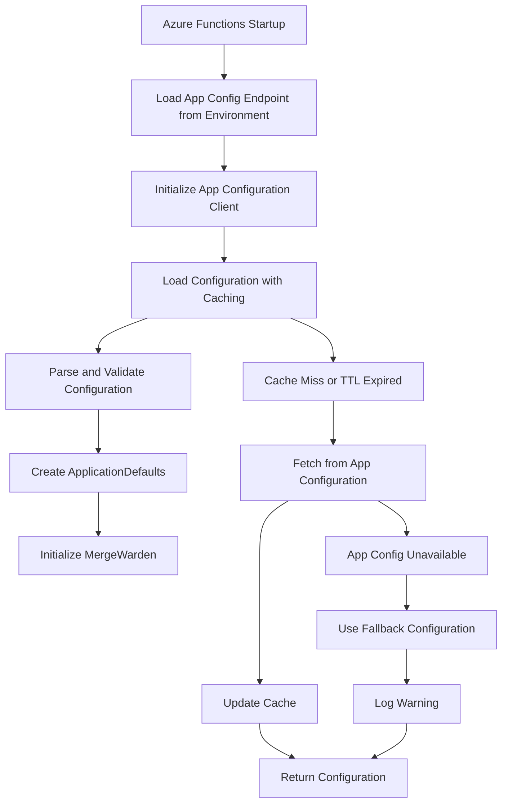

# Phase 5: Azure Functions App Configuration Integration

## Problem Description

Phase 4 established Azure App Configuration infrastructure with bypass rules and core application settings, but Azure Functions is still loading configuration from environment variables instead of the centralized App Configuration service.

Current issues:

1. Azure Functions loads `ENFORCE_TITLE_CONVENTION` and `REQUIRE_WORK_ITEMS` from environment variables, but these are now stored in App Configuration
2. Bypass rules configuration is stored in App Configuration but not loaded by Azure Functions
3. Some configuration (patterns, labels) is loaded from environment variables but not stored anywhere in App Configuration
4. No configuration caching or refresh mechanism
5. No fallback strategy if App Configuration is unavailable

## Surrounding Context

**Completed Infrastructure (Phase 4):**

- Azure App Configuration resource deployed with Free tier SKU
- RBAC permissions for Function App to read from App Configuration
- Configuration keys for bypass rules and core application settings
- Environment variable `APP_CONFIG_ENDPOINT` available to Azure Functions

**Current Azure Functions Configuration:**

- Loads secrets from Key Vault (GitHub app credentials, webhook secret)
- Loads system settings from environment variables (port, monitoring)
- Still loads application settings from environment variables that should come from App Configuration

## Proposed Solution

Implement Azure App Configuration client in Azure Functions to load centralized configuration, with proper caching, error handling, and fallback mechanisms.

### Alternatives Considered

1. **Direct environment variable migration**: Update Terraform to set all configuration as environment variables
   - **Rejected**: Doesn't leverage centralized configuration benefits, no dynamic updates

2. **Mixed approach**: Keep some configuration in environment variables, some in App Configuration
   - **Rejected**: Creates configuration fragmentation and complexity

3. **Full App Configuration migration with caching**
   - **Selected**: Provides centralized configuration, dynamic updates, and proper fallback

## Design

### Configuration Loading Architecture



### Configuration Key Mapping

| Azure App Configuration Key | Rust Struct Field | Environment Variable (deprecated) |
|---------------------------|------------------|----------------------------------|
| `application:enforce_title_convention` | `enforce_title_convention` | `ENFORCE_TITLE_CONVENTION` |
| `application:require_work_items` | `require_work_items` | `REQUIRE_WORK_ITEMS` |
| `bypass_rules:title:enabled` | `bypass_rules.title_convention.enabled` | - |
| `bypass_rules:title:users` | `bypass_rules.title_convention.users` | - |
| `bypass_rules:work_item:enabled` | `bypass_rules.work_items.enabled` | - |
| `bypass_rules:work_item:users` | `bypass_rules.work_items.users` | - |
| `logging:level` | `log_level` | - |
| `logging:rust_log` | `rust_log` | - |

### Implementation Plan

#### Step 1: Add Azure App Configuration Dependencies

Add required dependencies to `crates/azure-functions/Cargo.toml`:

- `azure-config` or `azure-data-appconfiguration` crate
- `tokio-cache` or similar for caching
- `serde_json` for JSON parsing

#### Step 2: Create Configuration Client Module

Create `crates/azure-functions/src/config_client.rs`:

- App Configuration client wrapper
- Configuration caching with TTL (5-10 minutes)
- Error handling and retry logic
- Fallback to default values

#### Step 3: Update Configuration Loading

Modify `get_azure_config()` in `main.rs`:

- Replace environment variable loading with App Configuration loading
- Handle missing configuration gracefully
- Implement proper error logging
- Return structured `ApplicationDefaults` instead of `AppConfig`

#### Step 4: Handle Missing Configuration Keys

For configuration keys not yet in App Configuration:

- `TITLE_CONVENTION_PATTERN` - Use hardcoded default from core crate
- `MISSING_TITLE_LABEL` - Use hardcoded default from core crate
- `WORK_ITEM_PATTERN` - Use hardcoded default from core crate
- `MISSING_WORK_ITEM_LABEL` - Use hardcoded default from core crate

#### Step 5: Update AppState Structure

Replace `AppConfig` with `ApplicationDefaults` in `AppState`:

- Remove intermediate `AppConfig` struct
- Use `ApplicationDefaults` directly
- Update all references throughout the codebase

#### Step 6: Add Configuration Refresh Logic

Implement background configuration refresh:

- Periodic refresh of configuration cache
- Graceful handling of configuration changes
- Telemetry for configuration updates

### Error Handling Strategy

1. **App Configuration Unavailable**: Use fallback default configuration and log warning
2. **Invalid Configuration Format**: Use fallback for specific keys and log error
3. **Network Timeout**: Retry with exponential backoff, fallback if all retries fail
4. **Authentication Failure**: Log error and use fallback configuration

### Caching Strategy

- **Cache TTL**: 10 minutes for production, 1 minute for development
- **Cache Key**: Hash of all configuration keys
- **Cache Invalidation**: TTL-based, with manual refresh capability
- **Memory Usage**: Limit cache size to prevent memory leaks

### Fallback Configuration

```rust
impl Default for ApplicationDefaults {
    fn default() -> Self {
        Self {
            enforce_title_convention: true,
            require_work_items: true,
            bypass_rules: BypassRules::default(),
            // ... other defaults
        }
    }
}
```

### Telemetry and Monitoring

- Log configuration loading success/failure at INFO level
- Track configuration cache hit/miss rates
- Monitor App Configuration response times
- Alert on fallback configuration usage

## Other Relevant Details

### Breaking Changes

- `AppConfig` struct will be removed
- Configuration loading logic changes from environment variables to App Configuration
- No changes to public API or configuration schema

### Security Considerations

- App Configuration access uses system-assigned managed identity
- No secrets stored in App Configuration (remain in Key Vault)
- Configuration keys are treated as public (non-sensitive)

### Performance Impact

- Initial configuration load adds ~100-200ms to startup time
- Cached configuration lookups add <1ms overhead
- Network calls only on cache miss or refresh

### Testing Strategy

- Unit tests for configuration parsing and caching logic
- Integration tests with mock App Configuration service
- End-to-end tests with real Azure App Configuration
- Error injection tests for fallback scenarios

## Conclusion

This design provides a robust, scalable approach to centralized configuration management while maintaining backward compatibility and providing comprehensive error handling. The implementation will enable dynamic configuration updates and better operational visibility into configuration usage.

**Implementation Priority**: High - Required for completing Work Item #16
**Estimated Effort**: 4-6 hours
**Risk Level**: Medium - Proper fallback strategies mitigate configuration availability risks
