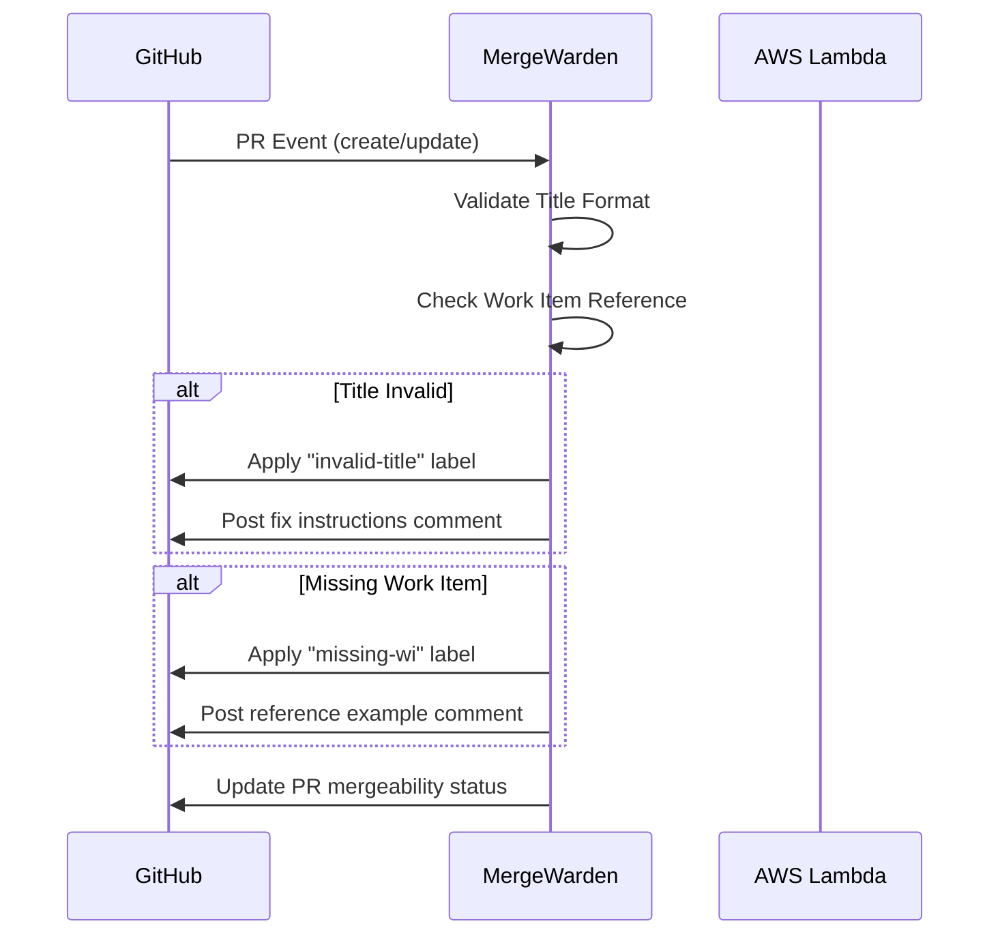
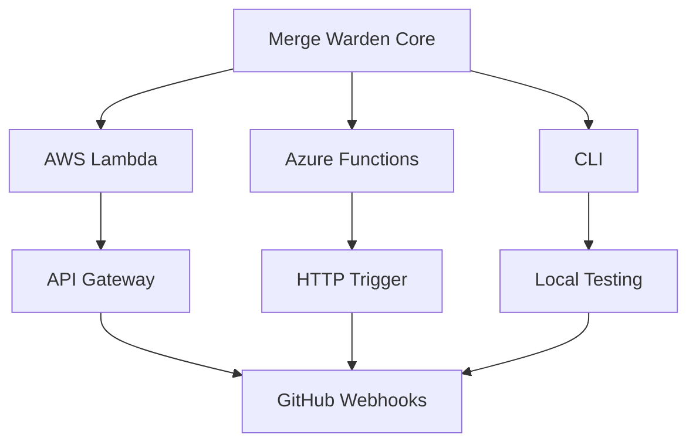

# Merge Warden PR Validation Specification

## Purpose

The Merge Warden service verifies and enforces a series of requirements for pull request in GitHub repositories. The goal
is to ensure that PRs provide enough information for future developers to understand why the changes were made, as well
as for the automatic processing of releases and release notes.

The application authenticates with GitHub using a GitHub App and listens for PR events to trigger validation checks. The
GitHub app requires the following permissions:

* Read access to metadata and content
* Write access to Pull Requests
* Read access to Issues

The application is designed to be deployed as a serverless function on AWS Lambda or Azure Functions, with a CLI for
local testing.

## Validation Rules

### 1. Title Validation

**Requirement**: PR titles must follow [Conventional Commits](https://www.conventionalcommits.org/) format
**Regex Pattern**:

```regex
^(build|chore|ci|docs|feat|fix|perf|refactor|revert|style|test){1}(\([\w-]+\))?!?: .+
```

### 2. Work Item Reference

**Requirement**: PR body must contain at least one GitHub issue reference
**Valid Formats**:

* `Closes #123`
* `Relates to #456`
* `Fixes org/repo#789`

## Enforcement Workflow



## Comment Management

| Requirement | Label | Comment Template |
|-------------|-------|------------------|
| Invalid Title | `invalid-title` | "⚠️ **Title Format Required**\nPlease use Conventional Commit format:\n`<type>(<scope>): <description>`\n\nValid types: build, chore, ci, docs, feat, fix, perf, refactor, revert, style, test" |
| Missing Work Item | `missing-wi` | "🔗 **Work Item Needed**\nPlease reference a GitHub issue using:\n`Closes #123` or `Relates to #456`\n\nYou can add this to the PR description body." |

## Mergeability Control

* Block merge if any requirements fail
* Only remove Merge Warden's merge block when all requirements pass
* Preserve other merge restrictions (e.g., CI checks, other apps)

## Deployment Architecture



## Implementation Plan

1. **Core Validation Logic**
   * Conventional commit regex matching
   * Work item reference parsing

2. **GitHub Integration**
   * Webhook event handling
   * Comment/label management API

3. **Deployment Targets**
   * AWS Lambda: `crates/aws-lambda`
   * Azure Functions: `crates/azure-functions`
   * CLI: `crates/cli`

4. **Error Handling**
   * Retry logic for GitHub API calls
   * Detailed logging with `tracing`
   * Custom error types (`MergeWardenError`)
